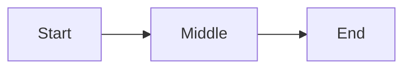

# docs — author & review documents

The DB owns document bodies: a `documents` row is the source — NEVER author a
loose `.md` file as the canonical body. `sc render` writes the read-only flat
copy to `specs_sc/` / `docs_sc/`; the GUI opens it rendered in md-converter.

| kind | lives on | meaning |
|---|---|---|
| `spec` | the **Roadmap** (the dev cycle) | working spec for a feature; a feature can hold several at once; **freezes on ship** |
| `doc` | the **Docs** tab | documentation; not part of the spec lifecycle |

`<self>` = your shell_id.

## One feature, many specs

Feature = the `roadmap` row; exists from `brainstorm` onward, before any spec.
Specs hang off the feature, not off each other: several unfrozen specs per
feature, each a `documents (kind='spec')` row, ordered by `seq`. No
feature-to-feature links; no second roadmap row for related work — related
work = another spec under the same feature. Freeze = the ship-time record of
what was built to; it never gates the feature's other specs.

| state | test | meaning |
|---|---|---|
| **shipped** | `frozen = 1` | delivered; immutable record |
| **active** | unfrozen + has rows in `spec_tasks` | the spec being built now |
| **backlog** | unfrozen, no task plan | the pile, ordered by `seq` |

The **doc** (`kind='doc'`) = the feature's readable face — write it when the
first spec ships, under the same `feature_id`. Sibling of the specs, not a
parent.

## Assess the work-stream on every feature

A feature attaches to a work-stream (`projects` row) via `roadmap.project_id`.
The GUI Flow view groups on it; `NULL` shows as Ungrouped = invisible to the
grouping. On every feature create / spec author / spec update, assess the
work-stream in the same act:

```
sc mem get projects   # existing work-streams — pick the fit
sc mem get roadmap    # this feature's current project_id
```

| case | action |
|---|---|
| new feature | create pre-assigned: `sc mem roadmap add "<title>" --project <shortname>` |
| existing + Ungrouped | `sc mem roadmap project <feature_id> <shortname>` |
| no fitting stream | `sc mem project add <shortname> "<title>" --purpose "…"` -> then assign |
| already correctly assigned | no-op — don't churn |

Auto-assign when only one plausible fit / it clearly belongs to an existing
stream. Surface to the FnB only when ambiguous — several streams fit, or a
new stream you're unsure how to name. Exempt (as with stages): work that
isn't a feature/spec (a quick fix) needs no work-stream.

## Review first

Before writing — don't duplicate, don't re-litigate:
```
sc mem get documents      # every spec/doc in the engine DB (kind, seq, frozen, task_count)
sc mem get decisions      # active-decision index (<id> = full row + rationale; --all incl. superseded)
sc map-sql "SELECT path FROM dr_filepath WHERE role='doc';"   # repo's own docs (map db)
```

Spec touches a recorded decision -> honor it, or supersede explicitly: say so
in the spec + record `sc mem decision "…" --parent <old_id>`. NEVER silently
re-decide a settled choice.

## Author

Write through `sc mem doc add` (routes through the engine API): `--body-file`
reads the markdown from a file (no shell-escaping a long body); `--seq`
auto-increments within `(feature, kind)`; it renders + snapshots for you
(pipeline = the `snapshot` skill):
```
# a doc against a feature (kind='doc'); DB owns the body:
sc mem doc add "…" --kind doc --feature <id> --body-file ./draft.md --render-path docs_sc/….md

# a feature's next spec stage (kind='spec'); seq auto-advances:
sc mem doc add "…" --kind spec --feature <id> --body-file ./draft.md --render-path specs_sc/….md
```

## Revise before freeze

Unfrozen -> edit in place: no new row, no seq bump. Pass any of `--title` /
`--body-file` / `--render-path`; renders + snapshots like `add`. Frozen ->
refused; open a new spec under the same feature instead:
```
sc mem doc edit <document_id> --body-file ./draft.md
sc mem doc edit <document_id> --title "New title" --render-path specs_sc/….md
```

## Freeze + document on ship — the planner's handoff

Shipping is a two-shell act (keeps `shipped` honest):

- **dev**: flips `roadmap_status = shipped` + opens a **docs-pending** flag
  (`spec` skill, Step 5) — `shipped` never silently claims a doc that doesn't
  exist yet.
- **planner**: on that flag (arrives in your inbox per the `flags` skill), do
  the paperwork:

1. **Freeze the shipped spec** — immutable thereafter; the feature's other
   specs stay unfrozen and unaffected. NEVER edit a frozen spec (open a new
   spec under the same feature); the GUI and render layer both refuse edits
   to frozen docs:
   ```
   sc mem doc freeze <document_id>
   ```
2. **Read the shipped code, then write the doc** — from the code as it
   actually shipped, NOT from the spec body. The spec is intent; the code is
   truth (drift lands during production). Read the implementation first,
   write what it does:
   ```
   sc mem doc add "<feature> — how it works" --kind doc --feature <id> --body-file ./draft.md --render-path docs_sc/<slug>.md
   ```
3. **Close the docs-pending flag** pointing at the doc:
   ```
   sc mem flag close <flag_id> --notes "Spec frozen; doc <document_id> written → docs_sc/<slug>.md"
   ```

Until step 3, `shipped` + open flag = the truthful interim state: delivered,
doc pending.

## View

GUI "open in md-converter ↗" (Roadmap card / Docs tab) opens any doc rendered
— the body rides in the URL, no upload. Long-form authoring: write the
markdown to `body`; render + md-converter own presentation.

---

# Authoring format (themed-markdown)

The `body` you write IS themed-markdown — the format md-converter renders.
Your job = structure; styling = the renderer's job. NEVER write visual
instructions (colors, fonts, sizes, themes) — apply the four semantic
classes; the theme picks colors.

Use ONLY the constructs below — anything else drops silently or breaks the
render.

`req` = required · `opt` = optional · `≤N` = soft character cap (over-cap
wraps awkwardly / overflows a fixed UI slot).

## Frontmatter

```
---
title: Document Title
tags: [tag1, tag2]
date: YYYY-MM-DD
project: Project Name
purpose: Brief description
---
```

| Field | Status | Cap |
|---|---|---|
| `title` | req | ≤40 |
| `tags` | req (YAML list; `[]` ok) | — |
| `date` | opt | `YYYY-MM-DD` |
| `project` | opt | ≤40 |
| `purpose` | opt | ≤40 |

`date`/`project`/`purpose` -> footer meta cards. `sc render` injects
`feature`, `roadmap_status`, `frozen`, `rendered_by`, `source` on top —
NEVER write those yourself. Tags = YAML list only; comma-separated
(`tags: a, b`) breaks.

## Structure

| Syntax | Role | Cap |
|---|---|---|
| `# Title` | doc title (opt; falls back to `frontmatter.title`) | — |
| `## Section` | sidebar tab | ≤28 |
| `### Heading` | subsection -> `<h3>` | ≤80 |

H4–H6 ⛔.

**Tab rule:** every H2 = one tab; content between two H2s belongs to the
first. Content between H1 and the first H2 is silently dropped — put intro
under an H2 (e.g. "Overview"). Single-section docs may omit H2s (whole doc =
one tab).

**Doc scale:** ≤25 sections + ≤15 Mermaid diagrams (every section renders
up-front; every Mermaid re-renders per tab switch) — split larger material.

## Inline · lists · tables · images · code

- Inline: `**bold**` · `*italic*` · `~~strike~~` · `` `code` `` · `[text](url)`
- Lists: `-` unordered · `1.` ordered · `- [ ]` / `- [x]` tasks
- Tables: standard GFM pipe tables
- Images: `` — absolute URLs only, descriptive alt
- Video: a bare video URL alone on its own line renders as a player — a
  `github.com/user-attachments/assets/<id>` URL (paste a video into a GitHub
  issue/PR to mint one) or any absolute URL ending `.mp4`/`.webm`/`.mov`/`.ogg`.
  NEVER wrap it in `` / `[]()` — bare triggers the player.
- Code: fenced with a language hint (```` ```python ````)

## Color classes

`class1`–`class4` — on callouts, stat cards, mermaid nodes, linear steps.
Choose the class by meaning; the theme decides the color. Keep one class per
semantic role across the doc (e.g. `class1` = primary, `class2` = supporting,
`class3` = positive/done, `class4` = caution/warning). Consistency >
specific choice.

## Callouts

```
> [!class1]
> Callout content.
```
Cap ≤280 (one short paragraph). class1–class4.

## Stat cards

````
```stats
:::class1
value: 87%
label: User satisfaction
description: Up 12% from last quarter
:::class2
value: 1.2M
label: Active users
```
````

| Field | Status | Cap | Notes |
|---|---|---|---|
| `value` | req | ≤12 | short token (`87%`, `1.2M`) — not sentences |
| `label` | req | ≤28 | one short noun phrase |
| `description` | opt | one short line | omit if no signal |

Layout: 2 per row; trailing odd card spans the row.

## Mermaid

````

````

Class via `:::classN` on nodes. The app injects `classDef` — NEVER write
`classDef`, `fill:`, or any style directive. Node label cap ≤24 (long labels
balloon auto-sized nodes).

**Quote labels with special characters** — unquoted node text is parsed as
Mermaid grammar. Any label containing `/`, `(`, `)`, `*`, `[`, `]`, `{`, `}`,
`<`, `>`, `#`, `:`, `;`, or a quote MUST be double-quoted inside the brackets
-> else *"Syntax error in text"* and nothing renders. Notably `A[/text/]` =
the parallelogram shape, so a literal path like `/lease/mail/*` breaks unless
quoted.

```
GOOD:  AD["/admin/user-credentials/"]:::class3
       N["count > 0"]:::class2
BAD:   AD[/admin/user-credentials/]      (parsed as a parallelogram shape → error)
       N[count > 0]                      (> is a grammar token → error)
```

Cylinder/stadium shapes are fine as-is — `DB[(secrets.db)]`, `X([ready])` —
quote only the inner text, not the shape brackets.

## Linear

````
```linear
Step 1 :::class1 -> Step 2 :::class2 -> Step 3 :::class3
```
````
Steps separated by `->`, optional `:::classN`. Renders vertically — one step
per row, top→bottom (never horizontal). Step text cap ≤48.

## Never

- H4–H6 · blockquotes (except callouts) · footnotes · raw HTML
- Color / font / size / theme / visual mentions (the theme owns styling)
- Content between H1 and the first H2 (silently dropped — use an H2)
- Comma-separated `tags` (must be a YAML list)
- `classDef` / `fill:` / style directives inside Mermaid
- Unquoted Mermaid labels containing special characters

## Open in md-converter

A doc whose `body` lives in the DB already opens in the app from the GUI
("open in md-converter ↗" on the Roadmap/Docs card) — author nothing there.

When committing a **standalone** themed-markdown file to the repo (a README,
or a rendered `docs_sc/` page meant to be read on GitHub), drop a one-click
badge in its preamble — between `# Title` and the first `##` (shows on
GitHub, dropped from the render by the preamble rule):

```markdown
[](https://md-converter.designs-os.com/?url=https://github.com/<owner>/<repo>/blob/<branch>/<path>)
```

Fill `<owner>/<repo>/<branch>/<path>` with the file's GitHub location (any
subdirectory depth). Public repos only — the badge fetches the raw file in
the reader's browser (no server/auth). Destination unknown -> keep the
placeholders and tell the user to fill them.
