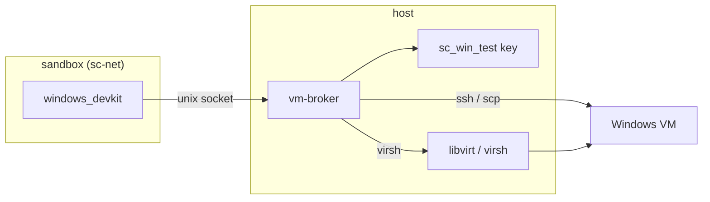

# Windows VM Broker — Spec

[](https://md-converter.designs-os.com/?url=https://github.com/jedbjorn/subfloor/blob/main/.super-coder/docs/windows-vm-broker.md)

## Overview

The [Windows Test VM](windows-test-vm.md) capability shipped the skills, the
config, and a host-side **validation** path — but not a way for the shells that
hold `windows_devkit` to actually *drive* the VM. Those shells run inside the
super-coder **sandbox container**, and the test VM lives on the host's libvirt
NAT network. A container cannot reach it, and cannot run `virsh`.

This spec adds a **host-side VM broker**: one process that holds the SSH key and
has libvirt access, exposes the four loop verbs over a local socket, and is
called by `windows_devkit` from inside the container. The key never enters the
fork; `virsh` runs where it works.

> [!class1]
> The broker is the **generic test-target seam** the Windows VM design deferred
> to "out of scope." The reachability test below proves it is **required**, not
> optional, for any containerized fork — Windows-via-VM is just provider #1.

## The gap (measured)

From inside the live `sc-dos-arch` container (`172.19.0.2` on `sc-net`):

```stats
:::class4
value: timeout
label: container → VM:22
description: 192.168.122.100 unreachable — no route across libvirt NAT
:::class4
value: none
label: ssh / scp / virsh
description: container has python3 only; no client, no hypervisor control
:::class3
value: refused
label: container → host:8804
description: route to host exists; services bind 127.0.0.1, so nothing answers
:::class3
value: mounted
label: repo bind-mount
description: /home/j3d1/dos-arch visible both sides — a unix socket can live here
```

## Why creds-in-container fails

The tempting shortcut — mount the SSH key into the sandbox — hits three walls,
and clears none of the important one:

| Wall | Detail |
|---|---|
| **No route** | container `sc-net` (172.19) cannot reach libvirt NAT (192.168.122). A key is useless if packets never arrive. |
| **No client** | the sandbox image has no `ssh`/`scp`. You'd have to bake OpenSSH into every fork image. |
| **`virsh` verbs** | `reset` (snapshot-revert) and `capture` (screenshot) are **host libvirt** ops. No credential makes a container revert a host snapshot — and a fork sandbox must never hold hypervisor control. |

Even if you mounted the key, installed `ssh`, *and* punched a firewall route,
you'd get `exec`/`push` and still could not `reset` between tests — the one verb
the isolated loop exists for. And the key would now live in the fork, the exact
posture the credential broker was built to avoid.

## Architecture

The broker is a **host process** — not the in-container API server. It mirrors
dos-arch's credential-broker precedent: the one host-side authority that holds a
secret so nothing downstream needs it.



- **Container side** — `windows_devkit` makes local socket calls. No key, no
  `ssh`, no `virsh`, no route to the VM. Nothing changes about its isolation.
- **Host side** — the broker reads `instance.json.vm`, holds the key path, and
  is the only thing that touches the guest or the hypervisor.

## Transport

Two options, both grounded in the measured facts. Recommend the socket.

> [!class3]
> **Unix socket in the bind-mounted repo (recommended).** The broker listens on
> e.g. `.super-coder/run/vm-broker.sock` inside the fork repo, which is mounted
> into the container at the same path. No network surface, no firewall, gated by
> filesystem permissions. `windows_devkit` calls it with `curl --unix-socket`.

The TCP fallback: bind the broker on the docker-bridge gateway (`172.19.0.1`) or
`0.0.0.0`. The container *can* reach that (refused, not dropped — a listener is
all that's missing), but it is a real network surface that then needs its own
auth token. The socket avoids that entirely.

```linear
windows_devkit :::class1 -> unix socket :::class2 -> vm-broker (host) :::class2 -> ssh / virsh :::class3 -> VM :::class3
```

## API

Four verb endpoints, plus the validation surface relocated from the in-server
endpoints (which presume host access the container doesn't have). All return
`{ok, ...}` and stream output, mirroring the existing `validate/{check}` shape.

| Method | Path | Does | Mechanism |
|---|---|---|---|
| `POST` | `/push` | stage a build artifact for the guest | copy into `transfer_dir` (virtio-fs share) or `scp` |
| `POST` | `/exec` | run a command in the guest | `ssh`; returns `{ok, exit, stdout, stderr}` |
| `POST` | `/capture` | collect output / installer GUI state | stdout passthrough; `virsh screenshot` for the screen |
| `POST` | `/reset` | revert to the clean baseline | `virsh snapshot-revert <domain> clean --running` |
| `POST` | `/validate/{check}` | the five setup checks | relocated from the host-presuming in-server endpoints |
| `GET`/`PUT` | `/vm` | read / write the `vm` config block | `instance.json` |
| `POST` | `/mcp/up` | open the GUI seam (idempotent) | broker-owned `ssh -N -L` unix-socket forward |
| `POST` | `/mcp/down` | close it (idempotent) | SIGTERM the forward |
| `GET` | `/mcp/status` | `{ok, running, pid, socket}` | pidfile + socket presence |

> [!class4]
> **`reset` uses `--running`.** The `clean` snapshot is **offline** — this CPU
> exposes the non-migratable `invtsc` flag, so a live (memory) snapshot is
> refused. Revert therefore lands in a powered-off state; `--running` boots it
> back. `windows_devkit`'s reset verb must pass it, or the box comes back dark.

## Security

The broker is the trust boundary, and it tightens the current posture rather
than loosening it.

- **Key stays host-side.** `~/.ssh` is not mounted into the sandbox today; the
  broker preserves that. The fork never holds the credential.
- **No hypervisor in the fork.** `virsh` runs only in the broker. A compromised
  sandbox can ask for a `reset`; it cannot script libvirt.
- **Scope the surface.** `exec` runs arbitrary commands *on the VM* by design —
  that is the test loop. The broker scopes to the configured guest only, never
  shells out on the host on behalf of the caller.
- **One door per caller class.** The broker is reached only by fork shells over
  the socket; admin provisioning (`configure_winbox`) is a separate, host-run
  path. Do not widen one gate to serve both.

## windows_devkit changes

The skill's four verbs map one-to-one onto broker calls — it stops shelling out
to `ssh`/`virsh` (which never worked from the container) and curls the socket.

| Verb | Was (broken in container) | Becomes |
|---|---|---|
| push | `scp` / share write | `POST /push` |
| exec | `ssh host cmd` | `POST /exec` |
| capture | `ssh` + `virsh screenshot` | `POST /capture` |
| reset | `virsh snapshot-revert` | `POST /reset` |

`configure_winbox` (admin provisioning) is rare and host-weighted; it can call
the broker too, or stay an explicit host-operator task. Either way its `virsh`
snapshot step lives host-side.

## MCP seam — GUI driving from the sandbox (#263)

The `windows_vm_gui` skill drives the guest's **Windows-MCP** server (UIA
tree, localhost-bound, baked into `clean`). A host-run seat just ssh-tunnels
to it; a sandboxed seat cannot (no ssh, no key, no route — the gap above).
The seam stays on the socket posture, and the broker never parses a byte of
MCP traffic:

```linear
claude mcp add (TCP 127.0.0.1:18000) :::class1 -> vm_mcp_relay.py (in-sandbox) :::class1 -> run/vm-mcp.sock (bind mount) :::class2 -> ssh -N -L (broker-owned, host) :::class2 -> guest 127.0.0.1:8000 Windows-MCP :::class3
```

- **`POST /mcp/up`** — the broker spawns one `ssh -N -L run/vm-mcp.sock:127.0.0.1:<mcp_port>`
  (OpenSSH forwards a *unix socket* to a remote TCP port; `StreamLocalBindMask=0177`
  lands it 0600, `ExitOnForwardFailure` keeps a dead forward from lingering as a
  live pid). The socket sits next to `vm-broker.sock` in the bind mount — no
  network surface, no auth token, exactly the transport decision above. SSE /
  chunked streaming is free: it is a byte pipe, not an HTTP proxy.
- **`./sc vm-mcp-relay up`** — in-sandbox, stdlib-only TCP→socket relay on
  `127.0.0.1:18000`, because `claude mcp add --transport http` only speaks TCP
  URLs. The TCP listener exists *inside the container's own namespace*; nothing
  is exposed on `sc-net` or the docker bridge.
- **Port comes from the saved block** (`vm.mcp_port`, default 8000), never the
  caller — the sandbox names an action, not a destination, same as every verb.
- **Trust class:** raw access to guest UIA ≈ `/exec` (arbitrary commands in the
  guest), which the sandbox already holds. The tunnel reaches one port on the
  configured guest's loopback; hypervisor control still never leaves the host.

The rejected alternatives from the design round: a tunnel sidecar container on
`sc-net` (moves the key off the host process + needs an auth story on a shared
network) and a gateway-bind TCP tunnel (re-opens the network-surface decision
this spec closed).

## Process & supervision (built)

- **Separate process, not the in-container server.** The sandbox server cannot
  hold the key or reach libvirt, so the broker is a distinct host process
  (`./sc vm-broker`).
- **Tied to the sandbox lifecycle.** `./sc launch` brings the broker up when the
  fork has linked a VM (it self-skips otherwise); `./sc down` stops it. So it
  tracks the shells that need it with no separate step — the normal-workflow
  default, dependency-free (nohup + pidfile).
- **Reboot-survival is opt-in.** `./sc vm-broker-install` writes a systemd
  `--user` unit (`Restart=on-failure`, `enable-linger`) so the broker comes back
  after logout/reboot without a launch. The two mechanisms coexist: `vm-broker-up`
  no-ops when the socket already answers (a launch after a systemd start is
  harmless), and `vm-broker-down` only stops what it started, never the
  systemd-managed broker. `vm-broker-uninstall` removes the unit.
- **Per-fork.** One broker per fork, reading that fork's `instance.json.vm` and
  socket path (the unit is named `sc-vm-broker-<repo>`), so two forks never share
  a VM handle by accident.

## Phasing

```linear
MVP: exec + reset over socket :::class1 -> full: push + capture + validate :::class2 -> generalize: test-target interface :::class3
```

1. **MVP** ✅ — socket + `exec` + `reset --running`. Proves the loop end-to-end
   from the container against the `clean` snapshot.
2. **Full** ✅ — `push`, `capture` (incl. screenshot), `validate` relocated to
   the broker (server proxies in-sandbox).
3. **Generalize** — lift the four verbs into a provider-agnostic test-target
   interface; Windows-via-VM becomes provider #1, with containers/devices later.

## Resolved (built)

The build settled the four open questions:

- **Where do the #129 `validate` endpoints run?** They lived in the in-container
  server and presumed host access the sandbox lacks. The broker now owns the
  live checks; the in-sandbox server **proxies** `/api/vm/validate/{check}` to
  the broker socket (and on the no-docker host path calls `vm.validate` directly,
  unchanged). `GET/PUT /api/vm` stay in the server — they are pure
  `instance.json` I/O that works anywhere. So the wizard's test-before-save works
  again from the dockerized default.
- **Socket vs bridge-TCP.** Unix socket, as recommended:
  `.super-coder/run/vm-broker.sock` in the bind-mounted engine dir. Unix sockets
  are filesystem objects, not network-namespace objects, so a container process
  connects to the host listener through the shared mount — no route, no firewall,
  no network surface.
- **Broker auth.** Filesystem permission is sufficient for now: the socket is
  `chmod 0600`, reachable only by processes sharing the mount. No per-fork token
  in MVP. (A token belongs only if the socket ever moves to TCP.)
- **Artifact transfer.** Keep the virtio-fs share as the `push` fast path —
  `/push` copies a host-visible (bind-mounted) artifact into `transfer_dir`. No
  scp, no guest auth on the hot path.

## Implementation

Built per the architecture above:

| Piece | Where |
|---|---|
| Broker process | `.super-coder/api/vm_broker.py` — AF_UNIX `ThreadingHTTPServer`, refuses to run under `SC_SANDBOX` |
| Loop verbs + socket client | `.super-coder/scripts/vm.py` — `do_exec` / `do_reset` / `do_push` / `do_capture`, `broker_call` (unix-socket HTTP), `SOCKET` |
| MCP seam | `vm.py` — `do_mcp_up` / `do_mcp_down` / `mcp_status` (broker-owned ssh socket-forward); `.super-coder/scripts/vm_mcp_relay.py` — in-sandbox TCP→socket relay (`./sc vm-mcp-relay`) |
| Supervision | `./sc vm-broker` (foreground), `./sc vm-broker-up` / `-down` (nohup + pidfile), `./sc vm-broker-sock` |
| Server proxy | `.super-coder/api/server.py` — `/api/vm/validate/{check}` proxies to the broker in-sandbox |
| Skill | `windows_devkit` — drives the four verbs via `curl --unix-socket`, holds no key |
| Tests | `tests/test_vm_broker.py` — verb dispatch + live unix-socket transport |

## Open questions

- **Phase 3 generalization** — lifting the four verbs into a provider-agnostic
  test-target interface (containers/devices as providers #2+) is still ahead.
