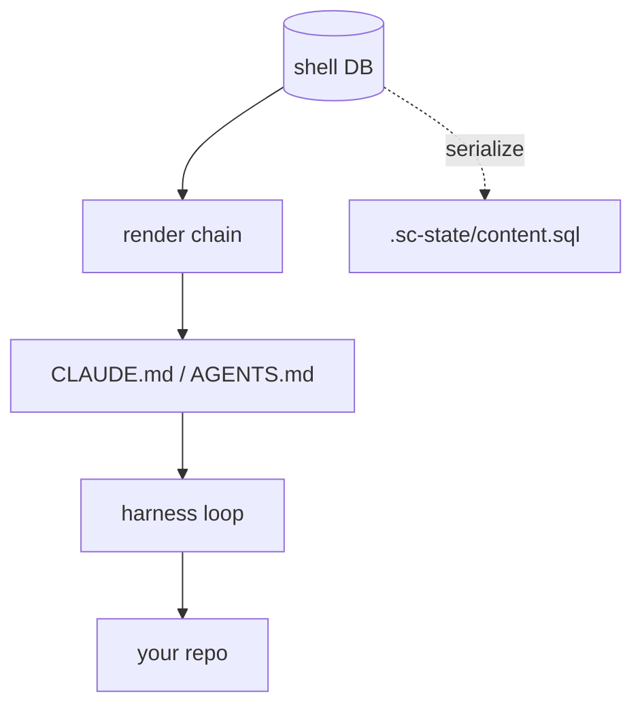

[](https://github.com/jedbjorn/subfloor/actions/workflows/tests.yml)
[](https://github.com/jedbjorn/subfloor/actions/workflows/render-check.yml)
[](LICENSE)
[](https://md-converter.designs-os.com/?url=https://github.com/jedbjorn/subfloor/blob/main/README.md)

# super-coder


## Overview

A **forkable shell substrate for a single code repository.** You install it into
a project repo; it brings the shell system — DB-backed identity, memory, seed/L&S,
decisions, flags, a roadmap, and spec/doc content — and runs that repo through
whatever coding harness you point at it — **Claude Code, OpenCode, Codex,
Mistral Vibe, and Kimi Code**, all sandbox-integrated (or run on the no-docker
host path).
Free to use, open source, MIT License.

> [!class2]
> **Repo:** [github.com/jedbjorn/subfloor](https://github.com/jedbjorn/subfloor) — source, issues, and releases.


### The headliners

- **Cross-provider orchestration.** A sprint runs planner → devs → reviewers
  **across providers** — devs on Codex, reviewers on Claude, the planner woken
  by events, workers booted headless per task. Zero scheduled polling: typed
  message rows, one PR-watch daemon, and session-surviving jobs carry the
  whole coordination. ([*Sprints*](docs/sprints.md))
- **A standing team, not a session.** Shells are DB rows — identity, memory,
  decisions, skills — that survive every session and boot on any of four
  harnesses; the same shell can run Claude Code today and OpenCode tomorrow.
  ([*The loop*](docs/the-loop.md) · [*Harnesses & models*](docs/harnesses-and-models.md))
- **Sidecars + brokers: capability without credentials.** A sandboxed shell
  tests against real Postgres, drives a real Windows VM, reaches tailnet
  hosts, bounces the host's pm2 stack, and reads the live app DB — while the
  DSN, the SSH key, the tailnet identity, and every route stay on the host,
  behind unix-socket brokers with fail-closed allowlists.
  ([*Opt-in features*](docs/features.md))
- **Worktrees + guardrails.** Every shell boots into its own git worktree on
  a base pinned to `origin/main`; a branch-guard blocks work on `main` in
  every harness; merging stays the operator's gate. Parallel shells, no
  clobbering, no surprise commits.
  ([*Shells & worktrees*](docs/shells-and-worktrees.md))
- **Self-updating, in place.** `./sc update` pulls the new engine and
  migrates the DB under the fork's feet — memory intact, sound
  `./sc rollback`, and `./sc eject` the day you'd rather own it outright.
  ([*Update a fork*](docs/update-a-fork.md))

The bet: **we build the data layer, we rent the harness.** The agent loop, the
tools, the model API are the harness's job. We own identity + memory + content
and render a boot artifact the harness reads natively.



How the overlay works — every property injected through an extension point the
harness already ships, nothing patched, nothing forked: [*Architecture*](docs/architecture.md).

## Quick start

> [!class4]
> **The bar: a reachable docker daemon + one signed-in harness CLI on PATH.** `./sc doctor` reports what it finds and the exact next command. Full prerequisites table (Arch / macOS), docker modes, and the no-docker escape hatch: [*Install*](docs/install.md).

Drop super-coder into an existing git repo and boot a shell:

```bash
cd your-repo                                                  # an existing git repo

# 1. Pull in the engine + entry script (files only, no history merge):
git remote add super-coder https://github.com/jedbjorn/subfloor.git
git fetch super-coder
git checkout super-coder/main -- .super-coder sc

# 2. Bootstrap the fork — installs harness CLIs, builds the DB, seeds your starting team:
./sc install

# 3. Sign in to your harness once, on the HOST (not inside the sandbox):
claude                          # or:  opencode auth login  ·  codex login  ·  vibe --setup  ·  kimi login

# 4. Launch the sandbox (server + GUI) and attach a session:
./sc launch
./sc enter                      # auth + pick a shell + pick a harness + boot

# 5. Commit the install (engine is gitignored — only sc + .sc-state + config track):
git add -A && git commit -m "chore: install super-coder"
```

That's the happy path — you're talking to a planner shell in your repo, with a
whole team behind it. Installer internals and harness sign-in, step by step:
[*Install*](docs/install.md).

## Docs

| Page | What's in it |
|---|---|
| [**Architecture**](docs/architecture.md) | The harness-overlay model, the engine/fork boundary, the repo layout |
| [**Install**](docs/install.md) | Prerequisites, install & launch, installer internals, harness sign-in |
| [**The loop**](docs/the-loop.md) | The everyday cycle: map → spec → build → review → freeze → verify |
| [**Harnesses & models**](docs/harnesses-and-models.md) | Plans over API keys; which model each role runs, and why |
| [**Shells & worktrees**](docs/shells-and-worktrees.md) | How a whole team shares one repo without clobbering it |
| [**Sprints**](docs/sprints.md) | The multi-shell mode: declared pushes on a zero-polling event loop |
| [**Update a fork**](docs/update-a-fork.md) | `./sc update` / `rollback`; customize vs upstream vs eject |
| [**CLI & dev kit**](docs/cli.md) | Every `./sc` command, the `make dos-` aliases, the sandbox toolchain |
| [**Opt-in features**](docs/features.md) | pg sidecar · Windows Test VM · tailnet / pm2 / db brokers |
| [**Review GUI**](docs/review-gui.md) | The localhost GUI's nine tabs + token & session analytics |

> [!class2]
> **Reading these docs.** Every page is themed markdown — GitHub renders it fine; the **Open in md-converter** badge up top serves the intended themed render. Swap the badge URL's `README.md` for any `docs/` path to read that page themed.

## License

[MIT](LICENSE) © 2026 jedbjorn.
