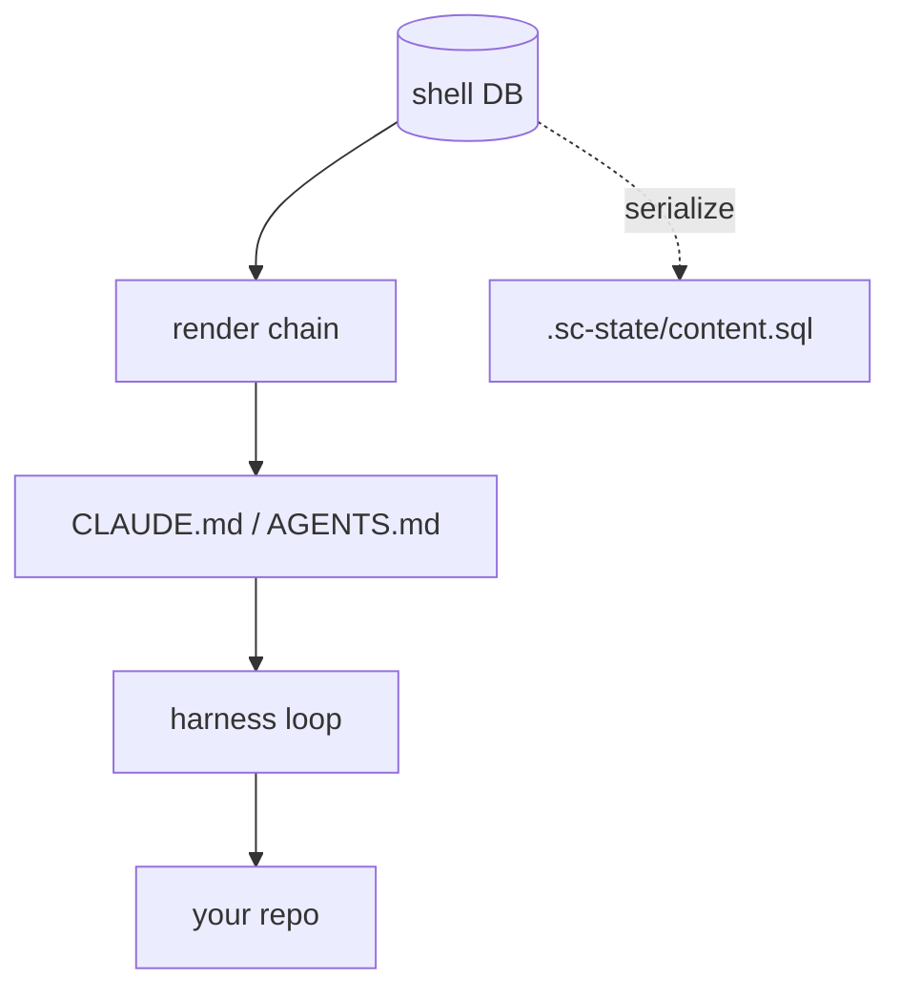
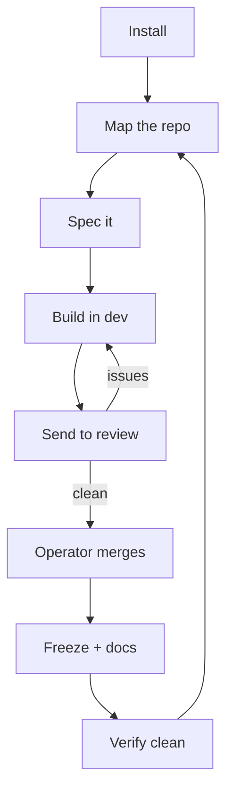

[](https://md-converter.designs-os.com/?url=https://github.com/jedbjorn/super-coder/blob/main/README.md)

# super-coder

## Overview


> [!class2]
> **UI** all eight Review-GUI tabs · **Shells** planner · reviewer · dev · cartographer · admin

A **forkable shell substrate for a single code repository.** You install it into
a project repo; it brings the shell system — DB-backed identity, memory, seed/L&S,
decisions, flags, a roadmap, and spec/doc content — and runs that repo through
whatever coding harness you point at it — **Claude Code, OpenCode, Codex, and
Mistral Vibe**, all sandbox-integrated (or run on the no-docker host path).

The bet: **we build the data layer, we rent the harness.** The agent loop, the
tools, the model API are the harness's job. We own identity + memory + content
and render a boot artifact the harness reads natively.



This repo is also **dogfood**: super-coder maintains super-coder. Its own
`.super-coder/` engine manages the maintainer shell that builds it.

```stats
:::class1
value: 4
label: Coding harnesses
description: Claude · Codex · OpenCode · Vibe
:::class3
value: 5
label: Shell flavors
description: planner · reviewer · dev · cartographer · admin
:::class2
value: 8
label: Review-GUI tabs
:::class2
value: 88xx
label: Per-repo port band
```

### Layout

```
.super-coder/         the engine — a gitignored, materialized DEPENDENCY in a
                      fork (see .super-coder/README.md); tracked only in this
                      source repo, where the engine IS the project
.sc-state/            fork-owned, tracked: content.sql (DB serialization / memory)
                      + engine.ref (the upstream SHA the engine is pinned at)
specs_sc/ docs_sc/    rendered from the DB, read-only (the _sc suffix = provenance)
skills_sc/ roadmap_sc.md
.claude/skills/       per-shell skills, rendered at boot — gitignored
.sc-worktrees/        one git worktree per shell — gitignored (admin excepted;
                      see "How shells share one repo")
CLAUDE.md / AGENTS.md boot artifact — gitignored, rebuilt at launch
```

A fork's git surfaces show **only its project** — the engine is a dependency,
not committed source, exactly like `node_modules/`. The one fork-owned artifact
that must survive is its DB, serialized to the tracked `.sc-state/content.sql`.

## Quick start

> [!class2]
> **UI** Shells (your landing tab) · **Shells** your starting team — planner · 2×dev · reviewer · admin · cartographer

### Preparation

One-time host setup — get this right and the rest is `./sc install`. super-coder
runs the harness in a **docker sandbox**; the installer bootstraps everything
else. The host needs a container engine, a few base tools, and one signed-in
coding harness.

| Need | Arch Linux | macOS |
|---|---|---|
| **Container engine** | `sudo pacman -S docker`, then start a daemon — rootless default: `dockerd-rootless-setuptool.sh install && systemctl --user enable --now docker` | `brew install colima docker && colima start` (or Docker Desktop) |
| **Base tools** | `sudo pacman -S git curl python sqlite` (usually already present) | `xcode-select --install` (git/curl); python3 + sqlite3 ship with macOS |
| **Harness CLI** | installed for you by `./sc install` (`claude` · `opencode` · `codex` · `vibe`, native installers). Repair by hand: `curl -fsSL https://claude.ai/install.sh \| bash` | same — **and put `~/.local/bin` on your PATH** (a fresh macOS shell omits it) |
| **Harness account** | a plan for one of Claude Code · OpenCode · Codex · Vibe; sign in once on the host (step 3) | same |

> [!class4]
> **The bar: a reachable docker daemon + a harness CLI on PATH.** `./sc doctor` reports the docker mode it finds (rootless / rootful) and the exact next command; `python3` + `sqlite3` are the only *hard* requirements (the engine runtime). **macOS PATH gotcha:** if `claude` reports *"missing or broken — run claude install to repair"*, the CLI installed fine but `~/.local/bin` isn't on your PATH. Add `export PATH="$HOME/.local/bin:$PATH"` to your shell profile (`~/.zshrc`), open a new shell, then `claude install`. No docker at all? The `./sc serve` + `./sc boot` escape hatch runs the shell on the host.

### Install & launch

With the prerequisites in place, drop super-coder into an existing git repo and
boot a shell:

```bash
cd your-repo                                                  # an existing git repo

# 1. Pull in the engine + entry script (files only, no history merge):
git remote add super-coder https://github.com/jedbjorn/super-coder.git
git fetch super-coder
git checkout super-coder/main -- .super-coder sc

# 2. Bootstrap the fork — installs harness CLIs, builds the DB, seeds your starting team:
./sc install

# 3. Sign in to your harness once, on the HOST (not inside the sandbox):
claude                          # or:  opencode auth login  ·  codex login  ·  vibe --setup

# 4. Launch the sandbox (server + GUI) and attach a session:
./sc launch
./sc enter                      # auth + pick a shell + pick a harness + boot

# 5. Commit the install (engine is gitignored — only sc + .sc-state + config track):
git add -A && git commit -m "chore: install super-coder"
```

That's the happy path. Each step is covered in depth below — installer internals,
harness sign-in, the docker modes, and the localhost review GUI. For the full
arc from a fresh repo through ship-and-loop, see *The loop*, next.

## The loop

> [!class2]
> **UI** Roadmap → Flags → Docs → Worktrees → Map · **Shells** cartographer · planner · dev · reviewer · admin

The everyday cycle a fork runs once it's installed. Each step is owned by a
**shell flavor**, and the work is done by the **skills** that flavor is granted
(its flavor also sets its model defaults — see *Harnesses & models*). You move
between flavors with `./sc enter-<shortname>`. Every flavor carries a common kit
— `git`, `db_map`, `memory`, `messaging`, `snapshot`, `surface_catalogue`,
`bootstrap` — so only the *flavor-specific* skills are called out per step below.

```linear
Install :::class1 -> Map :::class2 -> Spec :::class1 -> Build :::class1 -> Review :::class2 -> Freeze :::class3 -> Verify :::class3
```



Each flavor's flavor-specific skills (on top of that common kit) and the steps
it owns:

| Flavor | Flavor skills | Owns |
|---|---|---|
| **cartographer** | `cartographer` | map · re-map |
| **planner** | `docs` · `blueprint` · `flags` · `api-design` · `onboard` | spec doc · approach · freeze + docs |
| **dev** | `spec` · `dev_kit` · `test_authoring` · `database-migrations` · `redline_review` · `docs` · `flags` | break into tasks · implement · patch + test |
| **reviewer** | `test_authoring` · `database-migrations` · `redline_review` · `api-design` · `flags` | review |
| **admin** | `git_cleanup` · `self_update` · `migration_management` · `local_skill_management` | engine · verify-clean |

1. **Install** — `./sc install` seeds your **starting team**: a `planner` (your
   primary), two `dev`, a `reviewer`, the `admin` that owns `main` + the engine,
   and the singleton `cartographer`. *(admin · `self_update`, `migration_management` · UI: Shells)*
2. **Map the repo** — the cartographer configures the index once with
   `./sc map-setup`, then `./sc map` builds it; git hooks re-map on every pull.
   It's infrastructure working shells *read* via `surface_catalogue`.
   *(cartographer · `cartographer` · UI: Map)*
3. **Spec it** — the **planner** authors a spec document against a roadmap
   feature — viability, blockers, the done-condition. `blueprint` shapes the
   approach in a single session (no DB writes); both the spec and the docs ride
   the `docs` skill. *(planner · `docs`, `blueprint`, `flags` · UI: Roadmap)*
4. **Switch to dev** — `./sc enter-dev` boots the **dev** shell into its own git
   worktree on `shell/dev`, a base pinned to `origin/main`.
   *(dev · `bootstrap`, `memory` · UI: Shells)*
5. **Break it into tasks** — dev reads the spec and uses `spec` to decompose it
   into `spec_tasks` (Preparation → steps → Verification), then works one task
   per session. `memory` rolls `current_state` ("last / next task") so sessions
   resume cleanly. *(dev · `spec`, `memory` · UI: Roadmap)*
6. **Implement** — within each task, dev cuts a feature branch off `shell/dev`,
   writes code, schema, and tests, and runs `./sc test`.
   *(dev · `dev_kit`, `test_authoring`, `database-migrations`, `redline_review`, `git` · UI: Shells)*
7. **Send to review** — dev pushes and opens a PR (the `git` skill is
   branch → commit → push → **PR → stop**; dev never merges), then messages the
   reviewer. *(dev · `git`, `messaging` · UI: Flags)*
8. **Review, send back** — the **reviewer** (a *different lineage* than the code
   — defaults to Opus — so it isn't blind to the author's mistakes) reads the diff
   against the spec through its review lenses, opens flags for failures, and
   messages dev back. *(reviewer · `test_authoring`, `database-migrations`, `api-design`, `flags`, `messaging` · UI: Flags)*
9. **Patch + test** — dev addresses the flags, re-runs `./sc test`, and
   re-pushes; the thread closes when it's clean.
   *(dev · `dev_kit`, `test_authoring`, `flags`, `git` · UI: Flags)*
10. **Operator merges** — merging is the FnB's gate, never a shell's. On dev's
    next boot the launcher auto-syncs the base onto `origin/main` and prunes the
    merged branch. *(operator gate; no shell skill · UI: Worktrees)*
11. **Freeze spec + write docs** — on ship, the spec freezes (`frozen=1`,
    immutable; the next stage opens a fresh `seq`) and the feature doc is authored
    — both via `docs`. `snapshot` + `./sc render` write read-only `specs_sc/` +
    `docs_sc/`. *(planner / dev · `docs`, `snapshot` · UI: Docs)*
12. **Verify git trees clean** — the admin's `git_cleanup` triages every worktree
    (clean trees, prunable merged branches, preserved work); `./sc render-check`
    (committed `_sc` must match the DB render) and `./sc verify` (rebuild +
    headless boot) are the operator-run proofs.
    *(admin · `git_cleanup`, `snapshot` · UI: Worktrees)*
13. **Re-map** — the cartographer re-runs (auto on pull, or `./sc map`) so the
    index reflects the new shape — and the loop turns to the next feature.
    *(cartographer · `cartographer` · UI: Map)*

## Install

> [!class2]
> **UI** Shells · Scripts · **Shells** seeds the starting team — planner · 2×dev · reviewer · admin · cartographer

super-coder installs **alongside** your code — it renders to `_sc` dirs, so it
never collides with your repo's own `/docs`, `/specs`, or skills. A fork
inherits the **system** (schema + the skill catalogue + the render chain), never
super-coder's own memory or roadmap.

> [!class4]
> **Requirements: `docker`.** The default run mode is a sandbox container, so the harness's "allow everything" is safe — the kernel is the boundary, and the container sees only this repo + your harness creds. The image bakes the rest: `python3`, `sqlite3`, `git`, `curl`, and the four harness CLIs. No docker? The `./sc serve` + `./sc boot` primitives run on the host with only `python3` + `sqlite3` (and a harness on `PATH`).

**Docker mode — rootless is the default.** `./sc doctor` checks your docker.
Both modes work (the launcher's `duser()` adapts), and **rootless is the chosen
default: zero setup, same function.** Under rootless the sandbox runs the
container as root, which maps to *you*, so repo writes come out owned by you —
no phantom-uid problem (verified). Its only wart: `claude` runs as root inside,
so its `--dangerously-skip-permissions` flag is blocked — the sandbox replaces
the need for it. **Rootful is optional**, purely to drop that wart (1:1
bind-mounts, harness runs as a normal user); it costs a one-time sudo + re-login.

**Setup is one-time per machine (and rootless needs none).** `./sc launch` only
checks the daemon is reachable and points you here if not — it never does setup.

- **Rootless (default) — nothing to do.** If rootless docker runs as your user,
  `./sc launch` works as-is.
- **Rootful (optional upgrade).** Needs sudo + a re-login (a new `docker` group
  only applies to a fresh session — which is exactly why it can't fold into
  `launch`):

  ```bash
  sudo usermod -aG docker $USER            # 1. join the docker group
  sudo systemctl enable --now docker.socket # 2. start the system daemon
  # 3. LOG OUT and back in (the group only applies to a new session)
  docker context use default                # 4. point the CLI at the system daemon
  systemctl --user disable --now docker.service  # 5. optional: stop rootless
  ./sc doctor                               # verify → "docker ✓ rootful"
  ```

The commands are the five steps in the Quick start above — pull the engine in
via git (no history merge; super-coder never touches your repo's own
`Makefile`), `./sc install`, sign in, launch, commit.

`./sc install` does the rest: checks requirements, **installs the harness CLIs**
(`claude` + `opencode` + `codex` + `vibe`, via their official native installers — no
npm — if any are missing; `--skip-harness-install` to detect only), wires your `.gitignore`,
**makes the engine a gitignored dependency** (`git rm -r --cached .super-coder` —
files stay on disk; pins its upstream SHA in `.sc-state/engine.ref`), **strips
super-coder's own per-instance content** (a fork inherits the *system* — schema +
skill catalogue + render chain — never the memory or roadmap), builds the system
DB, seeds your fork's **starting team** (your user + a planner-flavor *primary*
carrying the CC Lineage Seed and its own genesis seed, plus two `dev`, a
`reviewer`, the `admin` that owns `main`, and the singleton **Cartographer**
repo-map owner), and renders. So after install
your git surfaces show only your project — the engine no longer appears in
`git status`. It refuses to run in the super-coder source repo or on an
already-installed fork (guarding against content loss).

Interactive by default (prompts for your **primary** shell's name/role/mandate —
the rest of the team is auto-named); pass flags to script it. `--flavor` picks
which roster slot is your primary (default `planner`):

```bash
python3 .super-coder/scripts/install.py \
    --username Jed --name Lead --shortname lead \
    --role "Planning lead" --mandate "Scope and steer the work in this repo."
```

After `./sc enter` you're talking to the shell, working your repo. Author
memory, roadmap, and specs into the DB; `./sc snapshot` (+ `./sc render`)
serializes back to the text git tracks.

## Harness sign-in

> [!class2]
> **UI** — host auth, no GUI · **Shells** any (the harness is a per-launch pick)

The harnesses are just CLIs — `./sc install` (and `./sc update`, `./sc
ensure-harness`) install the binaries, but you authenticate each **once, on the
host**, with your own account/subscription:

```bash
claude                      # Claude Code — prompts to sign in on first run
opencode auth login         # OpenCode
codex login                 # Codex (OpenAI / ChatGPT account)
vibe --setup                # Mistral Vibe — stores the API key (or export MISTRAL_API_KEY)
```

`./sc launch` bind-mounts each harness's credential dir into the sandbox
(`~/.claude` + `~/.claude.json`, `~/.config/opencode` + `~/.local/share/opencode`,
`~/.codex`, `~/.vibe`), so host auth flows straight into the container — **you
never sign in inside the sandbox.** Authenticate on the host, then `./sc enter`.

> [!class4]
> **Sign in on the host, not inside the sandbox.** OAuth logins spin up a localhost callback server (Codex uses `:1455`). Run the login on the **host** so your browser's callback reaches it — from *inside* the sandbox that port isn't published, so the browser gets `ERR_CONNECTION_REFUSED`.

> [!class2]
> **Vibe creds.** `vibe --setup` stores your key under `~/.vibe`, which the sandbox now mounts — so Vibe works inside the container like the others. Prefer the env-var path? `export MISTRAL_API_KEY` on the host before `./sc launch` and it's forwarded in (only when set). Re-run `./sc launch` after first authenticating, so the mount picks up `~/.vibe`.

> [!class2]
> **OpenCode is the exception.** Its `opencode auth login` for **API-key** providers is a paste-the-key prompt, not an OAuth callback, so it works at **either level** — host or inside the container (`./sc enter`). Because `~/.config/opencode` + `~/.local/share/opencode` are bind-mounted read-write, a key entered on either side lands in the same `auth.json`. (OAuth-based OpenCode providers still follow the host rule above.)

A note on Codex models: driven by a **ChatGPT account** (not an API key), Codex
exposes `gpt-5.5` and `gpt-5.4-mini` — the flavor defaults are set to those.
Plain API-only ids (e.g. `gpt-5.4`) return a 400 on a ChatGPT account.

## Harnesses & models

> [!class2]
> **UI** Shells (flavor model defaults) · **Shells** all five flavors

### Prefer a subscription plan over a raw API key

Agentic coding burns **huge** token volume — multi-step loops, large context,
constant re-reads. Metered per-token API billing scales with every one of those
tokens and gets expensive fast. A flat **subscription plan** is generally far
cheaper *and* predictable for this workload, so we recommend running each harness
against its plan rather than its pay-as-you-go API:

| Harness | Provider | Recommended plan |
|---|---|---|
| **Claude Code** | Anthropic | [Claude Pro / Max](https://claude.com/pricing) |
| **Codex** | OpenAI | [ChatGPT Plus / Pro](https://openai.com/chatgpt/pricing/) |
| **Vibe** | Mistral | [Mistral plans](https://mistral.ai/pricing) |
| **OpenCode** → open-weights | Ollama | [Ollama Cloud (or run local, free)](https://ollama.com/) |

Codex exists for exactly this reason — a ChatGPT account bills **flat, with no
per-token metering**. OpenCode with a raw API key stays the **metered catch-all**:
reach for it when you need a model no plan covers, accepting per-token cost. Ollama
goes one further — open-weights models you can run **locally for free** on your own
hardware, or on Ollama Cloud's plan.

### Why each role defaults to the model it does

Every shell has a **flavor** (its role); each flavor ships an advisory model
default per harness (the `flavor_defaults` table — the picker pre-selects it;
`--harness` / `-m` / the picker override). The doctrine:

| Flavor | Job | Codex | Claude | OpenCode (open-weights) |
|---|---|---|---|---|
| **planner** | architecture, plans | `gpt-5.5` | `sonnet` ★ | `deepseek-v4-pro` |
| **reviewer** | adversarial review | `gpt-5.5` | `opus` ★ | `glm-5.1` |
| **dev** | write the code | `gpt-5.4-mini` ★ | `sonnet` | `qwen3-coder-next` |
| **cartographer** | map the repo | `gpt-5.4-mini` ★ | `haiku` | `gpt-oss:20b` |
| **admin** | own the substrate, maintain `main` | `gpt-5.5` ★ | `sonnet` | `deepseek-v4-pro` |

★ = the harness the picker pre-selects for that flavor.

The logic, three rules:

- **Bookends premium, middle fast.** Planner and reviewer are *low-volume,
  high-leverage reasoning* — one good plan or one sharp review pays for the
  premium model. Dev and cartographer are *high-volume mechanical work* (bulk
  code, file mapping), where a fast, cheap, coding-tuned model wins on
  cost-per-token because the volume is highest.
- **Bookends default to Claude.** Planner (`sonnet`) and reviewer (`opus`) are the
  two roles whose picker default is Claude, not Codex — these are the reasoning
  bookends, and Claude is preferred for planning and adversarial review. The
  reviewer in particular runs a *different lineage than the code it reviews*, so it
  isn't blind to the same mistakes a GPT model made authoring it — adversarial
  *diversity*, not a second opinion from the same brain.
- **Three lineages, always.** Every flavor offers Codex (OpenAI), Claude
  (Anthropic), and OpenCode (open-weights via Ollama Cloud) — pick any provider for
  any role at launch. The OpenCode column is constrained to **MIT- or
  Apache-licensed** weights only (e.g. DeepSeek V4, GLM-5.1, Qwen3-Coder, gpt-oss);
  Modified-MIT / unresolved-license models (Kimi, MiniMax) are excluded even when
  available on the provider.
- **Admin decisions carry real risk** (a wrong rollback is data loss), so the
  one shell that maintains `main` (see *How shells share one repo*, next)
  defaults premium on Codex.

> [!class2]
> **Vibe sits outside this matrix.** Mistral Vibe takes no model from the launch seam — it selects its own via `active_model` in `~/.vibe/config.toml` (`vibe --setup`) or `VIBE_ACTIVE_MODEL`. It's a fourth harness option, not a fourth column here.

## How shells share one repo

> [!class2]
> **UI** Shells · Worktrees · **Shells** all flavors; admin is the only one on `main`

A fork boots a **whole team** out of the box — `planner` · 2×`dev` · `reviewer`
· `admin` · `cartographer` — and you add or retire shells from the GUI as
needed. They all work the same repo without clobbering each other:

- **Every shell boots into its own git worktree** at
  `.sc-worktrees/<shortname>/` on branch `shell/<shortname>` — parallel shells
  never share a cwd. The branch is a **moving base pinned to `origin/main`**,
  not a content branch: shells cut feature branches from it, push, and open
  PRs. Merging stays the operator's gate.
- **The launcher keeps bases fresh.** Every boot fetches and auto-syncs the
  worktree onto `origin/main` — but only when provably nothing can be lost
  (on the base branch, clean tree, no local-only commits). Anything local
  blocks the sync and is surfaced in the boot doc instead, so the shell asks
  you before any work is touched.
- **A branch-guard blocks work on `main`** in every harness — pre-tool hooks
  (Claude Code, Codex), an OpenCode plugin, and a git pre-commit backstop, all
  one shared script.
- **The admin shell is the one exception.** It boots in the **repo root** on
  `main` and maintains it directly — engine updates, rollbacks, migrations,
  applying approved patches, fork-local skills. The branch-guard exempts it
  (and only it). Working shells consume the substrate; admin owns the floor.
- **Reviewing a shell's UI work:** worktree edits never show on your main dev
  server. `./sc preview` serves every shell worktree's UI live (HMR) on the
  fork's dev port, routed by subdomain — `http://<shortname>.localhost:<port>/`
  — and the post-commit hook prints the shell's URL after each commit.

## Update a fork

> [!class2]
> **UI** Scripts (migrate · rebuild) · **Shells** admin

Ship an improvement to super-coder, pull it into each fork — **in place**, with
no loss of memory. The shell updates its own substrate: it pulls the new engine,
applies new migrations under its own feet, and the next boot stands on the new
floor with every row intact. (The shell-facing version of this is the
`self_update` skill — same procedure, framed as the handoff it is.)

```bash
./sc update                     # fetch + materialize the engine, reconcile in place
git add -A && git commit -m "chore: update super-coder"   # commits only .sc-state/ + _sc
```

`./sc update` fetches the engine from the `super-coder` remote and
**materializes** it into the gitignored `.super-coder/` dir (the engine is a
dependency — code, schema, migrations, skills; your `.sc-state/`, DB, and
`instance.json` are never touched), **pins** the new upstream SHA in
`.sc-state/engine.ref` (keeping the prior one as `engine.ref.prev`), backs up the
live DB, **applies pending migrations in place** (never a rebuild-from-snapshot —
your unsnapshotted in-session writes survive), syncs the skills catalogue
(id-stable, so grants stay valid), re-grants any new common skills, refreshes the
repo map, and re-snapshots the live state. Nothing under `.super-coder/` is
committed — you commit only `.sc-state/` (refreshed `content.sql` + bumped
`engine.ref`) and any `_sc` renders. Then restart the session to boot onto the
new floor.

- `./sc update --no-fetch` reconciles against the current working tree (offline /
  dev) — engine + `engine.ref` unchanged. `--branch <name>` to track a non-`main`
  engine branch.
- Missing remote? `git remote add super-coder https://github.com/jedbjorn/super-coder.git`

### Roll back a bad update

```bash
./sc rollback                   # restore the DB + engine together, then reboot
```

`./sc rollback` is a **sound pair-restore**: because engine code is read live and
a migration exists *because new code expects the new schema*, it restores both —
it backs up the current DB first (rollback is itself reversible), restores the DB
from the most recent pre-update backup, and re-materializes the engine at
`.sc-state/engine.ref.prev`. Whole-restore, not a per-step schema reversal; the
only data lost is anything written between the update and the rollback.

> [!class4]
> **The contract:** every schema change *after* a fork exists ships as a `migrations/NNNN_*.sql` file, never an edit to `schema.sql` — the migration ledger is what carries a delta across to an existing fork. Additive where you can make it.

## Run (everyday)

> [!class2]
> **UI** Scripts · Map (via `./sc preview`) · **Shells** all

```bash
./sc launch              # build + start the sandbox container (server + GUI), 127.0.0.1 only
./sc enter               # attach a session: auth + pick a shell + pick a harness + boot
./sc enter-<shortname>   # attach + boot one shell directly, skip the shell picker
./sc down                # stop + remove the sandbox container
./sc logs                # tail the sandbox server logs
./sc rebuild             # rebuild .super-coder/shell_db.db from schema + migrations + snapshot
./sc render              # regenerate the tracked flat _sc files from the DB
./sc render-check        # fail if the committed _sc files drift from the DB render (CI guard)
./sc snapshot            # serialize per-instance tables → .sc-state/content.sql
./sc preview             # live worktree UI previews, one subdomain per shell
./sc update              # fetch + materialize the engine, reconcile in place
./sc rollback            # sound undo of a bad update (restore DB + engine)
./sc verify              # rebuild + flat render + headless boot (no exec) — the proof
./sc help                # all commands
```


**Choosing a harness.** The boot artifact is dual-written every launch
(`CLAUDE.md` for Claude Code, `AGENTS.md` for the rest), so any installed harness
can boot the same shell. At launch, after you pick a shell: `--harness <name>` or
`HARNESS=<name>` forces one; otherwise, when more than one harness is on `PATH`,
you're prompted (default = your fork's `instance.json` harness). The pick is
per-launch and never written back — so two terminals can run the **same** shell on
different harnesses at once (one Claude Code, one OpenCode). A fork with a single
harness on `PATH` skips the prompt.

**`make`.** One prefix across the whole designs-OS family — `dos-` — so switching
repos never changes the muscle memory. Every command has a `make dos-<name>`
alias; the hot ones also get a letter — `dos-e` (enter), `dos-l` (launch),
`dos-r` (restart), `dos-d` (down), `dos-u` (update), `dos-t` (test) — and
`dos-h` / `dos-help` list / describe them. `make dos-e s=cc` boots one shell
directly; `make dos ARGS=<cmd>` is the passthrough. The targets live in
`.super-coder/aliases.mk`, which **travels with the engine** — install wires a
fork to `include` it, and because **every target is `dos-`prefixed it can't
collide** with the fork's own `test` / `build` / `install`. The source repo's
thin root `Makefile` just includes the same file; the `./sc <cmd>` binary keeps
its name and is always identical.

## Dev kit

> [!class2]
> **UI** Scripts · **Shells** dev (and any builder)

Every sandbox bakes a **toolchain** — `rg`, `sqlite3`, `curl`, Node 22 / `npm`,
and a Playwright + Chromium browser for E2E — but deliberately **not** your
project's dependencies. Those you install per fork with `./sc deps`, which builds
a repo-root `.venv` from every `requirements*.txt` (your pins are authoritative)
and runs `npm ci`/`install` for each `package.json`. Because the install lands in
the **bind-mounted repo** rather than the image, it survives rebuilds — built in
the container, run in the container, persisted in the mount. Run it first in a
fresh sandbox; a "module not found" is almost always just deps-not-yet-installed.
On top of your deps it layers a small engine baseline — `pytest`, `httpx`,
`coverage`, `ruff`, `mypy`, `datasette` — with pip's `only-if-needed` strategy, so
it never overrides a fork's pin or its `[tool.ruff]` / `[tool.mypy]` config.
**Available, not enforced:** opt into whichever pieces you want, fork by fork.

```bash
./sc deps          # install fork deps into the bind-mount (.venv + npm) — run first
./sc test          # backend (.venv pytest / stdlib unittest) + UI (npm test / vitest)
./sc lint [paths]  # ruff check  (.venv/bin/ruff format to apply formatting)
./sc typecheck     # mypy
```

One boundary trips people up: **you work inside the sandbox container**, and the
app the FnB watches in their browser is a *separate*, host-supervised instance. To
see your own changes, start a dev server **inside** the container on
`0.0.0.0:$SC_DEV_PORT` — the launcher publishes it to `http://127.0.0.1:$SC_DEV_PORT`
on the host — and use `datasette <db.sqlite>` the same way to browse a SQLite DB in
a web GUI. Never restart the host stack from inside the sandbox; run your own
instance instead. (The boot doc's `RUNNING THE APP` section and the `dev_kit` skill
carry the full detail. For the FnB-facing review of a shell's UI changes, use
`./sc preview` — see *How shells share one repo*.)

## Review GUI

> [!class2]
> **UI** this IS the GUI — Shells · Skills · Roadmap · Docs · Flags · Worktrees · Map · Scripts · **Shells** reviewer (every shell reads it)

A zero-dependency localhost GUI to review the substrate — shells, roadmap,
flags. One stdlib Python server serves both the JSON API and a static UI; no
venv, no npm, no build step. Its eight tabs are the windows the workflow above
refers to:

| Tab | What it shows |
|---|---|
| **Shells** | Each shell's role, mandate, editable `current_state`, identity, decisions, and skill grants. The default landing tab. |
| **Skills** | The skill catalogue (Repo · Substrate · Craft), with per-shell grant toggles and full content in a modal. |
| **Roadmap** | Features in funnel buckets (Brainstorm → … → Shipped), each with its spec tasks, linked docs, and flag blockers. |
| **Docs** | Read-only `kind='doc'` documents; opens in md-converter for reading. |
| **Flags** | The blocker / follow-up tracker, grouped by feature, filterable Open/Resolved/All. |
| **Worktrees** | Live git-hygiene report — dirty worktrees, prunable merged branches, clean trees. |
| **Map** | The repo catalogue — language mix, file roles, dependencies, env vars — with a re-map button. |
| **Scripts** | Run the maintenance chores (snapshot, render, seed-skills, migrate, rebuild) from a button. |


The server runs **inside the sandbox container** as its foreground process, so
`./sc launch` brings it up (printing its URL) and `./sc down` stops it;
`./sc enter` then attaches the interactive harness session into that same
container via `docker exec`, so the shell and the GUI run side by side, sharing
the one bind-mounted repo + creds. The port publishes to `127.0.0.1` only.

```bash
./sc health    # curl /api/health
./sc serve     # run the server in the foreground on the host (no docker)
./sc ports     # show this fork's derived port
```

> [!class2]
> **Ports are derived per repo**, never fixed — a fork runs *inside* a host repo that may have its own dev server, and several forks can run at once. Each fork hashes its path to a stable port in the `88xx` band (clear of superCC 8000 / dos-arch 8001 and common host ports), persisted to a gitignored `.super-coder/instance.json` you can hand-edit. Two forks won't collide.

What you can do in the GUI: read everything; **create shells** (pick a flavor —
the factory grants its skill set and opens its first session); edit a shell's
operational fields (`current_state`, `connections`, `workspace`) and skill
grants; edit the roadmap (linear status buckets, with toggle-filters) and
**non-frozen** documents; create and resolve flags. **seed and L&S are
read-only** — the laws say the shell curates them, so the API ships no endpoint
to write them at all. A `snapshot ⤓` button re-serializes + renders after
edits; **publish** goes one further — it snapshots, then lands your content
edits as a commit on a rolling `gui-content` branch, so `main` stays clean and
merging stays yours.

The **Scripts** tab lists the maintenance scripts (snapshot, render, seed-skills,
migrate, rebuild) — each with a description and a **run** button, so the common
chores work from the GUI without dropping to a terminal (rebuild prompts first,
since it discards un-snapshotted DB edits).

The live `.super-coder/shell_db.db` is **gitignored and rebuilt** from
git-tracked text. See `.super-coder/README.md` for the full model.

> [!class2]
> **Spec:** the founding design lives in the roadmap (`super-coder` feature row) and renders to `specs_sc/`.

## License

[MIT](LICENSE) © 2026 jedbjorn.
