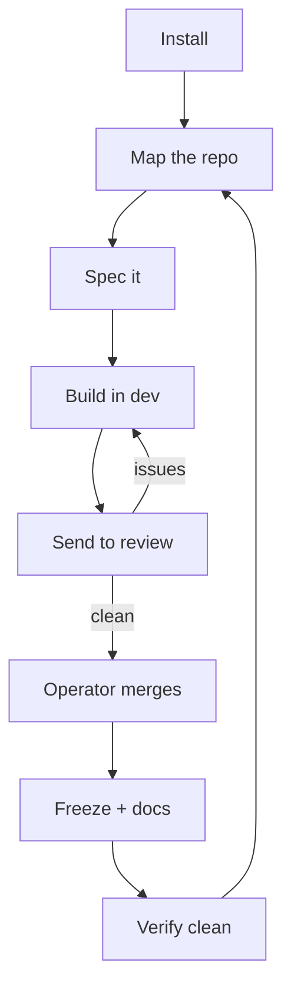
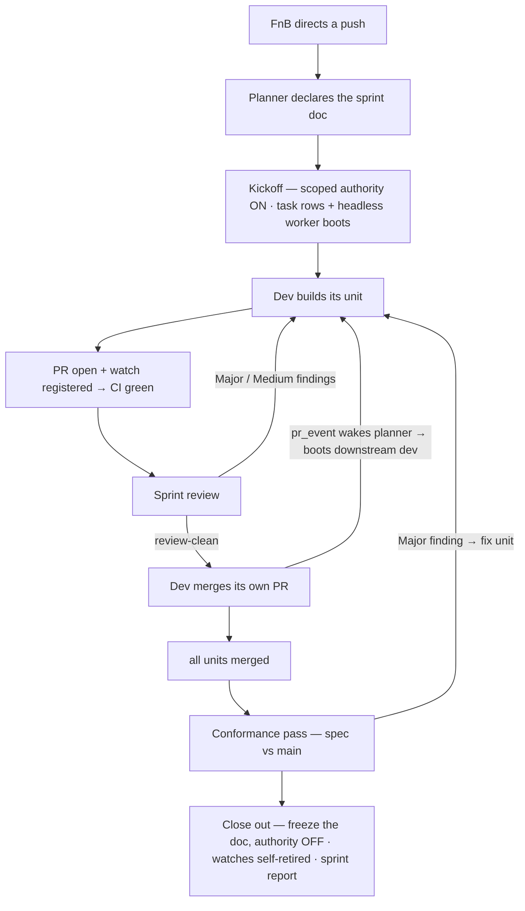
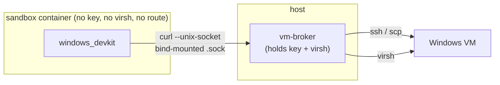

# subfloor — Docs

[](https://md-converter.designs-os.com/?url=https://github.com/jedbjorn/subfloor/blob/main/docs/README.md)

One page, ten sections — each `##` heading renders as a tab in md-converter;
on GitHub this reads as one long page with the same anchors.

## Architecture

### A harness overlay

A coding harness ships the **loop** — model, tools, context window — and
forgets everything else between sessions. subfloor is a **harness
overlay**: it supplies the properties a harness doesn't keep, and injects
every one of them through an extension point the harness itself already
ships — nothing patched, nothing forked:

| Property | Ours | Enters the harness via |
|---|---|---|
| **Boot context** | identity · memory · laws · current state | the boot doc it reads natively (`CLAUDE.md` / `AGENTS.md`) |
| **Native tooling** | the `./sc` CLI — `mem` · jobs · watches · brokers | the shell it already executes commands in |
| **Skills** | DB-canonical catalogue, per-shell grants | the skill dirs it already discovers |
| **Guardrails** | branch-guard · sandbox · worktrees | its own hook / plugin seams + the environment it boots into |
| **Orchestration** | eventing · headless boots · sprints | its headless mode (`claude -p` · `codex exec` · `opencode run`) |

The overlay makes the harness you rent behave like it has all of this built
in — without touching its loop. Think **distro over kernel**: the kernel (the
harness) runs the process; the distro (subfloor) gives it users, packages,
init, and permissions. Four harnesses, one overlay, zero forks of anyone's
loop — that is what harness-agnostic means in practice, and it's why a fork
is cheap: same overlay, whichever kernel you rent underneath.

This repo is also **dogfood**: subfloor maintains subfloor. Its own
`.super-coder/` engine manages the maintainer shell that builds it.

```stats
:::class1
value: 5
label: Coding harnesses
description: Claude · Codex · OpenCode · Vibe · Kimi
:::class3
value: 5
label: Shell flavors
description: planner · reviewer · dev · cartographer · admin
:::class2
value: 8
label: Review-GUI tabs
:::class2
value: 88xx
label: Per-repo port band
```

### Layout

```
.super-coder/         the engine — a gitignored, materialized DEPENDENCY in a
                      fork (see .super-coder/README.md); tracked only in this
                      source repo, where the engine IS the project
.sc-state/            fork-owned, tracked: content.sql (DB serialization / memory)
                      + engine.ref (the upstream SHA the engine is pinned at)
specs_sc/ docs_sc/    rendered from the DB, read-only (the _sc suffix = provenance)
skills_sc/ roadmap_sc.md
.claude/skills/       per-shell skills, rendered at boot — gitignored
.sc-worktrees/        one git worktree per shell — gitignored (admin excepted;
                      see "How shells share one repo")
CLAUDE.md / AGENTS.md boot artifact — gitignored, rebuilt at launch
```

A fork's git surfaces show **only its project** — the engine is a dependency,
not committed source, exactly like `node_modules/`. The one fork-owned artifact
that must survive is its DB, serialized to the tracked `.sc-state/content.sql`.

## Install

### Quick start

> [!class2]
> **UI** Shells (your landing tab) · **Shells** your starting team — planner · 2×dev · reviewer · admin · cartographer

**Preparation**

One-time host setup — get this right and the rest is `./sc install`. subfloor
runs the harness in a **docker sandbox**; the installer bootstraps everything
else. The host needs a container engine, a few base tools, and one signed-in
coding harness.

| Need | Arch Linux | macOS |
|---|---|---|
| **Container engine** | `sudo pacman -S docker`, then start a daemon — rootless default: `dockerd-rootless-setuptool.sh install && systemctl --user enable --now docker` | `brew install colima docker && colima start` (or Docker Desktop) |
| **Base tools** | `sudo pacman -S git curl python sqlite` (usually already present) | `xcode-select --install` (git/curl); python3 + sqlite3 ship with macOS |
| **Harness CLI** | installed for you by `./sc install` (`claude` · `opencode` · `codex` · `vibe` · `kimi`, native installers). Repair by hand: `curl -fsSL https://claude.ai/install.sh \| bash` | same — **and put `~/.local/bin` on your PATH** (a fresh macOS shell omits it) |
| **Harness account** | a plan for one of Claude Code · OpenCode · Codex · Vibe · Kimi Code; sign in once on the host (step 3) | same |

> [!class4]
> **The bar: a reachable docker daemon + a harness CLI on PATH.** `./sc doctor` reports the docker mode it finds (rootless / rootful) and the exact next command; `python3` + `sqlite3` are the only *hard* requirements (the engine runtime). **macOS PATH gotcha:** if `claude` reports *"missing or broken — run claude install to repair"*, the CLI installed fine but `~/.local/bin` isn't on your PATH. Add `export PATH="$HOME/.local/bin:$PATH"` to your shell profile (`~/.zshrc`), open a new shell, then `claude install`. No docker at all? The `./sc serve` + `./sc boot` escape hatch runs the shell on the host.

**Install & launch**

With the prerequisites in place, drop subfloor into an existing git repo and
boot a shell:

```bash
cd your-repo                                                  # an existing git repo

# 1. Pull in the engine + entry script (files only, no history merge):
git remote add super-coder https://github.com/jedbjorn/subfloor.git
git fetch super-coder
git checkout super-coder/main -- .super-coder sc

# 2. Bootstrap the fork — installs harness CLIs, builds the DB, seeds your starting team:
./sc install

# 3. Sign in to your harness once, on the HOST (not inside the sandbox):
claude                          # or:  opencode auth login  ·  codex login  ·  vibe --setup  ·  kimi login

# 4. Launch the sandbox (server + GUI) and attach a session:
./sc launch
./sc enter                      # auth + pick a shell + pick a harness + boot

# 5. Commit the install (engine is gitignored — only sc + .sc-state + config track):
git add -A && git commit -m "chore: install subfloor"
```

That's the happy path. Each step is covered in depth below — installer internals,
harness sign-in, the docker modes, and the localhost review GUI. For the full
arc from a fresh repo through ship-and-loop, see [*The loop*](#the-loop).

### Installer internals

> [!class2]
> **UI** Shells · Scripts · **Shells** seeds the starting team — planner · 2×dev · reviewer · admin · cartographer

subfloor installs **alongside** your code — it renders to `_sc` dirs, so it
never collides with your repo's own `/docs`, `/specs`, or skills. A fork
inherits the **system** (schema + the skill catalogue + the render chain), never
subfloor's own memory or roadmap.

> [!class4]
> **Requirements: `docker`.** The default run mode is a sandbox container, so the harness's "allow everything" is safe — the kernel is the boundary, and the container sees only this repo + your harness creds. The image bakes the rest: `python3`, `sqlite3`, `git`, `curl`, and the four harness CLIs. No docker? The `./sc serve` + `./sc boot` primitives run on the host with only `python3` + `sqlite3` (and a harness on `PATH`).

**Docker mode — rootless is the default.** `./sc doctor` checks your docker.
Both modes work (the launcher's `duser()` adapts), and **rootless is the chosen
default: zero setup, same function.** Under rootless the sandbox runs the
container as root, which maps to *you*, so repo writes come out owned by you —
no phantom-uid problem (verified). Its only wart: `claude` runs as root inside,
so its `--dangerously-skip-permissions` flag is blocked — the sandbox replaces
the need for it. **Rootful is optional**, purely to drop that wart (1:1
bind-mounts, harness runs as a normal user); it costs a one-time sudo + re-login.

**Setup is one-time per machine (and rootless needs none).** `./sc launch` only
checks the daemon is reachable and points you here if not — it never does setup.

- **Rootless (default) — nothing to do.** If rootless docker runs as your user,
  `./sc launch` works as-is.
- **Rootful (optional upgrade).** Needs sudo + a re-login (a new `docker` group
  only applies to a fresh session — which is exactly why it can't fold into
  `launch`):

  ```bash
  sudo usermod -aG docker $USER            # 1. join the docker group
  sudo systemctl enable --now docker.socket # 2. start the system daemon
  # 3. LOG OUT and back in (the group only applies to a new session)
  docker context use default                # 4. point the CLI at the system daemon
  systemctl --user disable --now docker.service  # 5. optional: stop rootless
  ./sc doctor                               # verify → "docker ✓ rootful"
  ```

The commands are the five steps in the Quick start above — pull the engine in
via git (no history merge; subfloor never touches your repo's own
`Makefile`), `./sc install`, sign in, launch, commit.

`./sc install` does the rest: checks requirements, **installs the harness CLIs**
(`claude` + `opencode` + `codex` + `vibe` + `kimi`, via their official native installers — no
npm — if any are missing; `--skip-harness-install` to detect only), wires your `.gitignore`,
**makes the engine a gitignored dependency** (`git rm -r --cached .super-coder` —
files stay on disk; pins its upstream SHA in `.sc-state/engine.ref`), **strips
subfloor's own per-instance content** (a fork inherits the *system* — schema +
skill catalogue + render chain — never the memory or roadmap), builds the system
DB, seeds your fork's **starting team** (your user + a planner-flavor *primary*
carrying the CC Lineage Seed and its own genesis seed, plus two `dev`, a
`reviewer`, the `admin` that owns `main`, and the singleton **Cartographer**
repo-map owner), and renders. So after install
your git surfaces show only your project — the engine no longer appears in
`git status`. It refuses to run in the subfloor source repo or on an
already-installed fork (guarding against content loss).

Interactive by default (prompts for your **primary** shell's name/role/mandate —
the rest of the team is auto-named); pass flags to script it. `--flavor` picks
which roster slot is your primary (default `planner`):

```bash
python3 .super-coder/scripts/install.py \
    --username Jed --name Lead --shortname lead \
    --role "Planning lead" --mandate "Scope and steer the work in this repo."
```

After `./sc enter` you're talking to the shell, working your repo. Author
memory, roadmap, and specs into the DB; `./sc snapshot` (+ `./sc render`)
serializes back to the text git tracks.

### Harness sign-in

> [!class2]
> **UI** — host auth, no GUI · **Shells** any (the harness is a per-launch pick)

The harnesses are just CLIs — `./sc install` (and `./sc update`, `./sc
ensure-harness`) install the binaries, but you authenticate each **once, on the
host**, with your own account/subscription:

```bash
claude                      # Claude Code — prompts to sign in on first run
opencode auth login         # OpenCode
codex login                 # Codex (OpenAI / ChatGPT account)
vibe --setup                # Mistral Vibe — stores the API key (or export MISTRAL_API_KEY)
kimi login                  # Kimi Code — device-code OAuth against your Kimi membership
```

`./sc launch` bind-mounts each harness's credential dir into the sandbox
(`~/.claude` + `~/.claude.json`, `~/.config/opencode` + `~/.local/share/opencode`,
`~/.codex`, `~/.vibe`, `~/.kimi-code`), so host auth flows straight into the
container — **you never sign in inside the sandbox.** Authenticate on the host,
then `./sc enter`.

> [!class4]
> **Sign in on the host, not inside the sandbox.** OAuth logins spin up a localhost callback server (Codex uses `:1455`). Run the login on the **host** so your browser's callback reaches it — from *inside* the sandbox that port isn't published, so the browser gets `ERR_CONNECTION_REFUSED`.

> [!class2]
> **Vibe creds.** `vibe --setup` stores your key under `~/.vibe`, which the sandbox now mounts — so Vibe works inside the container like the others. Prefer the env-var path? `export MISTRAL_API_KEY` on the host before `./sc launch` and it's forwarded in (only when set). Re-run `./sc launch` after first authenticating, so the mount picks up `~/.vibe`.

> [!class2]
> **Kimi creds.** `kimi login` (device-code OAuth) stores its state under `~/.kimi-code`, which the sandbox mounts — host auth flows in. Note kimi does **not** read keys from shell env vars (`export KIMI_API_KEY=…` does nothing); provider keys live in `~/.kimi-code/config.toml`. Re-run `./sc launch` after first authenticating, so the mount picks it up.

> [!class2]
> **OpenCode is the exception.** Its `opencode auth login` for **API-key** providers is a paste-the-key prompt, not an OAuth callback, so it works at **either level** — host or inside the container (`./sc enter`). Because `~/.config/opencode` + `~/.local/share/opencode` are bind-mounted read-write, a key entered on either side lands in the same `auth.json`. (OAuth-based OpenCode providers still follow the host rule above.)

A note on Codex models: driven by a **ChatGPT account** (not an API key), Codex
exposes the `gpt-5.6` line (`gpt-5.6-sol`, `gpt-5.6-terra`) and `gpt-5.5` — the
flavor defaults are set from those. Plain API-only ids return a 400 on a
ChatGPT account.

## The loop

> [!class2]
> **UI** Roadmap → Flags → Docs → Worktrees → Map · **Shells** cartographer · planner · dev · reviewer · admin

The everyday cycle a fork runs once it's installed. Each step is owned by a
**shell flavor**, and the work is done by the **skills** that flavor is granted
(its flavor also sets its model defaults — see *Harnesses & models*). You move
between flavors with `./sc enter-<shortname>`. Every flavor carries a common kit
— `git`, `db_map`, `memory`, `messaging`, `snapshot`, `surface_catalogue`,
`bootstrap` — so only the *flavor-specific* skills are called out per step below.

```linear
Install :::class1 -> Map :::class2 -> Spec :::class1 -> Build :::class1 -> Review :::class2 -> Freeze :::class3 -> Verify :::class3
```



Each flavor's flavor-specific skills (on top of that common kit) and the steps
it owns:

| Flavor | Flavor skills | Owns |
|---|---|---|
| **cartographer** | `cartographer` | map · re-map |
| **planner** | `docs` · `blueprint` · `flags` · `api-design` · `onboard` | spec doc · approach · freeze + docs |
| **dev** | `spec` · `dev_kit` · `test_authoring` · `database-migrations` · `redline_review` · `docs` · `flags` | break into tasks · implement · patch + test |
| **reviewer** | `test_authoring` · `database-migrations` · `redline_review` · `api-design` · `flags` | review |
| **admin** | `git_cleanup` · `self_update` · `migration_management` · `local_skill_management` | engine · verify-clean |

1. **Install** — `./sc install` seeds your **starting team**: a `planner` (your
   primary), two `dev`, a `reviewer`, the `admin` that owns `main` + the engine,
   and the singleton `cartographer`. *(admin · `self_update`, `migration_management` · UI: Shells)*
2. **Map the repo** — the cartographer configures the index once with
   `./sc map-setup`, then `./sc map` builds it; git hooks re-map on every pull.
   It's infrastructure working shells *read* via `surface_catalogue`.
   *(cartographer · `cartographer` · UI: Map)*
3. **Spec it** — the **planner** authors a spec document against a roadmap
   feature — viability, blockers, the done-condition. `blueprint` shapes the
   approach in a single session (no DB writes); both the spec and the docs ride
   the `docs` skill. *(planner · `docs`, `blueprint`, `flags` · UI: Roadmap)*
4. **Switch to dev** — `./sc enter-dev` boots the **dev** shell into its own git
   worktree on `shell/dev`, a base pinned to `origin/main`.
   *(dev · `bootstrap`, `memory` · UI: Shells)*
5. **Break it into tasks** — dev reads the spec and uses `spec` to decompose it
   into `spec_tasks` (Preparation → steps → Verification), then works one task
   per session. `memory` rolls `current_state` ("last / next task") so sessions
   resume cleanly. *(dev · `spec`, `memory` · UI: Roadmap)*
6. **Implement** — within each task, dev cuts a feature branch off `shell/dev`,
   writes code, schema, and tests, and runs `./sc test`.
   *(dev · `dev_kit`, `test_authoring`, `database-migrations`, `redline_review`, `git` · UI: Shells)*
7. **Send to review** — dev pushes and opens a PR (the `git` skill is
   branch → commit → push → **PR → stop**; dev never merges), then messages the
   reviewer. *(dev · `git`, `messaging` · UI: Flags)*
8. **Review, send back** — the **reviewer** (a *different lineage* than the code
   — defaults to Opus — so it isn't blind to the author's mistakes) reads the diff
   against the spec through its review lenses, opens flags for failures, and
   messages dev back. *(reviewer · `test_authoring`, `database-migrations`, `api-design`, `flags`, `messaging` · UI: Flags)*
9. **Patch + test** — dev addresses the flags, re-runs `./sc test`, and
   re-pushes; the thread closes when it's clean.
   *(dev · `dev_kit`, `test_authoring`, `flags`, `git` · UI: Flags)*
10. **Operator merges** — merging is the FnB's gate, never a shell's (the one
    scoped exception is a declared sprint — see *Sprints*). On dev's next boot
    the launcher auto-syncs the base onto `origin/main` and prunes the merged
    branch. *(operator gate; no shell skill · UI: Worktrees)*
11. **Freeze spec + write docs** — on ship, the spec freezes (`frozen=1`,
    immutable; the next stage opens a fresh `seq`) and the feature doc is authored
    — both via `docs`. `snapshot` + `./sc render` write read-only `specs_sc/` +
    `docs_sc/`. *(planner / dev · `docs`, `snapshot` · UI: Docs)*
12. **Verify git trees clean** — the admin's `git_cleanup` triages every worktree
    (clean trees, prunable merged branches, preserved work); `./sc render-check`
    (committed `_sc` must match the DB render) and `./sc verify` (rebuild +
    headless boot) are the operator-run proofs.
    *(admin · `git_cleanup`, `snapshot` · UI: Worktrees)*
13. **Re-map** — the cartographer re-runs (auto on pull, or `./sc map`) so the
    index reflects the new shape — and the loop turns to the next feature.
    *(cartographer · `cartographer` · UI: Map)*


## Harnesses & models

> [!class2]
> **UI** Shells (flavor model defaults) · **Shells** all five flavors

### Prefer a subscription plan over a raw API key

Agentic coding burns **huge** token volume — multi-step loops, large context,
constant re-reads. Metered per-token API billing scales with every one of those
tokens and gets expensive fast. A flat **subscription plan** is generally far
cheaper *and* predictable for this workload, so we recommend running each harness
against its plan rather than its pay-as-you-go API:

| Harness | Provider | Recommended plan |
|---|---|---|
| **Claude Code** | Anthropic | [Claude Pro / Max](https://claude.com/pricing) |
| **Codex** | OpenAI | [ChatGPT Plus / Pro](https://openai.com/chatgpt/pricing/) |
| **Vibe** | Mistral | [Mistral plans](https://mistral.ai/pricing) |
| **Kimi Code** | Moonshot AI | [Kimi memberships (Moderato / Allegretto / …)](https://www.kimi.com/help/membership/membership-pricing) |
| **OpenCode** → open-weights | Ollama | [Ollama Cloud (or run local, free)](https://ollama.com/) |

Codex exists for exactly this reason — a ChatGPT account bills **flat, with no
per-token metering**. OpenCode with a raw API key stays the **metered catch-all**:
reach for it when you need a model no plan covers, accepting per-token cost. Ollama
goes one further — open-weights models you can run **locally for free** on your own
hardware, or on Ollama Cloud's plan.

### Why each role defaults to the model it does

Every shell has a **flavor** (its role); each flavor ships an advisory model
default per harness (the `flavor_defaults` table — the picker pre-selects it;
`--harness` / `-m` / the picker override). The doctrine:

| Flavor | Job | Codex | Claude | OpenCode (open-weights) |
|---|---|---|---|---|
| **planner** | architecture, plans | `gpt-5.5` | `fable` ★ | `deepseek-v4-pro` |
| **reviewer** | adversarial review | `gpt-5.5` | `fable` ★ | `glm-5.2` |
| **dev** | write the code | `gpt-5.6-sol` ★ | `opus` | `qwen3-coder-next` |
| **cartographer** | map the repo | `gpt-5.6-terra` ★ | `sonnet` | `glm-5.2` |
| **admin** | own the substrate, maintain `main` | `gpt-5.5` | `opus` ★ | `deepseek-v4-pro` |

★ = the harness the picker pre-selects for that flavor.

The logic — defaults are set from **sprint success telemetry** (which
model/flavor pairings actually land reviewed, merged work across the fleet),
re-fit as the telemetry moves, plus three standing rules:

- **Bookends premium.** Planner and reviewer are *low-volume, high-leverage
  reasoning* — one good plan or one sharp review pays for the premium model
  (`fable` on both). Dev and cartographer are the volume roles; telemetry
  currently favors the `gpt-5.6` line there (`sol` writing code, `terra`
  mapping), which also keeps the bulk volume on the flat-billed ChatGPT plan.
- **Reviewer runs a different lineage than the code it reviews**, so it isn't
  blind to the same mistakes the authoring model made — adversarial
  *diversity*, not a second opinion from the same brain. With devs on GPT and
  review on Claude, the current fit preserves this.
- **Three lineages, always.** Every flavor offers Codex (OpenAI), Claude
  (Anthropic), and OpenCode (open-weights via Ollama Cloud) — pick any provider for
  any role at launch. The OpenCode column is constrained to **MIT- or
  Apache-licensed** weights only (e.g. DeepSeek V4, GLM-5.2, Qwen3-Coder, gpt-oss);
  Modified-MIT / unresolved-license models (Kimi, MiniMax) are excluded even when
  available on the provider.
- **Admin decisions carry real risk** (a wrong rollback is data loss), so the
  one shell that maintains `main` (see [*Shells & worktrees*](#shells--worktrees))
  defaults premium — currently `opus` on Claude.

> [!class2]
> **Vibe and Kimi Code sit outside this matrix.** Neither takes a model from the launch seam. Vibe selects its own via `active_model` in `~/.vibe/config.toml` (`vibe --setup`) or `VIBE_ACTIVE_MODEL`, and takes no headless boot. Kimi Code selects via `default_model` in `~/.kimi-code/config.toml` (its `-m` wants a user-local alias, not a portable model id) — it *does* boot headless (`kimi -p`), on that configured default (`./sc run` covers claude · codex · opencode · kimi).

### The sprint interview — models per role, per sprint

`flavor_defaults` + the picker cover interactive boots. Sprints boot workers
**headlessly** (`./sc run` — no picker), so the model seam moves to the sprint
declaration: the planner asks the operator exactly **two questions** — which
harness and model for **devs** (one answer, every dev runs it), and which for
**reviewers** (one answer, every reviewer runs it). The answers land in the
sprint doc's header —

```
models: devs=<harness>/<model> · reviewers=<harness>/<model>
```

— and parameterize every `./sc run` the planner issues for that sprint. No
answer → `flavor_defaults`, unchanged. One answer per flavor is deliberate:
shells of a flavor are interchangeable workers, and reviewers stay a
*different lineage* from the code they gate — the doctrine above, chosen per
sprint instead of per boot.

The planner itself is not interviewed — it is already booted. **Strong
recommendation, not a gate: run the planner on Claude.** The planner is the
low-volume, high-leverage reasoning seat, the one long-lived context in the
loop, and the only role the inbox watcher (`./sc watch inbox`, claude-only)
fully serves. Any harness *works* in the planner seat — wake latency and
ergonomics degrade, correctness doesn't.

## Shells & worktrees

> [!class2]
> **UI** Shells · Worktrees · **Shells** all flavors; admin is the only one on `main`

A fork boots a **whole team** out of the box — `planner` · 2×`dev` · `reviewer`
· `admin` · `cartographer` — and you add or retire shells from the GUI as
needed. They all work the same repo without clobbering each other:

- **Every shell boots into its own git worktree** at
  `.sc-worktrees/<shortname>/` on branch `shell/<shortname>` — parallel shells
  never share a cwd. The branch is a **moving base pinned to `origin/main`**,
  not a content branch: shells cut feature branches from it, push, and open
  PRs. Merging stays the operator's gate.
- **The launcher keeps bases fresh.** Every boot fetches and auto-syncs the
  worktree onto `origin/main` — but only when provably nothing can be lost
  (on the base branch, clean tree, no local-only commits). Anything local
  blocks the sync and is surfaced in the boot doc instead, so the shell asks
  you before any work is touched.
- **A branch-guard blocks work on `main`** in every harness — pre-tool hooks
  (Claude Code, Codex), an OpenCode plugin, and a git pre-commit backstop, all
  one shared script. Under Claude Code it also inspects the **edit's target
  path**, so a shell editing the stale repo-root checkout from inside its
  worktree is blocked (and an out-of-worktree edit to a feature branch warns).
- **The admin shell is the one exception.** It boots in the **repo root** on
  `main` and maintains it directly — engine updates, rollbacks, migrations,
  applying approved patches, fork-local skills. The branch-guard exempts it
  (and only it). Working shells consume the substrate; admin owns the floor.
- **Reviewing a shell's UI work:** worktree edits never show on your main dev
  server. `./sc preview` serves every shell worktree's UI live (HMR) on the
  fork's dev port, routed by subdomain — `http://<shortname>.localhost:<port>/`
  — and the post-commit hook prints the shell's URL after each commit.

## Sprints

> [!class2]
> **UI** Docs · **Shells** planner governs (`sprint_orchestration`) · devs build + reviewers gate (`sprint`)

The everyday loop ships one feature through one dev, with the operator merging.
A **sprint** is the multi-shell mode: a declared, planner-governed push where
several shells build **dependent units** — B builds on A, C on B — and run the
handoffs themselves. Every unit is built, reviewed, fixed, and **merged by the
shells**: the loop is planner → devs → reviewers → devs → planner, self-running
what the operator used to orchestrate by hand. You declare *that* a sprint
happens; the planner makes it run.

> [!class4]
> **Prerequisite: a planned, spec'd feature.** A sprint doesn't start from an
> idea — it starts from a thorough, multi-step feature already worked out with
> the planner: recommendation, feature design, and the specs (usually more than
> one) the units are cut from. Then start a **fresh session** and declare the
> sprint — planning and sprinting don't share a chat.

```linear
Recommendation :::class3 -> Design feature + specs :::class3 -> New session :::class4 -> Sprint :::class1
```

```linear
Declare :::class1 -> Kick off :::class1 -> Build :::class2 -> Review :::class3 -> Merge :::class2 -> Hand off :::class2 -> Close out :::class1
```



| Slot | Skill | Owns |
|---|---|---|
| **planner** | `sprint_orchestration` | decompose into units · sequence the chain · declare the board · kick off · monitor · unblock stalls · conformance pass + rulings · close out + synthesized report |
| **dev** | `sprint` | build its unit · PR · babysit CI · fix review findings · merge on green+clean · file its unit report · hand off downstream |
| **reviewer** | `sprint` | gate assigned units — Major/Medium block, Low goes to the report · declare `review-clean` |
| **conformance** | `sprint` | judge the spec against `main` pre-freeze — four-way verdicts filed as a `CONFORMANCE:` doc · verdicts, never rulings |

- **The sprint doc is the board — one writer.** The declaration is a
  `documents` row (`SPRINT: <title>`, visible in the Docs tab): status line
  (`ACTIVE | CLOSED`) plus one table row per unit — `seq · unit · shell ·
  reviewer · depends on · branch · pr · status`. Unit status walks
  `waiting → building → pr-open → in-review → fixing → merged`. The planner is
  the doc's **only writer**; participants report transitions by message and the
  planner folds them in. One writer, one board, no drift — the board is what
  the operator and any rebooted shell reads to re-orient mid-sprint.
- **Crew size is the planner's call, not a formula.** The planner weighs the
  magnitude of the push against the capacity actually available — the shells
  that exist, reviewer bandwidth, how wide the dependency graph genuinely
  runs. More units than shells is fine (units queue behind the chain); more
  shells than parallel work is waste. One reviewer may gate several units —
  it just mustn't become the whole sprint's bottleneck.
- **Scoped merge authority.** Merging stays the operator's gate everywhere —
  a sprint grants the one narrow exception. A dev may merge **only** its
  assigned unit's PR, **only** on all-green checks, **only** after its reviewer
  declared review-clean (every Major/Medium fixed), **only** while the doc says
  `ACTIVE` and isn't frozen. Anything outside those four conditions is the
  default gate, unchanged — and the authority dies when the sprint closes.
- **Events wake shells — nobody polls on a schedule.** A sprint is mostly
  waiting for someone else's PR, and idle waiting used to cost a full-context
  harness turn per poll, per shell. Now every instruction and result is a
  typed `shell_messages` row: the planner sends `task` rows and boots workers
  headless; a dev opens its PR and registers a watch for the planner; the
  fork's ONE GitHub watcher daemon turns CI conclusions, reviews, and merges
  into `pr_event` rows; the planner's zero-token inbox watcher wakes it the
  moment any row lands. Waking is not knowing: on wake a shell re-reads the
  board and its inbox — the event only says "look". The pieces and their
  commands are *Under the hood — the event loop*, below.
- **Models are declared per sprint.** Headless boots never pass the launch
  picker, so the model seam moves to the declaration: the planner asks the
  operator exactly two questions — which harness/model for **devs**, which
  for **reviewers** — and the answers ride the sprint doc's `models:` line
  into every `./sc run` of the sprint (see *Harnesses & models · The sprint
  interview*). No answer → `flavor_defaults`, unchanged. Cross-provider is
  first-class: devs on one harness, reviewers on another.
- **Ambiguities are called, then reported.** A dev that hits a spec ambiguity
  mid-unit makes the judgment call and keeps building — the chain doesn't wait
  for a ruling — and reports the call to the planner in one line (what was
  open, what it chose, why). The planner may overrule while the unit is
  un-merged; silence ratifies. Every call lands in the sprint report.
- **Review runs at sprint pace.** Same adversarial method as the everyday
  loop, different gate: **Major/Medium findings block** the merge and loop the
  dev through `fixing`; **Low findings inform** — one summary note to the
  planner, landing in the sprint report as the post-sprint cleanup list.
  Reviewers hand findings to the dev directly (scoped, like the merge
  authority) instead of routing through the operator.
- **Every merge closes with a unit report.** A dev's merged-notification is
  a structured result row — `shipped / judgements / issues / deviations /
  follow-ups` — filed at merge, while the unit's history is still in the
  worker's context. `deviations` is the honesty field: declared here it's a
  judgement to ratify; found later by the conformance pass it's a finding.
- **A conformance pass gates the close.** "All units merged" and "the spec
  shipped" are different claims — unit reviewers gate diffs, nobody else
  reads the integrated whole. So after the last merge, **before** the freeze,
  the planner boots review shell(s) to judge the spec against `main`: every
  requirement gets one of four verdicts — `as-specced`,
  `deviated-intentionally` (matches a ratified call), `deviated-silently`,
  `unimplemented`. Major findings become fix units under still-active sprint
  authority; Medium is a planner ruling; Low never holds the close. The
  design is [`specs_sc/sprint-reporting.md`](../specs_sc/sprint-reporting.md).
- **Close-out revokes everything, then reports.** Conformance rulings settled
  → the planner sets `CLOSED`, freezes the doc (freezing **is** the
  revocation — it's exactly what the `sprint` skill checks before any merge),
  verifies every PR watch retired itself (`./sc watch list`), and
  **synthesizes the sprint report** from the unit reports and the conformance
  doc reconciled against each other — fixed skeleton: Verdict · Units
  Shipped · Judgements Made · Spec Accuracy · Issues Encountered · Deferred &
  Follow-ups · Spec Debt · Metrics — filed as a doc row and dropped as a copy
  in the fork's `shared/` dir, with the `CONFORMANCE:` doc alongside as the
  evidence trail.

Enforcement is advisory in v1 — merge order and authority live in the skill
text and the board, not in a pre-commit check. The planner absorbs mechanics
(re-sequencing, stalls, severity disputes, booting workers — `./sc run` is
the nudge that replaces "is it alive?"), and escalates judgment: scope cuts
and interface changes stay the operator's calls. The daemon never boots
anything — it only writes rows; only the planner (or the operator) starts a
session.

### Under the hood — the event loop

Five pieces carry a sprint's coordination, one direction of flow. The frozen
design is [`specs_sc/sprint-eventing.md`](../specs_sc/sprint-eventing.md).

- **Typed messages.** Every `shell_messages` row carries a `kind`: `shell`
  (ordinary shell-to-shell mail, the default), `task` (planner → worker
  instruction), `result` (worker → planner completion report), `pr_event`
  (daemon → shell GitHub transition). The sprint trail is one query, and a
  rebooted planner — or the operator — can replay the whole coordination
  history from the table alone.
- **One watcher daemon per fork.** `./sc watch pr <owner/repo> <n>
  --shell <shortname>` registers a PR in the `watched_prs` registry (the
  `sprint` skill does it in the same step that opens the PR). The daemon —
  supervised by `./sc launch` / `./sc down` like the brokers — covers every
  live watch with one batched GraphQL poll and turns transitions (checks
  concluded, review submitted, merged, closed) into one-line `pr_event`
  rows: the message is the wake-up, not the payload. On merge/close a watch
  retires itself (a merge whose checks are still pending keeps its watch until
  they conclude); `./sc watch list` shows what's live. Each cycle the daemon
  also beats a heartbeat row, so `list` / `pr` can say whether anybody is
  actually polling — a watch can no longer report live with the daemon down.
  The daemon only ever writes rows — it never boots shells and never touches
  git.
- **Headless workers.** `./sc run <shortname> [-p "<prompt>"]
  [--harness <h>] [-m <model>]` boots a shell non-interactively: the same
  render as `./sc enter`, then a per-harness adapter — `claude -p` ·
  `codex exec` · `opencode run`. The default prompt is *"Check your inbox
  and act on your unread messages."* Harness + model resolve explicit flags
  → the sprint doc's `models:` line → `flavor_defaults`; a liveness guard
  refuses a shell that already has a live session — and classifies sessions
  that outlived their terminal as *orphaned*, so a dead boot is a labeled
  fact, not a silent block. Workers become
  ephemeral, per-task sessions — boot fresh, act, report a `result` row,
  exit — so no worker context accretes across the sprint, while memory,
  archives, and messages accrete in the DB exactly as in an interactive
  session.
- **A zero-token wake for the planner.** `./sc watch inbox` blocks until a
  message row lands, then exits — armed as a background task, its exit
  wakes the live planner session the moment anything arrives, at zero token
  cost while idle. Claude-harness only; on other harnesses the planner
  keeps the task-boundary inbox check, so correctness is identical and only
  wake latency degrades.
- **Session-surviving jobs.** `./sc job start [--label <slug>] [--timeout <s>]
  -- <cmd>` runs long local work — a suite, a bench, a build — as a detached,
  supervised one-shot that **outlives the session that started it** (a harness
  background task is session-scoped and dies with a headless boot, silently).
  Completion lands as a `result` row in the starting shell's own inbox — the
  same wake path PR events ride — and `--timeout` group-kills a wedged run
  into a bounded failure *with* a wake-up, never a silent hole. `list` /
  `status` / `tail` / `kill` complete the set; `./sc job wait <id>` is the
  bounded foreground slice (≤ 550 s; exit 2 = still running — drain your inbox
  between slices). Full doc: [`docs_sc/job-runner.md`](../docs_sc/job-runner.md).

```linear
Planner sends task row :::class1 -> sc run dev (headless) :::class2 -> Dev builds, opens PR + watch :::class2 -> CI concludes :::class3 -> Daemon writes pr_event :::class3 -> Watcher wakes planner :::class1 -> Planner boots next unit :::class1
```

The bar the feature shipped against: a unit goes task → build → PR → green →
review → merge with **zero scheduled polling by any shell** — the planner is
woken by rows, workers are booted per task, and the full history replays
from `shell_messages`.

## Update a fork

> [!class2]
> **UI** Scripts (migrate · rebuild) · **Shells** admin

Ship an improvement to subfloor, pull it into each fork — **in place**, with
no loss of memory. The shell updates its own substrate: it pulls the new engine,
applies new migrations under its own feet, and the next boot stands on the new
floor with every row intact. (The shell-facing version of this is the
`self_update` skill — same procedure, framed as the handoff it is.)

```bash
./sc update                     # fetch + materialize the engine, reconcile in place
git add -A && git commit -m "chore: update subfloor"   # commits only .sc-state/ + _sc
```

`./sc update` fetches the engine from the `super-coder` remote and
**materializes** it into the gitignored `.super-coder/` dir (the engine is a
dependency — code, schema, migrations, skills; your `.sc-state/`, DB, and
`instance.json` are never touched), **pins** the new upstream SHA in
`.sc-state/engine.ref` (keeping the prior one as `engine.ref.prev`), backs up the
live DB, **applies pending migrations in place** (never a rebuild-from-snapshot —
your unsnapshotted in-session writes survive), syncs the skills catalogue
(id-stable, so grants stay valid), re-grants any new common skills, refreshes the
repo map, and re-snapshots the live state. Nothing under `.super-coder/` is
committed — you commit only `.sc-state/` (refreshed `content.sql` + bumped
`engine.ref`) and any `_sc` renders. Then restart the session to boot onto the
new floor.

- `./sc update --no-fetch` reconciles against the current working tree (offline /
  dev) — engine + `engine.ref` unchanged. `--branch <name>` to track a non-`main`
  engine branch. `--ref <tag|sha>` pins the materialize to a specific upstream
  version instead of the branch head — hold a fork at a known-good engine and
  move deliberately.
- Missing remote? `git remote add super-coder https://github.com/jedbjorn/subfloor.git`

> [!class4]
> **Local engine edits block the update — never silently overwritten.** The
> materialize is a wholesale overwrite, so the engine keeps a hash manifest
> (written at install and after every materialize) and `./sc update` refuses
> when an engine file was locally modified since — listing the files and the
> real options: revert the edit, **upstream it** (PR subfloor — the strong
> default), `--force` to knowingly discard it, or `./sc eject` to own the
> engine outright (see *Customize a fork vs diverge from it*, next).

### Roll back a bad update

```bash
./sc rollback                   # restore the DB + engine together, then reboot
```

`./sc rollback` is a **sound pair-restore**: because engine code is read live and
a migration exists *because new code expects the new schema*, it restores both —
it backs up the current DB first (rollback is itself reversible), restores the DB
from the most recent pre-update backup, and re-materializes the engine at
`.sc-state/engine.ref.prev`. Whole-restore, not a per-step schema reversal; the
only data lost is anything written between the update and the rollback.

> [!class4]
> **The contract:** every schema change *after* a fork exists ships as a `migrations/NNNN_*.sql` file, never an edit to `schema.sql` — the migration ledger is what carries a delta across to an existing fork. Additive where you can make it.

### Customize a fork vs diverge from it

> [!class2]
> **UI** — a policy, not a tab · **Shells** admin (owns the engine boundary)

The engine/fork boundary draws a clean decision rule for the question every
fork operator eventually asks: *"the engine doesn't do what I need — now what?"*

**Customize (the default — track upstream forever).** As long as what you need
fits the **fork-owned extension points**, you never touch engine files, and
`./sc update` keeps delivering fixes, migrations, and new skills indefinitely:

| Extension point | What it carries |
|---|---|
| **Local skills** | Fork-authored procedures (GUI → Skills) — serialized in `content.sql`, survive every update |
| **Flavor overlays** | `.sc-state/flavors/<flavor>.json` — what a NEW shell of a flavor gets: `skills_add` / `skills_remove` against the engine template's list, plus role/mandate/focus overrides (e.g. swap the engine's `test_authoring` for a fork's own testing skill) |
| **Skill retire list** | `.sc-state/skills_retired.json` (written by `./sc skill retire <name>`) — engine skills this fork has taken out of service, e.g. ones superseded by a fork-local skill. Retired skills leave every surface (boot doc, renders, grants) on ALL shells and stay retired across updates; `unretire` restores them, grants intact |
| **`instance.json`** | Per-fork config: ports, harness default, the `pg` / `vm` / `ts` opt-in blocks |
| **`.sc-state/`** | Your memory (content.sql), map tuning, engine pin — the fork's one tracked artifact |
| **Per-shell identity** | `current_state`, connections, decisions, seed — all DB rows, all yours |
| **Your project** | Everything outside `.super-coder/` — the engine never touches it |

**Upstream (when the extension points don't reach).** Need an actual engine
change? **PR it to subfloor first.** If one fork needs it, the next fork
probably does too — that's how the engine grows (dos-arch is exactly this
proving-ground loop). Your fork then picks the change up through a normal
`./sc update`, still on the lifeline.

**Diverge (`./sc eject` — the one-way door).** Only when the change is
genuinely yours and upstream would rightly not take it. Eject flips the model:
`.super-coder/` becomes **fork source** — un-gitignored, committed, edited like
any other code — and the upstream lifeline is cut for good:

```linear
Extension points fit :::class3 -> Upstream the change :::class1 -> Eject :::class4
```

```bash
./sc eject          # interactive warning + typed confirmation, then stages the flip
```

What it does: drops the `/.super-coder/` gitignore rule (engine runtime files —
DB, `instance.json`, `run/`, `logs/` — stay ignored), deletes the engine pin
(`engine.ref`), writes a `.sc-state/ejected` marker recording the SHA you
diverged at, removes the `super-coder` remote (`--keep-remote` to keep it for
reference), and stages everything. **Committing stays yours** — review the diff
first. After eject, `./sc update` and `./sc rollback` refuse (the marker);
launch, enter, snapshot, render, and the GUI work unchanged.

> [!class4]
> **What you give up, permanently:** upstream fixes, schema migrations, and new
> catalogue skills stop flowing — every engine change from here on is yours to
> author and maintain. Re-adopting upstream later is a manual re-fork, not a
> command. Exhaust the first two lanes before taking the third.

## CLI & dev kit

### Run (everyday)

> [!class2]
> **UI** Scripts · Map (via `./sc preview`) · **Shells** all

```bash
./sc launch              # build + start the sandbox container (server + GUI), 127.0.0.1 only
./sc enter               # attach a session: auth + pick a shell + pick a harness + boot
./sc enter-<shortname>   # attach + boot one shell directly, skip the shell picker
./sc run <shortname>     # headless boot: render + exec, drain the inbox, act, exit (sprint workers)
./sc watch pr <o/r> <n>  # register a PR watch — the daemon turns its transitions into pr_event rows
./sc watch inbox         # block until this shell has unread messages — the planner's zero-token wake
./sc job start -- <cmd>  # run a long local command detached + supervised — survives the session,
                         #   completion lands in your inbox (wait/list/status/tail/kill complete the set)
./sc mem <cmd>           # a shell's own memory over the engine API (state · seed · lns · decision ·
                         #   flag · roadmap · doc · narrative) — identity is the shell's token
sc sql "<query>"         # read-only passthrough to the engine DB; `sc map-sql` for the repo-map dr_*
./sc down                # stop + remove the sandbox container
./sc restart             # confirm-gated (YES) + DB backup, then down + launch — recreate fresh
./sc persist             # reboot-proof the host daemons: install every applicable systemd --user unit
./sc logs                # tail the sandbox server logs
./sc rebuild             # rebuild .super-coder/shell_db.db from schema + migrations + snapshot
./sc render              # regenerate the tracked flat _sc files from the DB
./sc render-check        # fail if the committed _sc files drift from the DB render (CI guard)
./sc snapshot            # serialize per-instance tables → .sc-state/content.sql
./sc preview             # live worktree UI previews, one subdomain per shell
./sc update              # fetch + materialize the engine, reconcile in place (--ref <tag|sha> pins)
./sc rollback            # sound undo of a bad update (restore DB + engine)
./sc feature             # opt-in features: list / enable / disable (pg · windows · tailnet · pm2 · app-deploy)
./sc eject               # ONE-WAY: own the engine — stop tracking upstream (confirm-gated)
./sc verify              # rebuild + flat render + headless boot (no exec) — the proof
./sc help                # all commands
```


**Choosing a harness.** The boot artifact is dual-written every launch
(`CLAUDE.md` for Claude Code, `AGENTS.md` for the rest), so any installed harness
can boot the same shell. At launch, after you pick a shell: `--harness <name>` or
`HARNESS=<name>` forces one; otherwise, when more than one harness is on `PATH`,
you're prompted (default = your fork's `instance.json` harness). The pick is
per-launch and never written back — so two terminals can run the **same** shell on
different harnesses at once (one Claude Code, one OpenCode). A fork with a single
harness on `PATH` skips the prompt.

**`make`.** One prefix across the whole designs-OS family — `dos-` — so switching
repos never changes the muscle memory. Every command has a `make dos-<name>`
alias; the hot ones also get a letter — `dos-e` (enter), `dos-l` (launch),
`dos-r` (restart), `dos-d` (down), `dos-u` (update), `dos-t` (test) — and
`dos-h` / `dos-help` list / describe them. `make dos-e s=cc` boots one shell
directly; `make dos ARGS=<cmd>` is the passthrough. The targets live in
`.super-coder/aliases.mk`, which **travels with the engine** — install wires a
fork to `include` it, and because **every target is `dos-`prefixed it can't
collide** with the fork's own `test` / `build` / `install`. The source repo's
thin root `Makefile` just includes the same file; the `./sc <cmd>` binary keeps
its name and is always identical.

### Dev kit

> [!class2]
> **UI** Scripts · **Shells** dev (and any builder)

Every sandbox bakes a **toolchain** — `rg`, `sqlite3`, `curl`, Node 22 / `npm`,
and a Playwright + Chromium browser for E2E — but deliberately **not** your
project's dependencies. Those you install per fork with `./sc deps`, which builds
a repo-root `.venv` from every `requirements*.txt` (your pins are authoritative)
and runs `npm ci`/`install` for each `package.json`. Because the install lands in
the **bind-mounted repo** rather than the image, it survives rebuilds — built in
the container, run in the container, persisted in the mount. Run it first in a
fresh sandbox; a "module not found" is almost always just deps-not-yet-installed.
On top of your deps it layers a small engine baseline — `pytest`, `httpx`,
`coverage`, `ruff`, `mypy`, `datasette` — with pip's `only-if-needed` strategy, so
it never overrides a fork's pin or its `[tool.ruff]` / `[tool.mypy]` config.
**Available, not enforced:** opt into whichever pieces you want, fork by fork.

```bash
./sc deps          # install fork deps into the bind-mount (.venv + npm) — run first
./sc test          # backend (.venv pytest / stdlib unittest) + UI (npm test / vitest)
./sc lint [paths]  # ruff check  (.venv/bin/ruff format to apply formatting)
./sc typecheck     # mypy
```

One boundary trips people up: **you work inside the sandbox container**, and the
app the FnB watches in their browser is a *separate*, host-supervised instance. To
see your own changes, start a dev server **inside** the container on
`0.0.0.0:$SC_DEV_PORT` — the launcher publishes it to `http://127.0.0.1:$SC_DEV_PORT`
on the host — and use `datasette <db.sqlite>` the same way to browse a SQLite DB in
a web GUI. Never restart the host stack from inside the sandbox; run your own
instance instead. (The boot doc's `RUNNING THE APP` section and the `dev_kit` skill
carry the full detail. For the FnB-facing review of a shell's UI changes, use
`./sc preview` — see *Shells & worktrees*.)

## Opt-in features

> [!class2]
> **UI** Shells (skill grants) · Scripts (VM wizard) · **Shells** varies per feature

Beyond the core loop, the engine ships **opt-in features** — capabilities every
fork receives but none has on by default. Each one is the same pair underneath:
a **config block** in the gitignored `.super-coder/instance.json` (enables the
infrastructure — a sidecar container, a host-side broker) and **skill grants**
(`common=0` — the skills ship to every fork's catalogue but auto-grant to no
shell; the grant puts the procedure in the right hands). `./sc feature` is the
front door to the pair:

```bash
./sc feature                 # list the features + the state of both halves
./sc feature enable pg       # grant the skills to the owning flavors + wire the config
./sc feature disable pg      # reverse it (other shells' grants untouched)
```

| Feature | Config block | Skills → flavors | What it gives the fork |
|---|---|---|---|
| **`pg`** | `pg` (auto-created) | `test_authoring_pg` → dev, reviewer · `query_authoring_pg` → dev, reviewer, planner | A `postgres:17` sidecar on `sc-net`, `DATABASE_URL` forwarded into the sandbox — develop + test the fork's **app** against real Postgres (the engine DB stays SQLite, always) — plus the diagnostic-SQL runbook (psql mechanics, dialect traps, read-only handoff scripts) |
| **`windows`** | `vm` (operator-linked) | `windows_devkit` → dev, reviewer · `windows_vm_gui` → dev, reviewer · `configure_winbox` → admin | The Windows Test VM loop — push → exec → capture → reset against a real Windows box, via the host-side broker (next section) — plus UIA-based GUI driving for exploratory QAQC |
| **`tailnet`** | `ts` (operator-linked) | `tailscale` → devops | The tailnet broker — reach declared build/deploy hosts from the sandbox without holding a tailnet credential (section after) |
| **`pm2`** | `pm2` (operator-linked) | `pm2` → admin, devops | The pm2 broker — observe + manage the host's pm2-supervised **app** stack (status, health, logs, scoped restarts) from the sandbox (section after) |
| **`app-deploy`** | — (procedure-only) | `app_deploy_setup` → admin | A deploy-ritual scaffold for the fork's **app** (the engine deploys itself via `sc update`) — the admin fills the template (migration dirs, DB backup, ff-only sync, apply + move migrations, restart) and saves it as the repo's own project-local `deploy` skill, granted to every shell |

`enable pg` is complete in one step — the sidecar needs no host input, so the
block is auto-created and the next `./sc launch` starts it (data persists in a
named volume; `./sc pg-down` stops it, volume retained). `windows`, `tailnet`, and
`pm2` are **link-only**: their blocks carry host-specific, operator-verified
config (a ready VM, a tailnet scope), so `enable` grants the skills and prints
exactly how to link — the sections below are the full setup guides.
`app-deploy` has no config block at all: `enable` grants the scaffold skill to
the admin shell, and the finished product is a **project-local** skill — engine
skills self-heal to the shipped body on every `sc update`, so the fleshed-out
ritual must live under a name the engine doesn't ship.

Everything here can still be done by hand — the GUI's per-shell grant toggles
and a hand-edited `instance.json` are the same mechanisms; `./sc feature` just
makes the pair one visible, one-command surface.

### Windows Test VM

> [!class2]
> **UI** Scripts · **Shells** dev + reviewer (loop) · admin (provision)

A fork that builds Windows software needs to test on **real Windows** —
installers, services, the registry, system-level behavior where Wine is useless.
This is an **opt-in** capability: the engine ships the *orchestration* (a verified
push → exec → capture → reset loop, a **host-side broker** that lets a sandboxed
shell drive the VM without holding the key, and a guided setup card in the Scripts
tab); you bring the *VM* — license, image, and OS install are yours and unreachable
from the tool. It is **link-only**: it assumes a ready VM and captures + validates
the connection to it, rather than building one for you. Off by default; nothing here
touches forks that don't opt in.

> [!class4]
> **Host requirement: Linux + libvirt/KVM only. macOS is not supported yet.** The
> broker, SSH, and unix-socket transport are portable, but `reset`, `capture`, and
> the `domain`/`snapshot`/`transfer` checks are `virsh`/libvirt operations and the
> `push` fast path is a virtio-fs share — none exist on macOS. Mac support means
> swapping the `virsh` layer for a Mac hypervisor's CLI (`prlctl` / `vmrun` /
> `utmctl`) behind a provider switch — the deferred provider-agnostic test-target
> interface — and on Apple Silicon only Windows-on-ARM runs natively, so x86
> installer fidelity is lost. Until then, link a VM from a Linux host.

Config lives under a `vm` key in the gitignored `.super-coder/instance.json` —
**no secrets**, only a key *path* (`ssh_key_path`), never key material. The setup
card runs five live checks against the *candidate* config before you save, so what
gets persisted is verified, not hopeful:

| Check | Proves |
|---|---|
| `domain` | the VM exists and is visible to libvirt |
| `ssh` | key auth + remote exec work |
| `transfer` | artifact transfer works both ways |
| `snapshot` | the named clean snapshot exists for reset |
| `toolchain` | the box is provisioned (`configure_winbox` has run) |

**Setup is a three-role lifecycle, and the ordering *is* the design** — each role
can only act once the previous has:

```linear
User: SSH foothold :::class4 -> Admin: install kit :::class1 -> Snapshot = clean :::class3 -> Dev+Rev: run loop :::class2
```

1. **User (manual, once).** Bring up the VM, enable OpenSSH, authorize the key,
   share a transfer dir. The engine can't reach inside a fresh OS install — this
   bootstrap is irreducible.
2. **Admin — `configure_winbox` (once / on toolchain change).** SSH in, install the
   build toolchain, verify each tool, **then** take the `clean` snapshot.
3. **Dev + reviewer — `windows_devkit` (every test).** push → exec → capture →
   reset against that snapshot.

> [!class4]
> **The one gotcha: provision *before* the snapshot, not after.** The clean snapshot
> is *pristine OS + toolchain*, and every test reverts to it — so the toolchain must
> already be baked in. Bump the toolchain → reinstall → re-snapshot. Provision after
> snapshotting and the first test hits an empty box.

**Set up a Windows test box — step by step**

The one-time host setup the link-only design assumes. Everything below runs on the
**host** (libvirt and the key live there); the fork only ever talks to the broker.

**0 · Prereqs.** A Linux host with libvirt/KVM and `virsh`, your user in the
`libvirt` group (so `virsh --connect qemu:///system` works without `sudo`), and a
Windows ISO + license — yours to bring.

**1 · Create the VM and install Windows.** Build a *system-scope* domain (survives
reboots, shared across sessions) with `virt-manager`, or:

```bash
virt-install --connect qemu:///system --name win-test \
  --osinfo win10 --ram 8192 --vcpus 4 --disk size=64 \
  --cdrom /path/to/Windows.iso --network network=default
```

Note the domain name (`win-test`) and the NAT IP it lands on libvirt's `default`
network (e.g. `192.168.122.x`) — you need both for the link.

**2 · Enable OpenSSH + key auth in the guest.** In an elevated PowerShell *inside*
Windows:

```powershell
Add-WindowsCapability -Online -Name OpenSSH.Server~~~~0.0.1.0
Start-Service sshd; Set-Service -Name sshd -StartupType Automatic
```

On the **host**, make a dedicated keypair (the *path* is what goes in the link —
never the key itself):

```bash
ssh-keygen -t ed25519 -f ~/.ssh/sc_win_test -N ''
```

Put `~/.ssh/sc_win_test.pub` into the guest at
`C:\Users\<user>\.ssh\authorized_keys` (standard user) — or, for an **admin** user,
`C:\ProgramData\ssh\administrators_authorized_keys` with its ACL locked to
`Administrators`+`SYSTEM`. The default guest shell is `cmd.exe`; that's what `exec`
runs under. Confirm from the host: `ssh -i ~/.ssh/sc_win_test <user>@<ip> "ver"`.

**3 · Share a transfer dir (host → guest) for `push`.** `push` stages a build
artifact into a host directory the guest can read. Map one in with **virtio-fs**: add
a filesystem device to the domain pointing at your host `transfer_dir`, install the
virtio-fs guest driver (from the `virtio-win` ISO), and mount it to a drive letter.
Same-host only — cross-host `scp` is a later variant.

**4 · Provision the toolchain, then bake `clean` — in that order.** Boot the VM,
install your build kit (the admin `configure_winbox` skill does this **via the
broker** from the fork's committed winget manifest, and verifies exactly what
the manifest installs; or by hand — e.g. `dotnet tool install --global wix`).
Then bake the offline baseline every test reverts to — one command, once the VM
is linked (step 5):

```bash
./sc vm-bake      # graceful shutdown → delete old `clean` → re-bake OFFLINE, guest left off
```

(Equivalent by hand: `virsh shutdown`, then `virsh snapshot-create-as <domain>
clean --description "pristine OS + toolchain"` — the snapshot must be taken
powered off.) Baking is **host-only, deliberately not a broker verb**: the
snapshot is the trust anchor every test reverts to, so the sandbox may run
*against* it but never redefine it — `configure_winbox` provisions + verifies,
then hands you this one command. Re-provisioning later is re-run skill →
re-run `./sc vm-bake` — and nothing "sticks" until it's baked, so never run a
test loop (which reverts) in between.

**5 · Link it.** Fill the `vm` block — via the Scripts → **Windows Test VM** wizard
(it live-tests every field before save) or by hand in `.super-coder/instance.json`:

```json
"vm": {
  "domain": "win-test",
  "ssh_host": "192.168.122.50", "ssh_port": 22, "ssh_user": "tester",
  "ssh_key_path": "~/.ssh/sc_win_test",
  "transfer_dir": "/var/sc/win-xfer",
  "snapshot": "clean",
  "libvirt_uri": "qemu:///system"
}
```

`libvirt_uri` is **optional** — set `qemu:///system` for a system-scope domain (the
default `qemu:///session` can't see it); omit it otherwise.

**6 · Grant the skills + start the broker.** All three skills are engine `common=0` —
they propagate to every fork but **auto-grant to none**. `./sc feature enable windows`
grants them in one step (`windows_devkit` + `windows_vm_gui` → dev + reviewer,
`configure_winbox` → admin); or toggle them per shell in the GUI. The broker comes up
automatically with `./sc launch` when a VM is linked; or drive it directly:

```bash
./sc vm-broker-up            # start in the background (also: auto-started by ./sc launch)
./sc vm-broker-install       # optional: a systemd --user unit, survives logout/reboot
```

A dev shell can now run the loop — `push → exec → capture → reset` — ending each run
with a `reset` that returns to `clean` and powers the VM **off**, so a multi-GB guest
never idles on the host.

**How the broker reaches the sandbox**

The piece that makes link-only work *from inside a container*. A fork's shells run in
the **sandbox container**; the VM sits on the host's libvirt NAT. The container has
**no route to it, no `virsh`, and no key** — and must never hold any of those. So it
doesn't touch the VM at all: it calls a small **host-side broker** that does.



- The broker (`./sc vm-broker`) is a **host process** that holds the key path and has
  libvirt access — the one authority that touches the guest or the hypervisor,
  mirroring a credential broker.
- It listens on a **unix socket** in the engine dir
  (`.super-coder/run/vm-broker.sock`). The sandbox bind-mounts the whole repo at the
  *same absolute path* (`-v "$here:$here"`), so that socket file exists identically on
  both sides of the boundary.
- **Unix sockets are filesystem objects, not network-namespace objects** — so a
  process in the container `connect()`s to that socket path and reaches the host
  listener *through the shared mount*. No published port, no route across the NAT, no
  firewall hole, no token: the socket is `chmod 0600`, reachable only by processes
  that share the mount.
- `windows_devkit` simply `curl --unix-socket`s the four verbs. The key never enters
  the fork and `virsh` runs only on the host — a compromised sandbox can *ask* for a
  reset, but cannot script libvirt or read the credential.
- **GUI driving rides the same seam.** `./sc vm-mcp-relay up` opens an
  in-sandbox TCP relay (`127.0.0.1:18000`) tunneled through the broker's
  socket to the guest's Windows-MCP, so `claude mcp add --transport http`
  reaches it from a sandboxed seat — the `windows_vm_gui` skill's UIA-based
  exploratory QAQC runs over this.

Full design: [`.super-coder/docs/windows-test-vm.md`](../.super-coder/docs/windows-test-vm.md) ·
[`.super-coder/docs/windows-vm-broker.md`](../.super-coder/docs/windows-vm-broker.md).

### Tailnet broker

> [!class2]
> **Shells** devops (reach hosts over the tailnet) · **UI** hand-edit the `ts` block (no wizard yet)

Sibling of the Windows VM broker, same shape, different backend: a **host-side
broker over a unix socket** that lets a sandboxed shell drive a **tailnet**
without ever holding a tailnet credential. A fork's shells run bound to
`sc-net`/127.0.0.1 only; a devops shell still needs to reach build/deploy hosts.
Rather than bake `tailscaled` into every fork's image (a reusable node
credential inside the sandbox + `CAP_NET_ADMIN`/`/dev/net/tun` — an isolation
regression), `tailscaled` and the tailnet identity stay on the **host** (already
`tailscale up`, authenticated once) and the broker exposes verbs over a
`chmod 0600` socket in the bind-mounted engine dir. The container `curl`s the
socket and holds nothing — no route, no firewall hole, no token.

One difference from the VM broker: a tailnet has **many** hosts, so the verbs are
parameterized by `{host, command}` and the `ts` block carries a fail-closed
`allowed_hosts` scope — a compromised sandbox can only reach hosts the fork has
declared. Config lives under a `ts` key in the gitignored
`.super-coder/instance.json` (**no secrets** — the host node's identity is the
credential and never leaves the host), coexisting with the `vm` block.
`./sc feature enable tailnet` grants the `tailscale` skill to devops shells;
the `ts` block itself is yours to fill (link-only, like the VM).

```bash
./sc ts-broker-up            # start backgrounded (also auto-started by ./sc launch when a tailnet is linked)
./sc ts-broker-install       # optional: a systemd --user unit, survives logout/reboot
SOCK="$(./sc ts-broker-sock)"
curl -s --unix-socket "$SOCK" http://ts/exec -d '{"host":"build-box","command":"uptime"}'
```

Full design: [`.super-coder/docs/tailscale-broker.md`](../.super-coder/docs/tailscale-broker.md).

### pm2 broker

> [!class2]
> **Shells** admin, devops (observe + manage the host app stack) · **UI** hand-edit the `pm2` block (no wizard yet)

Third sibling of the VM and tailnet brokers, same shape, different backend: a
**host-side broker over a unix socket** that lets a sandboxed shell observe and
manage the host's **pm2-supervised app stack** — the one a host-run
`make deploy` targets. From inside the sandbox there is no `pm2` binary and no
route to the host's `127.0.0.1`-bound ports, so without this the live-app half
of a deploy audit degrades to "ask the human to run `make status`". The broker
runs pm2 and curls the app's health URL **where they work — on the host** — and
exposes narrow verbs over a `chmod 0600` socket in the bind-mounted engine dir.

Every verb — even `status` — is fail-closed on the `pm2` block's `processes`
allowlist: the sandbox sees and bounces only what the fork declared, never the
host's full process table. `restart` (the deploy verb — it heals) rides the
allowlist alone; `stop`/`start` (an outage surface) additionally need
`"allow_lifecycle": true`; `delete` is not a verb at all. Config lives under a
`pm2` key in the gitignored `.super-coder/instance.json` (**no secrets**),
coexisting with the `vm`/`ts` blocks. `./sc feature enable pm2` grants the
`pm2` skill to admin + devops shells; the block itself is yours to fill
(link-only, like the VM and the tailnet).

```bash
./sc pm2-broker-up           # start backgrounded (also auto-started by ./sc launch when a stack is linked)
./sc pm2-broker-install      # optional: a systemd --user unit, survives logout/reboot
SOCK="$(./sc pm2-broker-sock)"
curl -s --unix-socket "$SOCK" http://pm2/status
curl -s --unix-socket "$SOCK" http://pm2/restart -d '{"proc":"myapp-api"}'
```

Full design: [`.super-coder/docs/pm2-broker.md`](../.super-coder/docs/pm2-broker.md).

### db broker

> [!class2]
> **Shells** dev · reviewer · planner (diagnostic reads) · **UI** `./sc db-init` scaffolds the `db` block (no wizard)

Fourth sibling, same shape, different backend: a **host-side broker over a unix
socket** for **read-only diagnostic reads of the fork's live app Postgres** —
without handing the sandbox a DSN or a network route. The sandbox's own pg
sidecar is deliberately empty (it's the dev/test target), so the live DB —
where the runtime telemetry that *confirms* a diagnosis lives — is unreachable
from inside; the cruder fixes (mount the DSN, open a route) both widen the
blast radius. Instead the DSN and the route stay host-side and the sandbox
gets one narrow verb.

Read-only is **enforced twice**: the DSN must be a read-only Postgres role
(the DB-enforced backstop; the broker also connects
`default_transaction_read_only=on`), and the broker rejects anything that
isn't a single `SELECT`/`WITH` before `psql` ever runs. Table scoping is
fail-closed on the `db` block's `allow_tables` (default: ops/telemetry only —
content/tenant tables are added only by explicit operator scope), every query
gets a row cap + statement timeout, and every call lands in an audit log. The
block carries **no secret** — it names an env var (`dsn_env`), which the
broker resolves host-side at query time; `instance.json` stays
sandbox-readable and safe.

```bash
./sc db-init                 # scaffold the "db" block + print the one-time host steps (RO role, GRANTs, export the DSN)
./sc db-broker-up            # start backgrounded (also auto-started by ./sc launch when a db is linked)
./sc db-broker-install       # optional: a systemd --user unit (its EnvironmentFile carries the DSN var)
SOCK="$(./sc db-broker-sock)"
curl -s --unix-socket "$SOCK" http://db/query -d '{"sql":"SELECT count(*) FROM skill_runs"}'
```

Unlike the other three, this one isn't a `./sc feature` entry — `./sc db-init`
plus the host steps it prints are the whole setup. Full design:
[`.super-coder/docs/db-broker.md`](../.super-coder/docs/db-broker.md).

> [!class2]
> **Reboot-proof it all in one verb.** Every host-side daemon — the GitHub watch daemon and the four brokers — has a `-install` verb (a systemd `--user` unit). `./sc persist` runs them all in one pass: installs + enables every unit that applies to this fork (the watch daemon when `gh` is present; each broker when its block is linked), enables linger so they survive logout and reboot, and skips the rest with a reason. Idempotent — re-run any time.

## Review GUI

> [!class2]
> **UI** this IS the GUI — Shells · Skills · Roadmap · Docs · Flags · Worktrees · Map · Analytics · Scripts · **Shells** reviewer (every shell reads it)

A zero-dependency localhost GUI to review the substrate — shells, roadmap,
flags. One stdlib Python server serves both the JSON API and a static UI; no
venv, no npm, no build step. Its nine tabs are the windows the workflow above
refers to:

| Tab | What it shows |
|---|---|
| **Shells** | Each shell's role, mandate, editable `current_state`, identity, decisions, and skill grants. The default landing tab. |
| **Skills** | The skill catalogue (Repo · Substrate · Craft), with per-shell grant toggles and full content in a modal. |
| **Roadmap** | Features in a planning funnel (Brainstorm → … → Shipped), each with its spec tasks, linked docs, and flag blockers. Two views — a **Board** for editing a feature inline, and a **Flow** that groups features by work-stream and wires their blocker dependencies (see below). |
| **Docs** | Read-only `kind='doc'` documents; opens in md-converter for reading. |
| **Flags** | The blocker / follow-up tracker, grouped by feature, filterable Open/Resolved/All. |
| **Worktrees** | Live git-hygiene report — dirty worktrees, prunable merged branches, clean trees. |
| **Map** | The repo catalogue — language mix, file roles, dependencies, env vars — with a re-map button. |
| **Analytics** | Token & session analytics — per-class spend cards, a local-day graph, and the session history swept from each harness's on-disk usage data (see [Token & session analytics](#token--session-analytics)). |
| **Scripts** | Run the maintenance chores (snapshot, render, seed-skills, migrate, rebuild) from a button. |

The header's **snapshot ⤓** / **publish ⤴** buttons serialize the DB and open a
rolling content PR. How they authenticate to GitHub (`gh auth login` or a scoped
`SC_GH_TOKEN`), and the rolling event log (`.super-coder/logs/webapp.log` /
`GET /api/logs`, last 20 events) for seeing what a publish actually did:
[`.super-coder/docs/publish-and-gh-auth.md`](../.super-coder/docs/publish-and-gh-auth.md).


### Roadmap views — Board & Flow

The Roadmap tab renders the same feature rows two ways, toggled top-centre:

- **Board** — the planning funnel. Features sit in status columns (Brainstorm →
  In Progress → Next → Near Term → Long Term → Shipped, plus a Retired filter),
  and clicking one expands its inline editor — title, status, summary, and the
  spec-task checklist (the screenshot above).
- **Flow** — a left-to-right read of *what's committed and in what order*.
  Features are grouped into **work-streams** (a `projects` row doubles as a
  work-stream; `roadmap.project_id` is the link, NULL = Ungrouped), and the
  **blocker edges** between them (`feature_blockers`) draw as wires — a
  prerequisite must land before what it blocks. The graph is kept acyclic, so it
  reads cleanly stage by stage.


> [!class2]
> **Drive it from the shell, too.** `./sc mem roadmap project <feature_id> <work-stream>`
> assigns a feature's work-stream and `./sc mem roadmap depends <feature_id> --on <id>`
> sets its blocker edges (cycles refused) — the Flow view is the same data the
> CLI and the `db_map` skill write.

The server runs **inside the sandbox container** as its foreground process, so
`./sc launch` brings it up (printing its URL) and `./sc down` stops it;
`./sc enter` then attaches the interactive harness session into that same
container via `docker exec`, so the shell and the GUI run side by side, sharing
the one bind-mounted repo + creds. The port publishes to `127.0.0.1` only.

```bash
./sc health    # curl /api/health
./sc serve     # run the server in the foreground on the host (no docker)
./sc ports     # show this fork's derived port
```

> [!class2]
> **Ports are derived per repo**, never fixed — a fork runs *inside* a host repo that may have its own dev server, and several forks can run at once. Each fork hashes its path to a stable port in the `88xx` band (clear of superCC 8000 / dos-arch 8001 and common host ports), persisted to a gitignored `.super-coder/instance.json` you can hand-edit. Two forks won't collide.

What you can do in the GUI: read everything; **create shells** (pick a flavor —
the factory grants its skill set and opens its first session); rename a
shell's `display_name` (✎ next to the name); edit a shell's
operational fields (`current_state`, `connections`, `workspace`) and skill
grants; edit the roadmap (linear status buckets, with toggle-filters) and
**non-frozen** documents; create and resolve flags. **seed and L&S are
read-only** — the laws say the shell curates them, so the API ships no endpoint
to write them at all. A `snapshot ⤓` button re-serializes + renders after
edits; **publish** goes one further — it snapshots, then commits your content
edits onto an ephemeral `sc_gui_content` branch, force-pushes it, and opens (or
refreshes) one PR to `main` — then returns to `main` and drops the local branch.
No merge: `main` stays clean and merging the PR stays yours.

The **Scripts** tab lists the maintenance scripts (snapshot, render, seed-skills,
migrate, rebuild) — each with a description and a **run** button, so the common
chores work from the GUI without dropping to a terminal (rebuild prompts first,
since it discards un-snapshotted DB edits).

The live `.super-coder/shell_db.db` is **gitignored and rebuilt** from
git-tracked text. See `.super-coder/README.md` for the full model.

> [!class2]
> **Spec:** the founding design lives in the roadmap (`super-coder` feature row) and renders to `specs_sc/`.

### Token & session analytics

> [!class2]
> **Every token, every harness** — swept from what the CLIs already write to disk; no wrapper, no proxy, nothing in the model path

subfloor never calls a model itself — it launches harness CLIs — so token
telemetry is **pull-based**: each harness already writes usage data to disk
(claude transcripts — subagents included, codex rollouts, kimi wire logs, the
opencode DB, vibe session metas), and a per-harness parser normalizes what it
finds into one table, `session_token_usage` — one row per harness session ×
model, in four token classes (fresh input / output / cache read / cache write)
plus an informational reasoning split. `NULL` means *this harness doesn't
expose the class*; `0` means *measured zero* — parsers never invent zeros.

The sweep is incremental and idempotent — re-sweeping never double-counts —
and runs from four triggers:

- **every boot** — `./sc enter` sweeps before opening the session, so the view
  is current and the previous session's end time gets backfilled;
- **claude SessionEnd hook** — real-time capture the moment a session ends;
- **Analytics tab load** — the GUI sweeps on open;
- **manual** — `./sc analytics sweep [--harness <name>]`.

Sessions attribute to shells by cwd (a worktree maps to the shell whose
shortname names it) and archive time-window; anything ambiguous stays visibly
**unattributed** rather than guessed. The Analytics tab reads it all back:
per-class stat cards with harness/model filters, a local-day spend graph,
usage panels (favorite model by flavor, peak day, features and specs shipped,
docs outstanding), and a session history grouped by local day with sprint
clusters and per-session token rollups.


The same reads are served as JSON at `/api/analytics/*` (session window +
cursor, token totals and series, filters) for anything outside the GUI.
