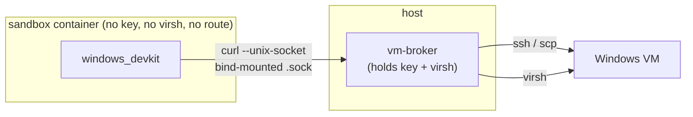

# Opt-in features

## Opt-in features

> [!class2]
> **UI** Shells (skill grants) · Scripts (VM wizard) · **Shells** varies per feature

Beyond the core loop, the engine ships **opt-in features** — capabilities every
fork receives but none has on by default. Each one is the same pair underneath:
a **config block** in the gitignored `.super-coder/instance.json` (enables the
infrastructure — a sidecar container, a host-side broker) and **skill grants**
(`common=0` — the skills ship to every fork's catalogue but auto-grant to no
shell; the grant puts the procedure in the right hands). `./sc feature` is the
front door to the pair:

```bash
./sc feature                 # list the features + the state of both halves
./sc feature enable pg       # grant the skills to the owning flavors + wire the config
./sc feature disable pg      # reverse it (other shells' grants untouched)
```

| Feature | Config block | Skills → flavors | What it gives the fork |
|---|---|---|---|
| **`pg`** | `pg` (auto-created) | `test_authoring_pg` → dev, reviewer · `query_authoring_pg` → dev, reviewer, planner | A `postgres:17` sidecar on `sc-net`, `DATABASE_URL` forwarded into the sandbox — develop + test the fork's **app** against real Postgres (the engine DB stays SQLite, always) — plus the diagnostic-SQL runbook (psql mechanics, dialect traps, read-only handoff scripts) |
| **`windows`** | `vm` (operator-linked) | `windows_devkit` → dev, reviewer · `windows_vm_gui` → dev, reviewer · `configure_winbox` → admin | The Windows Test VM loop — push → exec → capture → reset against a real Windows box, via the host-side broker (next section) — plus UIA-based GUI driving for exploratory QAQC |
| **`tailnet`** | `ts` (operator-linked) | `tailscale` → devops | The tailnet broker — reach declared build/deploy hosts from the sandbox without holding a tailnet credential (section after) |
| **`pm2`** | `pm2` (operator-linked) | `pm2` → admin, devops | The pm2 broker — observe + manage the host's pm2-supervised **app** stack (status, health, logs, scoped restarts) from the sandbox (section after) |
| **`app-deploy`** | — (procedure-only) | `app_deploy_setup` → admin | A deploy-ritual scaffold for the fork's **app** (the engine deploys itself via `sc update`) — the admin fills the template (migration dirs, DB backup, ff-only sync, apply + move migrations, restart) and saves it as the repo's own project-local `deploy` skill, granted to every shell |

`enable pg` is complete in one step — the sidecar needs no host input, so the
block is auto-created and the next `./sc launch` starts it (data persists in a
named volume; `./sc pg-down` stops it, volume retained). `windows`, `tailnet`, and
`pm2` are **link-only**: their blocks carry host-specific, operator-verified
config (a ready VM, a tailnet scope), so `enable` grants the skills and prints
exactly how to link — the sections below are the full setup guides.
`app-deploy` has no config block at all: `enable` grants the scaffold skill to
the admin shell, and the finished product is a **project-local** skill — engine
skills self-heal to the shipped body on every `sc update`, so the fleshed-out
ritual must live under a name the engine doesn't ship.

Everything here can still be done by hand — the GUI's per-shell grant toggles
and a hand-edited `instance.json` are the same mechanisms; `./sc feature` just
makes the pair one visible, one-command surface.

## Windows Test VM (opt-in)

> [!class2]
> **UI** Scripts · **Shells** dev + reviewer (loop) · admin (provision)

A fork that builds Windows software needs to test on **real Windows** —
installers, services, the registry, system-level behavior where Wine is useless.
This is an **opt-in** capability: the engine ships the *orchestration* (a verified
push → exec → capture → reset loop, a **host-side broker** that lets a sandboxed
shell drive the VM without holding the key, and a guided setup card in the Scripts
tab); you bring the *VM* — license, image, and OS install are yours and unreachable
from the tool. It is **link-only**: it assumes a ready VM and captures + validates
the connection to it, rather than building one for you. Off by default; nothing here
touches forks that don't opt in.

> [!class4]
> **Host requirement: Linux + libvirt/KVM only. macOS is not supported yet.** The
> broker, SSH, and unix-socket transport are portable, but `reset`, `capture`, and
> the `domain`/`snapshot`/`transfer` checks are `virsh`/libvirt operations and the
> `push` fast path is a virtio-fs share — none exist on macOS. Mac support means
> swapping the `virsh` layer for a Mac hypervisor's CLI (`prlctl` / `vmrun` /
> `utmctl`) behind a provider switch — the deferred provider-agnostic test-target
> interface — and on Apple Silicon only Windows-on-ARM runs natively, so x86
> installer fidelity is lost. Until then, link a VM from a Linux host.

Config lives under a `vm` key in the gitignored `.super-coder/instance.json` —
**no secrets**, only a key *path* (`ssh_key_path`), never key material. The setup
card runs five live checks against the *candidate* config before you save, so what
gets persisted is verified, not hopeful:

| Check | Proves |
|---|---|
| `domain` | the VM exists and is visible to libvirt |
| `ssh` | key auth + remote exec work |
| `transfer` | artifact transfer works both ways |
| `snapshot` | the named clean snapshot exists for reset |
| `toolchain` | the box is provisioned (`configure_winbox` has run) |

**Setup is a three-role lifecycle, and the ordering *is* the design** — each role
can only act once the previous has:

```linear
User: SSH foothold :::class4 -> Admin: install kit :::class1 -> Snapshot = clean :::class3 -> Dev+Rev: run loop :::class2
```

1. **User (manual, once).** Bring up the VM, enable OpenSSH, authorize the key,
   share a transfer dir. The engine can't reach inside a fresh OS install — this
   bootstrap is irreducible.
2. **Admin — `configure_winbox` (once / on toolchain change).** SSH in, install the
   build toolchain, verify each tool, **then** take the `clean` snapshot.
3. **Dev + reviewer — `windows_devkit` (every test).** push → exec → capture →
   reset against that snapshot.

> [!class4]
> **The one gotcha: provision *before* the snapshot, not after.** The clean snapshot
> is *pristine OS + toolchain*, and every test reverts to it — so the toolchain must
> already be baked in. Bump the toolchain → reinstall → re-snapshot. Provision after
> snapshotting and the first test hits an empty box.

### Set up a Windows test box — step by step

The one-time host setup the link-only design assumes. Everything below runs on the
**host** (libvirt and the key live there); the fork only ever talks to the broker.

**0 · Prereqs.** A Linux host with libvirt/KVM and `virsh`, your user in the
`libvirt` group (so `virsh --connect qemu:///system` works without `sudo`), and a
Windows ISO + license — yours to bring.

**1 · Create the VM and install Windows.** Build a *system-scope* domain (survives
reboots, shared across sessions) with `virt-manager`, or:

```bash
virt-install --connect qemu:///system --name win-test \
  --osinfo win10 --ram 8192 --vcpus 4 --disk size=64 \
  --cdrom /path/to/Windows.iso --network network=default
```

Note the domain name (`win-test`) and the NAT IP it lands on libvirt's `default`
network (e.g. `192.168.122.x`) — you need both for the link.

**2 · Enable OpenSSH + key auth in the guest.** In an elevated PowerShell *inside*
Windows:

```powershell
Add-WindowsCapability -Online -Name OpenSSH.Server~~~~0.0.1.0
Start-Service sshd; Set-Service -Name sshd -StartupType Automatic
```

On the **host**, make a dedicated keypair (the *path* is what goes in the link —
never the key itself):

```bash
ssh-keygen -t ed25519 -f ~/.ssh/sc_win_test -N ''
```

Put `~/.ssh/sc_win_test.pub` into the guest at
`C:\Users\<user>\.ssh\authorized_keys` (standard user) — or, for an **admin** user,
`C:\ProgramData\ssh\administrators_authorized_keys` with its ACL locked to
`Administrators`+`SYSTEM`. The default guest shell is `cmd.exe`; that's what `exec`
runs under. Confirm from the host: `ssh -i ~/.ssh/sc_win_test <user>@<ip> "ver"`.

**3 · Share a transfer dir (host → guest) for `push`.** `push` stages a build
artifact into a host directory the guest can read. Map one in with **virtio-fs**: add
a filesystem device to the domain pointing at your host `transfer_dir`, install the
virtio-fs guest driver (from the `virtio-win` ISO), and mount it to a drive letter.
Same-host only — cross-host `scp` is a later variant.

**4 · Provision the toolchain, then bake `clean` — in that order.** Boot the VM,
install your build kit (the admin `configure_winbox` skill does this **via the
broker** from the fork's committed winget manifest, and verifies exactly what
the manifest installs; or by hand — e.g. `dotnet tool install --global wix`).
Then bake the offline baseline every test reverts to — one command, once the VM
is linked (step 5):

```bash
./sc vm-bake      # graceful shutdown → delete old `clean` → re-bake OFFLINE, guest left off
```

(Equivalent by hand: `virsh shutdown`, then `virsh snapshot-create-as <domain>
clean --description "pristine OS + toolchain"` — the snapshot must be taken
powered off.) Baking is **host-only, deliberately not a broker verb**: the
snapshot is the trust anchor every test reverts to, so the sandbox may run
*against* it but never redefine it — `configure_winbox` provisions + verifies,
then hands you this one command. Re-provisioning later is re-run skill →
re-run `./sc vm-bake` — and nothing "sticks" until it's baked, so never run a
test loop (which reverts) in between.

**5 · Link it.** Fill the `vm` block — via the Scripts → **Windows Test VM** wizard
(it live-tests every field before save) or by hand in `.super-coder/instance.json`:

```json
"vm": {
  "domain": "win-test",
  "ssh_host": "192.168.122.50", "ssh_port": 22, "ssh_user": "tester",
  "ssh_key_path": "~/.ssh/sc_win_test",
  "transfer_dir": "/var/sc/win-xfer",
  "snapshot": "clean",
  "libvirt_uri": "qemu:///system"
}
```

`libvirt_uri` is **optional** — set `qemu:///system` for a system-scope domain (the
default `qemu:///session` can't see it); omit it otherwise.

**6 · Grant the skills + start the broker.** All three skills are engine `common=0` —
they propagate to every fork but **auto-grant to none**. `./sc feature enable windows`
grants them in one step (`windows_devkit` + `windows_vm_gui` → dev + reviewer,
`configure_winbox` → admin); or toggle them per shell in the GUI. The broker comes up
automatically with `./sc launch` when a VM is linked; or drive it directly:

```bash
./sc vm-broker-up            # start in the background (also: auto-started by ./sc launch)
./sc vm-broker-install       # optional: a systemd --user unit, survives logout/reboot
```

A dev shell can now run the loop — `push → exec → capture → reset` — ending each run
with a `reset` that returns to `clean` and powers the VM **off**, so a multi-GB guest
never idles on the host.

### How the broker reaches the sandbox

The piece that makes link-only work *from inside a container*. A fork's shells run in
the **sandbox container**; the VM sits on the host's libvirt NAT. The container has
**no route to it, no `virsh`, and no key** — and must never hold any of those. So it
doesn't touch the VM at all: it calls a small **host-side broker** that does.



- The broker (`./sc vm-broker`) is a **host process** that holds the key path and has
  libvirt access — the one authority that touches the guest or the hypervisor,
  mirroring a credential broker.
- It listens on a **unix socket** in the engine dir
  (`.super-coder/run/vm-broker.sock`). The sandbox bind-mounts the whole repo at the
  *same absolute path* (`-v "$here:$here"`), so that socket file exists identically on
  both sides of the boundary.
- **Unix sockets are filesystem objects, not network-namespace objects** — so a
  process in the container `connect()`s to that socket path and reaches the host
  listener *through the shared mount*. No published port, no route across the NAT, no
  firewall hole, no token: the socket is `chmod 0600`, reachable only by processes
  that share the mount.
- `windows_devkit` simply `curl --unix-socket`s the four verbs. The key never enters
  the fork and `virsh` runs only on the host — a compromised sandbox can *ask* for a
  reset, but cannot script libvirt or read the credential.
- **GUI driving rides the same seam.** `./sc vm-mcp-relay up` opens an
  in-sandbox TCP relay (`127.0.0.1:18000`) tunneled through the broker's
  socket to the guest's Windows-MCP, so `claude mcp add --transport http`
  reaches it from a sandboxed seat — the `windows_vm_gui` skill's UIA-based
  exploratory QAQC runs over this.

Full design: [`.super-coder/docs/windows-test-vm.md`](../.super-coder/docs/windows-test-vm.md) ·
[`.super-coder/docs/windows-vm-broker.md`](../.super-coder/docs/windows-vm-broker.md).

## Tailnet broker (opt-in)

> [!class2]
> **Shells** devops (reach hosts over the tailnet) · **UI** hand-edit the `ts` block (no wizard yet)

Sibling of the Windows VM broker, same shape, different backend: a **host-side
broker over a unix socket** that lets a sandboxed shell drive a **tailnet**
without ever holding a tailnet credential. A fork's shells run bound to
`sc-net`/127.0.0.1 only; a devops shell still needs to reach build/deploy hosts.
Rather than bake `tailscaled` into every fork's image (a reusable node
credential inside the sandbox + `CAP_NET_ADMIN`/`/dev/net/tun` — an isolation
regression), `tailscaled` and the tailnet identity stay on the **host** (already
`tailscale up`, authenticated once) and the broker exposes verbs over a
`chmod 0600` socket in the bind-mounted engine dir. The container `curl`s the
socket and holds nothing — no route, no firewall hole, no token.

One difference from the VM broker: a tailnet has **many** hosts, so the verbs are
parameterized by `{host, command}` and the `ts` block carries a fail-closed
`allowed_hosts` scope — a compromised sandbox can only reach hosts the fork has
declared. Config lives under a `ts` key in the gitignored
`.super-coder/instance.json` (**no secrets** — the host node's identity is the
credential and never leaves the host), coexisting with the `vm` block.
`./sc feature enable tailnet` grants the `tailscale` skill to devops shells;
the `ts` block itself is yours to fill (link-only, like the VM).

```bash
./sc ts-broker-up            # start backgrounded (also auto-started by ./sc launch when a tailnet is linked)
./sc ts-broker-install       # optional: a systemd --user unit, survives logout/reboot
SOCK="$(./sc ts-broker-sock)"
curl -s --unix-socket "$SOCK" http://ts/exec -d '{"host":"build-box","command":"uptime"}'
```

Full design: [`.super-coder/docs/tailscale-broker.md`](../.super-coder/docs/tailscale-broker.md).

## pm2 broker (opt-in)

> [!class2]
> **Shells** admin, devops (observe + manage the host app stack) · **UI** hand-edit the `pm2` block (no wizard yet)

Third sibling of the VM and tailnet brokers, same shape, different backend: a
**host-side broker over a unix socket** that lets a sandboxed shell observe and
manage the host's **pm2-supervised app stack** — the one a host-run
`make deploy` targets. From inside the sandbox there is no `pm2` binary and no
route to the host's `127.0.0.1`-bound ports, so without this the live-app half
of a deploy audit degrades to "ask the human to run `make status`". The broker
runs pm2 and curls the app's health URL **where they work — on the host** — and
exposes narrow verbs over a `chmod 0600` socket in the bind-mounted engine dir.

Every verb — even `status` — is fail-closed on the `pm2` block's `processes`
allowlist: the sandbox sees and bounces only what the fork declared, never the
host's full process table. `restart` (the deploy verb — it heals) rides the
allowlist alone; `stop`/`start` (an outage surface) additionally need
`"allow_lifecycle": true`; `delete` is not a verb at all. Config lives under a
`pm2` key in the gitignored `.super-coder/instance.json` (**no secrets**),
coexisting with the `vm`/`ts` blocks. `./sc feature enable pm2` grants the
`pm2` skill to admin + devops shells; the block itself is yours to fill
(link-only, like the VM and the tailnet).

```bash
./sc pm2-broker-up           # start backgrounded (also auto-started by ./sc launch when a stack is linked)
./sc pm2-broker-install      # optional: a systemd --user unit, survives logout/reboot
SOCK="$(./sc pm2-broker-sock)"
curl -s --unix-socket "$SOCK" http://pm2/status
curl -s --unix-socket "$SOCK" http://pm2/restart -d '{"proc":"myapp-api"}'
```

Full design: [`.super-coder/docs/pm2-broker.md`](../.super-coder/docs/pm2-broker.md).

## db broker (opt-in)

> [!class2]
> **Shells** dev · reviewer · planner (diagnostic reads) · **UI** `./sc db-init` scaffolds the `db` block (no wizard)

Fourth sibling, same shape, different backend: a **host-side broker over a unix
socket** for **read-only diagnostic reads of the fork's live app Postgres** —
without handing the sandbox a DSN or a network route. The sandbox's own pg
sidecar is deliberately empty (it's the dev/test target), so the live DB —
where the runtime telemetry that *confirms* a diagnosis lives — is unreachable
from inside; the cruder fixes (mount the DSN, open a route) both widen the
blast radius. Instead the DSN and the route stay host-side and the sandbox
gets one narrow verb.

Read-only is **enforced twice**: the DSN must be a read-only Postgres role
(the DB-enforced backstop; the broker also connects
`default_transaction_read_only=on`), and the broker rejects anything that
isn't a single `SELECT`/`WITH` before `psql` ever runs. Table scoping is
fail-closed on the `db` block's `allow_tables` (default: ops/telemetry only —
content/tenant tables are added only by explicit operator scope), every query
gets a row cap + statement timeout, and every call lands in an audit log. The
block carries **no secret** — it names an env var (`dsn_env`), which the
broker resolves host-side at query time; `instance.json` stays
sandbox-readable and safe.

```bash
./sc db-init                 # scaffold the "db" block + print the one-time host steps (RO role, GRANTs, export the DSN)
./sc db-broker-up            # start backgrounded (also auto-started by ./sc launch when a db is linked)
./sc db-broker-install       # optional: a systemd --user unit (its EnvironmentFile carries the DSN var)
SOCK="$(./sc db-broker-sock)"
curl -s --unix-socket "$SOCK" http://db/query -d '{"sql":"SELECT count(*) FROM skill_runs"}'
```

Unlike the other three, this one isn't a `./sc feature` entry — `./sc db-init`
plus the host steps it prints are the whole setup. Full design:
[`.super-coder/docs/db-broker.md`](../.super-coder/docs/db-broker.md).

> [!class2]
> **Reboot-proof it all in one verb.** Every host-side daemon — the GitHub watch daemon and the four brokers — has a `-install` verb (a systemd `--user` unit). `./sc persist` runs them all in one pass: installs + enables every unit that applies to this fork (the watch daemon when `gh` is present; each broker when its block is linked), enables linger so they survive logout and reboot, and skips the rest with a reason. Idempotent — re-run any time.
