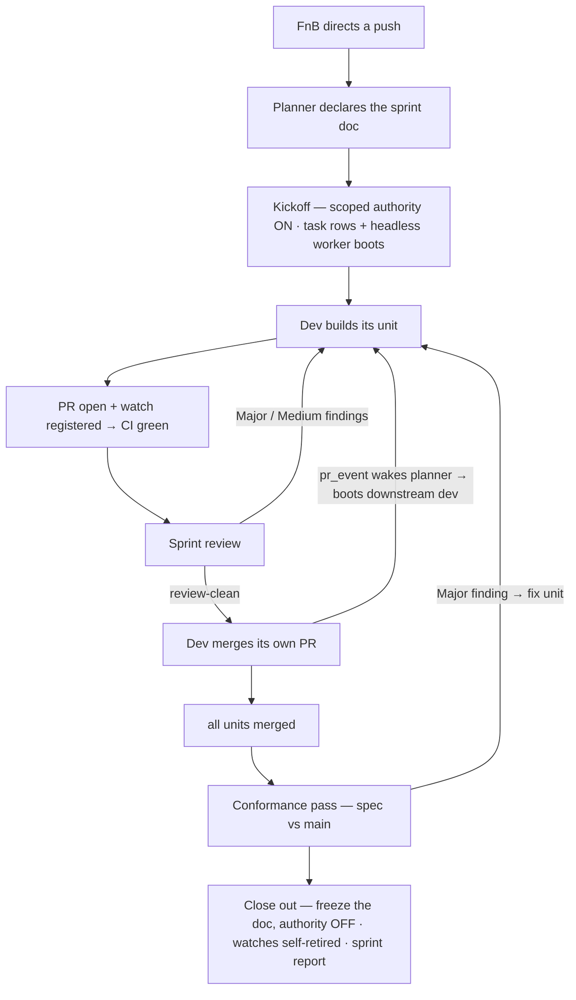

# Sprints

## Sprints

> [!class2]
> **UI** Docs · **Shells** planner governs (`sprint_orchestration`) · devs build + reviewers gate (`sprint`)

The everyday loop ships one feature through one dev, with the operator merging.
A **sprint** is the multi-shell mode: a declared, planner-governed push where
several shells build **dependent units** — B builds on A, C on B — and run the
handoffs themselves. Every unit is built, reviewed, fixed, and **merged by the
shells**: the loop is planner → devs → reviewers → devs → planner, self-running
what the operator used to orchestrate by hand. You declare *that* a sprint
happens; the planner makes it run.

> [!class4]
> **Prerequisite: a planned, spec'd feature.** A sprint doesn't start from an
> idea — it starts from a thorough, multi-step feature already worked out with
> the planner: recommendation, feature design, and the specs (usually more than
> one) the units are cut from. Then start a **fresh session** and declare the
> sprint — planning and sprinting don't share a chat.

```linear
Recommendation :::class3 -> Design feature + specs :::class3 -> New session :::class4 -> Sprint :::class1
```

```linear
Declare :::class1 -> Kick off :::class1 -> Build :::class2 -> Review :::class3 -> Merge :::class2 -> Hand off :::class2 -> Close out :::class1
```



| Slot | Skill | Owns |
|---|---|---|
| **planner** | `sprint_orchestration` | decompose into units · sequence the chain · declare the board · kick off · monitor · unblock stalls · conformance pass + rulings · close out + synthesized report |
| **dev** | `sprint` | build its unit · PR · babysit CI · fix review findings · merge on green+clean · file its unit report · hand off downstream |
| **reviewer** | `sprint` | gate assigned units — Major/Medium block, Low goes to the report · declare `review-clean` |
| **conformance** | `sprint` | judge the spec against `main` pre-freeze — four-way verdicts filed as a `CONFORMANCE:` doc · verdicts, never rulings |

- **The sprint doc is the board — one writer.** The declaration is a
  `documents` row (`SPRINT: <title>`, visible in the Docs tab): status line
  (`ACTIVE | CLOSED`) plus one table row per unit — `seq · unit · shell ·
  reviewer · depends on · branch · pr · status`. Unit status walks
  `waiting → building → pr-open → in-review → fixing → merged`. The planner is
  the doc's **only writer**; participants report transitions by message and the
  planner folds them in. One writer, one board, no drift — the board is what
  the operator and any rebooted shell reads to re-orient mid-sprint.
- **Crew size is the planner's call, not a formula.** The planner weighs the
  magnitude of the push against the capacity actually available — the shells
  that exist, reviewer bandwidth, how wide the dependency graph genuinely
  runs. More units than shells is fine (units queue behind the chain); more
  shells than parallel work is waste. One reviewer may gate several units —
  it just mustn't become the whole sprint's bottleneck.
- **Scoped merge authority.** Merging stays the operator's gate everywhere —
  a sprint grants the one narrow exception. A dev may merge **only** its
  assigned unit's PR, **only** on all-green checks, **only** after its reviewer
  declared review-clean (every Major/Medium fixed), **only** while the doc says
  `ACTIVE` and isn't frozen. Anything outside those four conditions is the
  default gate, unchanged — and the authority dies when the sprint closes.
- **Events wake shells — nobody polls on a schedule.** A sprint is mostly
  waiting for someone else's PR, and idle waiting used to cost a full-context
  harness turn per poll, per shell. Now every instruction and result is a
  typed `shell_messages` row: the planner sends `task` rows and boots workers
  headless; a dev opens its PR and registers a watch for the planner; the
  fork's ONE GitHub watcher daemon turns CI conclusions, reviews, and merges
  into `pr_event` rows; the planner's zero-token inbox watcher wakes it the
  moment any row lands. Waking is not knowing: on wake a shell re-reads the
  board and its inbox — the event only says "look". The pieces and their
  commands are *Under the hood — the event loop*, below.
- **Models are declared per sprint.** Headless boots never pass the launch
  picker, so the model seam moves to the declaration: the planner asks the
  operator exactly two questions — which harness/model for **devs**, which
  for **reviewers** — and the answers ride the sprint doc's `models:` line
  into every `./sc run` of the sprint (see *Harnesses & models · The sprint
  interview*). No answer → `flavor_defaults`, unchanged. Cross-provider is
  first-class: devs on one harness, reviewers on another.
- **Ambiguities are called, then reported.** A dev that hits a spec ambiguity
  mid-unit makes the judgment call and keeps building — the chain doesn't wait
  for a ruling — and reports the call to the planner in one line (what was
  open, what it chose, why). The planner may overrule while the unit is
  un-merged; silence ratifies. Every call lands in the sprint report.
- **Review runs at sprint pace.** Same adversarial method as the everyday
  loop, different gate: **Major/Medium findings block** the merge and loop the
  dev through `fixing`; **Low findings inform** — one summary note to the
  planner, landing in the sprint report as the post-sprint cleanup list.
  Reviewers hand findings to the dev directly (scoped, like the merge
  authority) instead of routing through the operator.
- **Every merge closes with a unit report.** A dev's merged-notification is
  a structured result row — `shipped / judgements / issues / deviations /
  follow-ups` — filed at merge, while the unit's history is still in the
  worker's context. `deviations` is the honesty field: declared here it's a
  judgement to ratify; found later by the conformance pass it's a finding.
- **A conformance pass gates the close.** "All units merged" and "the spec
  shipped" are different claims — unit reviewers gate diffs, nobody else
  reads the integrated whole. So after the last merge, **before** the freeze,
  the planner boots review shell(s) to judge the spec against `main`: every
  requirement gets one of four verdicts — `as-specced`,
  `deviated-intentionally` (matches a ratified call), `deviated-silently`,
  `unimplemented`. Major findings become fix units under still-active sprint
  authority; Medium is a planner ruling; Low never holds the close. The
  design is [`specs_sc/sprint-reporting.md`](../specs_sc/sprint-reporting.md).
- **Close-out revokes everything, then reports.** Conformance rulings settled
  → the planner sets `CLOSED`, freezes the doc (freezing **is** the
  revocation — it's exactly what the `sprint` skill checks before any merge),
  verifies every PR watch retired itself (`./sc watch list`), and
  **synthesizes the sprint report** from the unit reports and the conformance
  doc reconciled against each other — fixed skeleton: Verdict · Units
  Shipped · Judgements Made · Spec Accuracy · Issues Encountered · Deferred &
  Follow-ups · Spec Debt · Metrics — filed as a doc row and dropped as a copy
  in the fork's `shared/` dir, with the `CONFORMANCE:` doc alongside as the
  evidence trail.

Enforcement is advisory in v1 — merge order and authority live in the skill
text and the board, not in a pre-commit check. The planner absorbs mechanics
(re-sequencing, stalls, severity disputes, booting workers — `./sc run` is
the nudge that replaces "is it alive?"), and escalates judgment: scope cuts
and interface changes stay the operator's calls. The daemon never boots
anything — it only writes rows; only the planner (or the operator) starts a
session.

### Under the hood — the event loop

Five pieces carry a sprint's coordination, one direction of flow. The frozen
design is [`specs_sc/sprint-eventing.md`](../specs_sc/sprint-eventing.md).

- **Typed messages.** Every `shell_messages` row carries a `kind`: `shell`
  (ordinary shell-to-shell mail, the default), `task` (planner → worker
  instruction), `result` (worker → planner completion report), `pr_event`
  (daemon → shell GitHub transition). The sprint trail is one query, and a
  rebooted planner — or the operator — can replay the whole coordination
  history from the table alone.
- **One watcher daemon per fork.** `./sc watch pr <owner/repo> <n>
  --shell <shortname>` registers a PR in the `watched_prs` registry (the
  `sprint` skill does it in the same step that opens the PR). The daemon —
  supervised by `./sc launch` / `./sc down` like the brokers — covers every
  live watch with one batched GraphQL poll and turns transitions (checks
  concluded, review submitted, merged, closed) into one-line `pr_event`
  rows: the message is the wake-up, not the payload. On merge/close a watch
  retires itself (a merge whose checks are still pending keeps its watch until
  they conclude); `./sc watch list` shows what's live. Each cycle the daemon
  also beats a heartbeat row, so `list` / `pr` can say whether anybody is
  actually polling — a watch can no longer report live with the daemon down.
  The daemon only ever writes rows — it never boots shells and never touches
  git.
- **Headless workers.** `./sc run <shortname> [-p "<prompt>"]
  [--harness <h>] [-m <model>]` boots a shell non-interactively: the same
  render as `./sc enter`, then a per-harness adapter — `claude -p` ·
  `codex exec` · `opencode run`. The default prompt is *"Check your inbox
  and act on your unread messages."* Harness + model resolve explicit flags
  → the sprint doc's `models:` line → `flavor_defaults`; a liveness guard
  refuses a shell that already has a live session — and classifies sessions
  that outlived their terminal as *orphaned*, so a dead boot is a labeled
  fact, not a silent block. Workers become
  ephemeral, per-task sessions — boot fresh, act, report a `result` row,
  exit — so no worker context accretes across the sprint, while memory,
  archives, and messages accrete in the DB exactly as in an interactive
  session.
- **A zero-token wake for the planner.** `./sc watch inbox` blocks until a
  message row lands, then exits — armed as a background task, its exit
  wakes the live planner session the moment anything arrives, at zero token
  cost while idle. Claude-harness only; on other harnesses the planner
  keeps the task-boundary inbox check, so correctness is identical and only
  wake latency degrades.
- **Session-surviving jobs.** `./sc job start [--label <slug>] [--timeout <s>]
  -- <cmd>` runs long local work — a suite, a bench, a build — as a detached,
  supervised one-shot that **outlives the session that started it** (a harness
  background task is session-scoped and dies with a headless boot, silently).
  Completion lands as a `result` row in the starting shell's own inbox — the
  same wake path PR events ride — and `--timeout` group-kills a wedged run
  into a bounded failure *with* a wake-up, never a silent hole. `list` /
  `status` / `tail` / `kill` complete the set; `./sc job wait <id>` is the
  bounded foreground slice (≤ 550 s; exit 2 = still running — drain your inbox
  between slices). Full doc: [`docs_sc/job-runner.md`](../docs_sc/job-runner.md).

```linear
Planner sends task row :::class1 -> sc run dev (headless) :::class2 -> Dev builds, opens PR + watch :::class2 -> CI concludes :::class3 -> Daemon writes pr_event :::class3 -> Watcher wakes planner :::class1 -> Planner boots next unit :::class1
```

The bar the feature shipped against: a unit goes task → build → PR → green →
review → merge with **zero scheduled polling by any shell** — the planner is
woken by rows, workers are booted per task, and the full history replays
from `shell_messages`.
