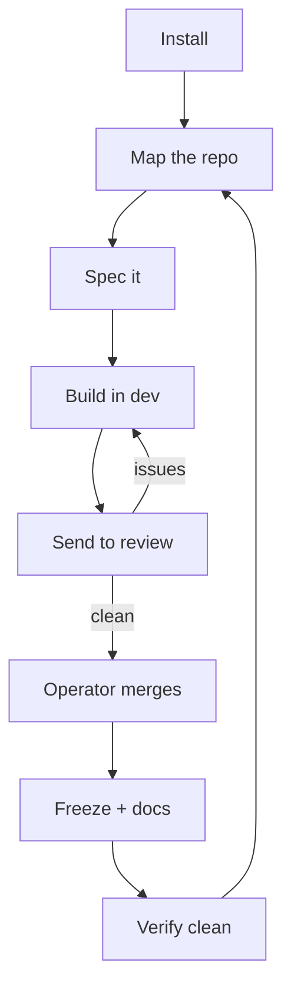

# The loop

## The loop

> [!class2]
> **UI** Roadmap → Flags → Docs → Worktrees → Map · **Shells** cartographer · planner · dev · reviewer · admin

The everyday cycle a fork runs once it's installed. Each step is owned by a
**shell flavor**, and the work is done by the **skills** that flavor is granted
(its flavor also sets its model defaults — see *Harnesses & models*). You move
between flavors with `./sc enter-<shortname>`. Every flavor carries a common kit
— `git`, `db_map`, `memory`, `messaging`, `snapshot`, `surface_catalogue`,
`bootstrap` — so only the *flavor-specific* skills are called out per step below.

```linear
Install :::class1 -> Map :::class2 -> Spec :::class1 -> Build :::class1 -> Review :::class2 -> Freeze :::class3 -> Verify :::class3
```



Each flavor's flavor-specific skills (on top of that common kit) and the steps
it owns:

| Flavor | Flavor skills | Owns |
|---|---|---|
| **cartographer** | `cartographer` | map · re-map |
| **planner** | `docs` · `blueprint` · `flags` · `api-design` · `onboard` | spec doc · approach · freeze + docs |
| **dev** | `spec` · `dev_kit` · `test_authoring` · `database-migrations` · `redline_review` · `docs` · `flags` | break into tasks · implement · patch + test |
| **reviewer** | `test_authoring` · `database-migrations` · `redline_review` · `api-design` · `flags` | review |
| **admin** | `git_cleanup` · `self_update` · `migration_management` · `local_skill_management` | engine · verify-clean |

1. **Install** — `./sc install` seeds your **starting team**: a `planner` (your
   primary), two `dev`, a `reviewer`, the `admin` that owns `main` + the engine,
   and the singleton `cartographer`. *(admin · `self_update`, `migration_management` · UI: Shells)*
2. **Map the repo** — the cartographer configures the index once with
   `./sc map-setup`, then `./sc map` builds it; git hooks re-map on every pull.
   It's infrastructure working shells *read* via `surface_catalogue`.
   *(cartographer · `cartographer` · UI: Map)*
3. **Spec it** — the **planner** authors a spec document against a roadmap
   feature — viability, blockers, the done-condition. `blueprint` shapes the
   approach in a single session (no DB writes); both the spec and the docs ride
   the `docs` skill. *(planner · `docs`, `blueprint`, `flags` · UI: Roadmap)*
4. **Switch to dev** — `./sc enter-dev` boots the **dev** shell into its own git
   worktree on `shell/dev`, a base pinned to `origin/main`.
   *(dev · `bootstrap`, `memory` · UI: Shells)*
5. **Break it into tasks** — dev reads the spec and uses `spec` to decompose it
   into `spec_tasks` (Preparation → steps → Verification), then works one task
   per session. `memory` rolls `current_state` ("last / next task") so sessions
   resume cleanly. *(dev · `spec`, `memory` · UI: Roadmap)*
6. **Implement** — within each task, dev cuts a feature branch off `shell/dev`,
   writes code, schema, and tests, and runs `./sc test`.
   *(dev · `dev_kit`, `test_authoring`, `database-migrations`, `redline_review`, `git` · UI: Shells)*
7. **Send to review** — dev pushes and opens a PR (the `git` skill is
   branch → commit → push → **PR → stop**; dev never merges), then messages the
   reviewer. *(dev · `git`, `messaging` · UI: Flags)*
8. **Review, send back** — the **reviewer** (a *different lineage* than the code
   — defaults to Opus — so it isn't blind to the author's mistakes) reads the diff
   against the spec through its review lenses, opens flags for failures, and
   messages dev back. *(reviewer · `test_authoring`, `database-migrations`, `api-design`, `flags`, `messaging` · UI: Flags)*
9. **Patch + test** — dev addresses the flags, re-runs `./sc test`, and
   re-pushes; the thread closes when it's clean.
   *(dev · `dev_kit`, `test_authoring`, `flags`, `git` · UI: Flags)*
10. **Operator merges** — merging is the FnB's gate, never a shell's (the one
    scoped exception is a declared sprint — see *Sprints*). On dev's next boot
    the launcher auto-syncs the base onto `origin/main` and prunes the merged
    branch. *(operator gate; no shell skill · UI: Worktrees)*
11. **Freeze spec + write docs** — on ship, the spec freezes (`frozen=1`,
    immutable; the next stage opens a fresh `seq`) and the feature doc is authored
    — both via `docs`. `snapshot` + `./sc render` write read-only `specs_sc/` +
    `docs_sc/`. *(planner / dev · `docs`, `snapshot` · UI: Docs)*
12. **Verify git trees clean** — the admin's `git_cleanup` triages every worktree
    (clean trees, prunable merged branches, preserved work); `./sc render-check`
    (committed `_sc` must match the DB render) and `./sc verify` (rebuild +
    headless boot) are the operator-run proofs.
    *(admin · `git_cleanup`, `snapshot` · UI: Worktrees)*
13. **Re-map** — the cartographer re-runs (auto on pull, or `./sc map`) so the
    index reflects the new shape — and the loop turns to the next feature.
    *(cartographer · `cartographer` · UI: Map)*


