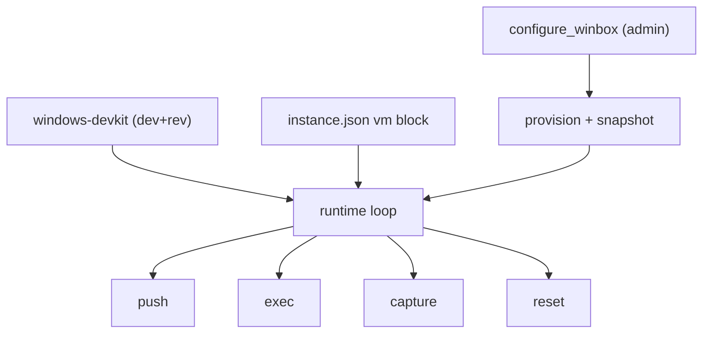

# Windows Test VM — Opt-in Capability

## Overview

A super-coder fork that builds Windows software needs to test on **real Windows** — installers, services, registry, system-level behavior, where Wine is useless. This design adds an **opt-in capability** that links a fork to a Windows VM the operator already runs on their own box, gives the shell a verified push/exec/capture/reset loop against it, and exposes a guided setup modal in the Scripts tab.

The engine ships the *orchestration*; the operator brings the *VM* (license, image, OS install are theirs — unreachable from the tool).

> [!class1]
> The product is **verified config**, not stored strings. The modal's value is that every field is live-tested — `can I see the domain, SSH in, run a command, read the transfer dir, revert the snapshot` — before it is saved.

> [!class4]
> **Scope boundary:** super-coder cannot create the VM. Installing the guest OS, enabling OpenSSH inside Windows, and building the clean snapshot are manual, host-side, and outside what a web modal can reach. This design is **link-only** — it assumes a ready VM and captures + validates the connection to it.

## Decisions

Two design forks, both settled:

| Question | Decision | Consequence |
|---|---|---|
| Test target | Installers / system-level | Real Windows VM mandatory; Wine dropped — no fidelity for MSI/services/registry |
| Fidelity need | High-fidelity, pre-merge | A gated validation loop, not a per-iteration smoke test |
| Config scope | **Per-fork**, per-shell grant | One VM config per install; the capability grant decides which shells may use it |
| Wizard scope | **Link-only** | Assume a ready VM (SSH + snapshot exist). Capture + validate only — no prereqs automation |
| Skill + assignment | **`windows-devkit`**, engine `common=0`, granted to **dev + reviewer** | Reusable across forks; explicit per-fork grant, not in the base flavor arrays |
| Provisioning | Admin shell via **`configure_winbox`** (engine `common=0`) — **winget** + fork-committed manifest | Toolchain is defined-as-code; installed *before* the clean snapshot so reverts preserve it |

The per-fork decision removes the need for any schema change: the VM is a host resource, so its config lives in the fork-level config file, not on the `shells` table.

## Architecture

Three independent layers — a per-shell *gate*, a per-fork *config*, and a runtime *loop*:



- **Provision** — admin's `configure_winbox` installs the toolchain and bakes the clean snapshot, once.
- **Gate** — reuses the existing `common=0` opt-in grant model. No new mechanism.
- **Config** — one JSON block per fork. No secrets in it.
- **Loop** — `windows-devkit` drives the four verbs against the linked VM.

## Capability gate

The capability is delivered as **two role-split skills**, both authored in the **engine catalogue** (`assets/skills/*/SKILL.md`, `common=0`) so they propagate to every fork but auto-grant to none. Neither is added to the base flavor arrays — that would foist Windows skills on forks that build nothing for Windows. Both are **granted explicitly, per-fork**, to the shells that need them.

| Skill | Granted to | Does |
|---|---|---|
| **`configure_winbox`** | **admin** | provisions the box (winget toolchain) + bakes the clean snapshot. Sibling to `self_update`/`migration_management`. |
| **`windows-devkit`** | **dev + reviewer** | drives the test loop. Devs build + test; the reviewer verifies. Same dual-role pattern as `test_authoring`. |

- **Grant:** explicit `shell_skills` insert (or the `PUT /api/shells/{id}/skills/{skill_id}` toggle), then snapshot to persist fork-local.
- Config is fork-wide; **who may use it is per-shell**. Configure the VM once, grant each skill to the shells that should hold it.

## Setup lifecycle

Three roles, in order — each can only act once the previous has. The ordering *is* the design.

```linear
User: SSH foothold :::class4 -> Admin: install kit :::class1 -> Snapshot = clean :::class3 -> Dev+Rev: run loop :::class2
```

1. **User (manual, once).** Install Windows, enable OpenSSH, authorize the key. The engine cannot reach inside a fresh OS install — this is the irreducible bootstrap.
2. **Admin — `configure_winbox` (once / on toolchain change).** SSH in, **winget**-install the MSI toolchain from a fork-committed manifest, verify each tool, then take the `clean` snapshot.
3. **Dev + reviewer — `windows-devkit` (every test).** push → exec → capture → reset against that snapshot.

> [!class4]
> **`configure_winbox` runs before the snapshot, not after.** The clean snapshot is *pristine OS + toolchain*; every test reverts to it, so the toolchain must be baked in. Bump the toolchain → re-run `configure_winbox` → re-snapshot. Provision after snapshotting and the first test hits an empty box.

The manifest (a `winget` export — WiX, .NET SDK, MSBuild for dos-arch) is committed in the fork at a known path and rides snapshot/render. `configure_winbox` supplies the *mechanism* (ssh in, `winget import`, verify); the fork supplies the *package list* — so the skill stays generic across forks.

## Config

Lives in the existing fork-level `instance.json` (where the port is already persisted) under a `vm` key. **No schema migration, no `connections` un-retire, no `SHELL_EDITABLE` plumbing.**

```json
{
  "vm": {
    "domain": "win-test",
    "ssh_host": "127.0.0.1",
    "ssh_port": 22,
    "ssh_user": "tester",
    "ssh_key_path": "~/.ssh/sc_win_test",
    "transfer_dir": "/var/sc/win-xfer",
    "snapshot": "clean"
  }
}
```

| Field | Meaning |
|---|---|
| `domain` | libvirt domain name (`virsh` target) |
| `ssh_host` / `ssh_port` / `ssh_user` | how to reach the guest's OpenSSH |
| `ssh_key_path` | **path** to the private key — never the key itself |
| `transfer_dir` | host-side dir the guest sees (virtio-fs share) or scp target |
| `snapshot` | named clean snapshot to revert to between runs |

> [!class3]
> **Secrets posture matches the rest of the engine.** Super-coder stores zero credentials in the DB or on disk today — harness keys live in operator home, git uses the SSH agent. The `vm` block holds a key *path*, never key material. The wizard can generate a keypair into operator home and show the **public** key to install in the guest's `authorized_keys`; the DB/config never sees the private half.

## API

Three small routes, added to the existing stdlib `http.server` handler (no FastAPI). All bound to localhost, same as the rest of the surface.

| Method | Path | Role |
|---|---|---|
| `GET` | `/api/vm` | read the current `vm` block |
| `PUT` | `/api/vm` | write the block to `instance.json` |
| `POST` | `/api/vm/validate/{check}` | run one live check against the **candidate config in the request body** |

The validate route takes the in-progress config in the POST body, so the operator can **test before save**. It mirrors the existing `run_script` pattern: run a real command host-side, return `{ok, output}`, stream to the modal's `<pre>`. The `toolchain` check is a verify-only probe — it confirms `configure_winbox` has run; it never installs.

### The five checks

```linear
domain :::class1 -> ssh :::class2 -> transfer :::class3 -> snapshot :::class4 -> toolchain :::class1
```

| Check | Command | Proves |
|---|---|---|
| `domain` | `virsh dominfo <domain>` | the VM exists and is visible to libvirt |
| `ssh` | `ssh -i <key> <user>@<host> echo ok` | auth + remote exec work |
| `transfer` | write + read back a file in `transfer_dir` | artifact transfer works both ways |
| `snapshot` | `virsh snapshot-list <domain>` | the named clean snapshot exists for reset |
| `toolchain` | `dotnet --version` / `where wix` over SSH | the box is provisioned — `configure_winbox` has run |

## Wizard / UI

A **Windows Test VM** card in the Scripts tab opens a single `openModal()` (the house pattern — vanilla JS, `el()` helper, no framework). Link-only means no multi-step flow is needed:

```linear
Fill fields :::class1 -> Run checks :::class2 -> Green :::class3 -> Save :::class4
```

- **Form** — the seven fields above, built with `el()`.
- **Validate panel** — a "Run all" button fires the five checks; each renders green/red plus its output into a `<pre>`, exactly like the Scripts tab's run-output block.
- **Requirements note** — a short static line: *your VM must already have OpenSSH, a clean snapshot, the transfer dir, and the toolchain installed (admin's `configure_winbox`).* (No detection — that's the prereqs wizard, explicitly out of scope.)
- **Save** — `PUT /api/vm` persists to `instance.json`.

## The skill

`windows-devkit` reads `instance.json.vm`, then runs the high-fidelity, installer-grade loop. Dev shells use the full loop to build and test; the reviewer uses **exec → capture → reset** to independently verify a candidate build during review:

| Verb | How |
|---|---|
| **push** | drop the build artifact into `transfer_dir` (virtio-fs share or scp) |
| **exec** | `ssh` into the guest, run the installer / test command |
| **capture** | collect stdout + exit code; `virsh screenshot` for installer GUI state |
| **reset** | `virsh snapshot-revert <domain> <snapshot>` back to clean |

Every run starts from the clean snapshot, so installer side-effects never leak between runs — the property that makes system-level testing trustworthy.

## First consumer: dos-arch

dos-arch is the proving-ground fork and the immediate need. Wiring it on this box, once the engine feature lands:

1. Grant `windows-devkit` to `Arch-dev-01` (2), `Arch-dev-02` (5), `Arch-review-01` (3); grant `configure_winbox` to `Arch-Admin` (6). Snapshot to persist fork-local.
2. User: confirm the Windows VM under VMM has OpenSSH + key auth and a transfer dir.
3. Generate `~/.ssh/sc_win_test`, install the pubkey in the guest.
4. Admin runs `configure_winbox` → winget-installs WiX + .NET SDK + MSBuild from the dos-arch manifest, verifies, takes the `clean` snapshot.
5. Fill the wizard, run the five checks green, save.
6. dos-arch's two devs and reviewer now have a verified Windows build/test/verify loop.

This is the second thread of the original ask — *actually testing dos-arch on this box* — riding on the engine feature as its first real use.

## Out of scope

Deliberately deferred — named so the build stays small and nothing is silently dropped:

| Deferred | Why later |
|---|---|
| Wine tier-1 smoke | Dropped for this target (installers/system-level) — no fidelity. Revisit only if a fork tests CLI binaries |
| Prereqs wizard | The guest-side automation (install OpenSSH, build snapshot, mount share) the modal can't reach. Link-only for now |
| Remote VM (scp-only) | Assumes the VM is on the same host as the build (virtio-fs share). Cross-host is a later provider variant |
| Multiple VMs / matrix | One VM per fork. Multi-target testing is a future generalization |
| Generic test-target interface | The broader super-coder win — pluggable providers (VM, container, device) behind one interface. Windows-via-VM is provider #1; abstract once there's a second |
