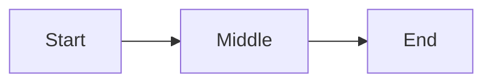

# docs

Author or review docs & specs in super-coder. The DB owns the body (documents table); roadmap tracks specs (the dev cycle), the Docs tab holds docs. Use whenever asked for a doc, spec, report, design, RFC, ADR, runbook, or to edit existing ones.

**Category:** substrate

---

# docs — author & review documents

In super-coder the **DB owns document bodies** — never loose `.md` files. A
`documents` row is the source; `./sc render` writes the read-only flat copy to
`specs_sc/` / `docs_sc/`, and the GUI opens it rendered in md-converter.

| kind | lives on | meaning |
|---|---|---|
| `spec` | the **Roadmap** (the dev cycle) | a working spec for a feature; a feature can hold several at once; **freezes on ship** |
| `doc` | the **Docs** tab | documentation; not part of the spec lifecycle |

`<self>` = your shell_id.

## One feature, many specs

A feature (the `roadmap` row) is the umbrella, and it exists from `brainstorm`
onward — before any spec is written. **Specs hang off the feature, not off each
other:** a feature can hold several unfrozen specs at once (the working pile),
each a `documents (kind='spec')` row, ordered by `seq`. There are no
feature-to-feature links and no second roadmap row for related work — related
work is just another spec under the same feature.

A spec stays unfrozen until it ships; freeze is the ship-time record of what we
built to, and it never gates the feature's other specs. So at any moment a
feature's specs are in one of three states:

| state | how to tell | meaning |
|---|---|---|
| **shipped** | `frozen = 1` | delivered; immutable record |
| **active** | unfrozen **and** has rows in `spec_tasks` | the spec being built now |
| **backlog** | unfrozen, no task plan yet | the pile, ordered by `seq` |

The **doc** (`kind='doc'`) is the feature's readable face — write it when the
first spec ships, under the same `feature_id`. It is a sibling of the specs, not
a parent they point at.

## Review first

Before writing, see what exists — don't duplicate:
```sql
SELECT document_id, feature_id, kind, seq, title, frozen FROM documents ORDER BY feature_id, kind, seq;  -- shell_db.db
sqlite3 .sc-state/map.db "SELECT path FROM dr_filepath WHERE role='doc';"  -- repo's own docs (map db)
```

## Author

Write through `./sc mem doc add` — it guards the engine DB, `--body-file` reads
the markdown from a file (no shell-escaping a long body), `--seq` auto-increments
within `(feature, kind)`, and it renders + snapshots for you:
```
# a doc against a feature (kind='doc'); DB owns the body:
./sc mem doc add "…" --kind doc --feature <id> --body-file ./draft.md --render-path docs_sc/….md

# a feature's next spec stage (kind='spec'); seq auto-advances:
./sc mem doc add "…" --kind spec --feature <id> --body-file ./draft.md --render-path specs_sc/….md
```

## Freeze on ship

Freeze only at ship — it records what we built to, immutable thereafter. The
feature's other specs stay unfrozen and unaffected; never edit a frozen one (open
a new spec under the same feature instead):
```
./sc mem doc freeze <document_id>
```
The GUI and the render layer both refuse edits to frozen docs.

## View

Open any doc rendered: the GUI's "open in md-converter ↗" (Roadmap card or Docs
tab) — the body rides in the URL, no upload. For long-form authoring, write the
markdown to the `body` and let the render + md-converter handle presentation.

---

# Authoring format (themed-markdown)

The `body` you write **is** themed-markdown — the format md-converter renders.
**Your job is structure; styling is the renderer's job.** Never write visual
instructions (colors, fonts, sizes, themes). Apply the four semantic classes;
the theme picks the actual colors.

Use **only** the constructs below. Anything else either drops silently or breaks
the render.

`req` = required · `opt` = optional · `≤N` = soft character cap (over-cap wraps
awkwardly or overflows a fixed UI slot).

## Frontmatter

Author these in the body's frontmatter:

```
---
title: Document Title
tags: [tag1, tag2]
date: YYYY-MM-DD
project: Project Name
purpose: Brief description
---
```

| Field | Status | Cap |
|---|---|---|
| `title` | req | ≤40 |
| `tags` | req (YAML list; `[]` ok) | — |
| `date` | opt | `YYYY-MM-DD` |
| `project` | opt | ≤40 |
| `purpose` | opt | ≤40 |

`date`/`project`/`purpose` → footer meta cards. **`./sc render` injects
`feature`, `roadmap_status`, `frozen`, `rendered_by`, `source` on top of these
— don't write those yourself.** Never use comma-separated tags (`tags: a, b`);
always a YAML list.

## Structure

| Syntax | Role | Cap |
|---|---|---|
| `# Title` | doc title (opt; falls back to `frontmatter.title`) | — |
| `## Section` | sidebar tab | ≤28 |
| `### Heading` | subsection → `<h3>` | ≤80 |

H4–H6 ⛔.

**Tab rule:** every H2 = one tab. Content between two H2s belongs to the first.
Content between H1 and the first H2 is **silently dropped** — put intro under an
H2 (e.g. "Overview"). Single-section docs may omit H2s (whole doc = one tab).

**Doc scale:** the app renders every section up-front and re-renders every
Mermaid on each tab switch. Aim for ≤25 sections and ≤15 Mermaid diagrams; split
larger material.

## Inline · lists · tables · images · code

- Inline: `**bold**` · `*italic*` · `~~strike~~` · `` `code` `` · `[text](url)`
- Lists: `-` unordered · `1.` ordered · `- [ ]` / `- [x]` tasks
- Tables: standard GFM pipe tables
- Images: `` — absolute URLs only, descriptive alt
- Code: fenced with a language hint (```` ```python ````)

## Color classes

`class1`–`class4`, available on callouts, stat cards, mermaid nodes, and linear
steps. **You choose which class fits each piece by meaning** — the theme decides
the color. Keep one class per semantic role across the doc (e.g. `class1` =
primary, `class2` = supporting, `class3` = positive/done, `class4` =
caution/warning). Consistency > specific choice.

## Callouts

```
> [!class1]
> Callout content.
```
Cap ≤280 (one short paragraph). class1–class4.

## Stat cards

````
```stats
:::class1
value: 87%
label: User satisfaction
description: Up 12% from last quarter
:::class2
value: 1.2M
label: Active users
```
````

| Field | Status | Cap | Notes |
|---|---|---|---|
| `value` | req | ≤12 | Short token: `87%`, `1.2M`. Not sentences. |
| `label` | req | ≤28 | One short noun phrase. |
| `description` | opt | one short line | Omit if no signal. |

Layout: 2 per row; trailing odd card spans the row.

## Mermaid

````

````

Class via `:::classN` on nodes. The app injects `classDef` — **don't** write
`classDef`, `fill:`, or any style directive. Node label cap ≤24 (Mermaid
auto-sizes nodes; long labels balloon them).

**Quote labels with special characters.** Unquoted node text is parsed as
Mermaid grammar, not literal text. Any label containing `/`, `(`, `)`, `*`, `[`,
`]`, `{`, `}`, `<`, `>`, `#`, `:`, `;`, or a quote **must** be wrapped in double
quotes inside the brackets — otherwise the diagram throws *"Syntax error in
text"* and renders nothing. Notably `A[/text/]` is the parallelogram shape, so a
literal path like `/lease/mail/*` breaks unless quoted.

```
GOOD:  AD["/admin/user-credentials/"]:::class3
       N["count > 0"]:::class2
BAD:   AD[/admin/user-credentials/]      (parsed as a parallelogram shape → error)
       N[count > 0]                      (> is a grammar token → error)
```

Cylinder/stadium shapes are fine as-is — `DB[(secrets.db)]`, `X([ready])` —
quote only the inner *text*, not the shape brackets.

## Linear

````
```linear
Step 1 :::class1 -> Step 2 :::class2 -> Step 3 :::class3
```
````
Steps separated by `->`, optional class via `:::classN`. Steps render
**vertically** — one per row, top→bottom (never horizontal). Step text cap ≤48.

## Never

- H4–H6 · blockquotes (except callouts) · footnotes · raw HTML
- Color / font / size / theme / visual mentions (the theme owns styling)
- Content between H1 and the first H2 (silently dropped — use an H2)
- Comma-separated `tags` (must be a YAML list)
- `classDef` / `fill:` / style directives inside Mermaid
- Unquoted Mermaid labels containing special characters

## Open in md-converter

A doc whose `body` lives in the DB already opens in the app from the GUI
("open in md-converter ↗" on the Roadmap/Docs card) — nothing to author there.

When you instead **commit a standalone themed-markdown file** to the repo (a
README, or a rendered `docs_sc/` page meant to be read on GitHub), drop a
one-click badge in its preamble — between `# Title` and the first `##`, so it
shows on GitHub but is dropped from the render (preamble rule):

```markdown
[](https://md-converter.designs-os.com/?url=https://github.com/<owner>/<repo>/blob/<branch>/<path>)
```

Fill `<owner>/<repo>/<branch>/<path>` with the file's GitHub location (any
subdirectory depth). Public repos only — the badge fetches the raw file in the
reader's browser (no server/auth). Destination unknown → keep the placeholders
and tell the user to fill them.
