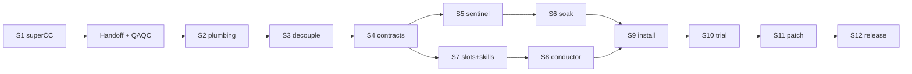

# Conductor — CLI sprint orchestration v1

## Overview

**Objective.** Rebuild subfloor sprint orchestration around a **Conductor**: a weak-model OpenCode shell that never decides — it relays directives between ephemeral planner/dev/reviewer shells, driven by DB state and woken by a liveness sentinel. CLI only; the TMUX/interface subsystem is removed. Proven in a fresh fork install (dos-app).

**Provenance & ownership.** Plan authored by **superCC** — the parent shell, the first subfloor, tree at `~/superCC` — and imported here 2026-07-28. superCC executes **Step 1 only** on his tree's `conductor` branch, then hands off. We (CC / subfloor-cli) import his shipped work, QAQC it against this spec, and own Steps 2–12 to completion and the system thereafter. His subfloor stays live for his own records and duties; **subfloor-cli is the maintainer home from handoff onward** (see the Handoff & QAQC tab).

```stats
:::class1
value: 12
label: Steps to v1
description: Step 1 by superCC; 2–12 by CC post-handoff
:::class2
value: 1
label: Resident seat
description: The Conductor — everything else is ephemeral
:::class3
value: 0
label: Scheduled shell polls
description: The sentinel (engine service) is the sole poller
:::class4
value: 4
label: Forks to repin
description: dos-arch, md-converter, ami, rst-c at release
```

**Base decision (evidence-backed).** Build on a long-lived **`conductor` branch cut from subfloor `main`** — not from the `subfloor-cli` backup. His main is 136 commits ahead of our tree (we sit at `81756b1`, a clean ancestor); the delta contains the layer the Conductor stands on: `sprint_units` + board-as-record (#616), the board transition machine (#662), engine-service-as-sole-poller (spec #20 — the sentinel's host), the OpenCode headless adapter, and role-split skills (#633). Building from the backup would re-port all of that before Step 1. What the Conductor supersedes — the interface subsystem and its wake/binding pipeline — is bounded and is stripped in Steps 1–2.

**Rollout model.** All step PRs target the `conductor` branch (FnB merges, as always). `main` stays untouched — TMUX intact, existing forks unaffected. dos-app installs pin to the branch (the isolated test environment). Rollout gate = the `conductor` → `main` merge at Step 12, followed by fleet repins. Abandonment path = delete the branch; main never changed.

**Topology (RESOLVED — FnB, 2026-07-28): sandbox kept.** The single-namespace requirement is already satisfied on the Docker seat: the container's entry process IS the engine service (`docker run … ./sc serve`), and shells boot via `docker exec` into the same container — the sentinel shares the pid namespace and filesystem with every shell it watches. Pid scans (`shell_launch_records` → `/proc`) and worktree mtimes work with zero rearrangement. Creds handling unchanged. Residuals: auth-doctor steps verify the weak model is *routable*, not just that creds are mounted; harness CLIs are image-baked, so a newer OpenCode build = image epoch roll; the Conductor inherits the container's ambient `GH_TOKEN` — existing trust boundary, noted not fixed in v1. Bare-metal seats must hold too — see Open questions.

## Doctrine

### Sprint eligibility and ownership

- **Eligibility gate:** the governing spec must have at least one completed QAQC round performed by a review shell before it can enter a sprint. No review evidence means the Planner refuses declaration and returns the spec to the FnB.
- **Declaration:** the FnB declares the sprint with a Planner. That Planner interviews the FnB for models, decomposes and assigns the work, provisions the sprint tasks and board, and records itself as the originating Planner.
- **Hard handoff:** after provisioning, the Planner emits the handoff, gives the FnB the exact Conductor boot command, and exits. It does not boot Conductor or workers, watch events, advance units, or otherwise run the sprint. The FnB explicitly boots Conductor once as the declared-to-active readiness gate. Conductor then owns the active execution loop and all mechanical board transitions; post-activation directive/sentinel wakes may resume it automatically.
- **Decision re-entry:** when Conductor needs a ruling, answer, re-plan, conformance kickoff, or close instruction, it boots the same originating Planner with the question and evidence. At that boot the Planner may inspect or modify the board, answer, and send directives in any combination; then it exits and Conductor acts.

Fixed for all steps. Any step that drifts from these is off-design — stop and re-read.

- **DB = source of all truth.** MD renders are untracked, derived, for FnB review only.
- **The Conductor never decides.** Instructions come only from Planner, Reviewer, Dev, or the system (sentinel). Directives carry an issuer; the per-flavor whitelist is enforced at the API layer AND re-checked by the Conductor (defense in depth).
- **Zero scheduled polling by any shell.** The sentinel (engine service) is the sole poller; silence becomes an event via per-status dwell timeouts.
- **All intelligence is ephemeral:** planner/dev/reviewer boot headless per task, act, report, exit. The Conductor is the only resident seat and holds no state worth keeping.
- **No attach semantics anywhere in v1** (FnB, 2026-07-28). A shell session is boot → work → exit. Nothing attaches, reattaches, recovers, or validates terminal state; no client ever shares a terminal with another. Liveness is observed from outside (sentinel: pid, disk, messages, PRs) — never negotiated with a terminal.
- **Signal ladder:** process dead → dead shell (definitive, immediate). Process alive + disk quiet + no message + dwell expired → wake Conductor → check messages → message: relay; none: boot Planner with the evidence snapshot.

```linear
Sentinel detects :::class1 -> Conductor relays :::class2 -> Planner decides :::class3
```

## Handoff & QAQC

The governing layer for our execution — added at import (FnB, 2026-07-28).

### Boundary

superCC takes the plan **to Step 1 and no further**: cut the `conductor` branch, DB backup, interface *surface* strip (scripts, routes/WS, spike dir, tests, SPA tab), `sprint.py` stubs — merged to his `conductor` branch. Then handoff.

### Import mechanics

He stays there; we stay here. His subfloor was the first and holds records specific to him — it is never our working tree.

1. Add his tree as a git remote of subfloor-cli; fetch.
2. Verify `81756b1` is a clean ancestor of his `main`; fast-forward our `main` through the ~136-commit delta.
3. Adopt the `conductor` branch (with his Step-1 merges) into this repo.
4. From then on, every step PR (Steps 2–12) originates and merges **here**. We are the maintainers of record.

### QAQC gate — blocks Step 2

- Re-run Step 1's full verification in the imported tree: deleted modules unimportable outside the Step-2 quarantine list (`git grep 'import interface_'` = only pr_poller/update/rebuild/activity_readers hits, each tagged with a Step-2 marker); UI loads without the Interface tab; interface tests gone from collection.
- Conformance pass: shipped code vs this spec's Step 1, findings ruled per the Step 11 severity rubric. **Majors patched before Step 2 begins.**
- Reconcile this spec against what he actually shipped — refine the affected steps; the spec stays unfrozen and tracks reality until v1 ships.

> [!class4]
> Until the QAQC gate passes, nothing from Steps 2–12 starts. The gate is the handoff — not a courtesy review.

## Step 1 — superCC

**Executor: superCC** on his tree. Ours to QAQC, not to build.

**Context.** The interface subsystem is woven into main, not bolted on. This step removes the *surfaces*; Step 2 rewires the *engine plumbing* that imports them. Verified inventory: `interface_broker/cli/exec/hook/hooks/reconcile/recovery/runtime/state/wake.py` in `.super-coder/scripts/`; `api/interface_routes.py` + `api/interface_ws.py`; `api/server.py` module-level imports + message-ingress wake hooks + sprint-close binding hooks; `spikes/interface-stream/`; **21** `test_interface_*`/submit test files; the Interface tab + ~71 references in the single-file SPA (`ui/app.js`, `index.html`).

**Tasks.**
1. Cut the `conductor` branch from `main` — all step PRs target it from here on.
2. `db_backup` the fork DB.
3. Delete interface scripts, API routes/WS, spike dir, the 21 test files.
4. `server.py` surgery: remove imports, message-ingress wake hooks, sprint-close binding hooks (pr_poller stays temporarily broken-quarantined — Step 2).
5. SPA surgery: remove the Interface tab and its `app.js` code paths.
6. Stub `sprint.py` interface call sites — BOTH `/api/interface/sprint-bindings` AND `/api/interface/sprint-alerts` — to a clear "interface retired" error.

**Verification.** Deleted modules unimportable anywhere except the Step-2 quarantine list; UI loads without the Interface tab; interface tests gone from collection. Re-run by us at the QAQC gate.
**Rollback.** Single PR — revert. DB backup restores.
**Tier:** default. **Depends on:** — .

## Steps 2–3 — Decouple

Ours from here on. All remaining steps execute in subfloor-cli post-handoff.

### Step 2 — Interface strip: engine plumbing + boot paths

**Context.** Four engine subsystems import interface modules and must be rewired, and the interactive boot path is currently *gated onto* the interface: `run.py` hard-exits public interactive launches with "use ./sc enter", and `./sc enter` is `docker exec … ./sc interface enter`. After the strip there is no interactive door unless this step re-opens it.

**Tasks.**
1. `pr_poller.py`: remove `interface_wake` import + `eligible_binding` wake-item emission — poller output becomes plain event/message rows (Step 5 retargets them as system directives).
2. `update.py` + `rebuild.py`: remove `interface_reconcile` guards; define the replacement refusal rule (an ACTIVE sprint blocks update, read through the centralized `sprint_state` predicate over unfrozen `SPRINT:` documents with `sprint_units` — there is no `sprints` table, and interface state is irrelevant).
3. `activity_readers.py`: drop `interface_sessions` queries; `snapshot.py`: drop the five `interface_*` tables from the audit list. Legacy wake-audit rows have foreign keys into those retired parents, so their snapshot projection also stops here; the live tables and rows remain for Step 4’s explicit drain/retirement migration.
4. Re-open the interactive path: un-gate `run.py` main(), repoint `./sc enter` at direct `sc boot`.
5. Full green suite pass.

**Verification.** pytest green; `./sc enter` boots interactive without the API running; `./sc run <shell> -p "say ok"` headless works; engine service starts clean and the PR poller cycles without error; `git grep -i 'import interface'` = zero hits; `git grep -i tmux` = docs/history only.
**Rollback.** Single PR — revert. **Tier:** default. **Depends on:** Step 1 + QAQC gate.

### Step 3 — Sprint decoupling + DB-truth audit

**Context.** Sprints must run with zero interface residue and full DB truth. Main already has `sprint_units` (board as record, planner-only verbs) and the board transition machine. Keep this step *minimal*: the stubbed binding/alert paths get bridged only as far as v1 needs — the real worker-boot flow arrives with `--slot` (Step 7) and the Conductor (Step 8). Don't build an interim wake mechanism Step 8 throws away.

**Tasks.**
1. `sprint.py`: remove binding/alert verbs; minimal bridge = worker boot via plain headless `./sc run` where a verb must keep working pre-Conductor; everything else errors clearly ("arrives with Conductor").
2. Audit every sprint read/write path: state lives in `sprints`/`sprint_units`/messages only; the MD board is derived render, never read back by any shell.
3. Render audit: enumerate all rendered artifacts; confirm each untracked + regenerable; add an `sc` render verb for the FnB-review board if missing.
4. Dwell clock: REUSE `sprint_units.state_changed_at` (exists — verified); no new column. Confirm the transition machine stamps it on every walk.

**Verification.** Scripted mini-sprint state walk green with the interface gone; full render pass leaves `git status` clean; pytest green.
**Rollback.** PR revert; no schema change. **Tier:** default. **Depends on:** Step 2.

## Step 4 — Contracts

**Context.** The phase that makes everything fit. Three dependents build against these contracts: sentinel (reads expectations, writes events), skills (emit directives), Conductor (executes directives, enforces whitelist). Designed whole, landed once. Spec-writing may run parallel with Steps 1–3 (no shared files); the migration lands only after Step 3. This step also RETIRES the old wake machine — `sprint_planner_bindings`, `planner_wake_batches`, `planner_wake_items`, `planner_action_receipts`, `planner_alerts`. Installed forks have LIVE rows in these tables (dos-arch: 2 live bindings, verified), so the migration must define the **drain story**, not just DROP.

**Tasks.**
1. Spec: `directives` — issuer shell + flavor, kind, payload (JSON), target, sprint/unit linkage, status (pending/executed/refused), executed_at. Whitelist as data. v1 vocabulary — dev: `ready-for-review`, `ask-planner`, `merged`, `unit-report`; reviewer: `review-clean`, `findings`, `ask-planner`; planner: `kickoff`, `hold`, `re-scope`, `re-task`, `close`, `answer`; system: `pr-green`, `pr-red`, `pr-merged`, `stall`, `dead-shell`.
2. Spec: `sentinel_events` — append-only observation log (boots, exits, PR transitions, activity beats, dwell expiries, liveness verdicts) with evidence payload (last mtime, last commit, PR state, last message id).
3. Spec: `unit_expectations` — per unit-status: expected signals + max dwell. Data, not code; calibrated in Steps 6/9–11.
4. Old-machine retirement + fork drain story: migration converts/closes live binding rows (drain-to-closed with audit trail), drops or dormants the five wake tables (explicit decision in spec), and defines behavior when a repin meets live interface state.
5. Migration + `sc` read verbs (list/inspect directives + events).
6. Adversarial schema review (fresh-context agent attacks: missing kinds, unrepresentable states, whitelist holes, drain-story gaps).

**Verification.** Migration applies + rolls back on a COPY OF THE REAL dos-arch DB (live bindings present), not just a clean DB; directive round-trip with whitelist enforced at API layer in tests (issuer-invalid insert refused); spec doc frozen per house docs flow.
**Rollback.** `db_backup` pre-migration; migration reversible.
**Tier:** strongest. **Depends on:** Step 3 (migration); spec text parallel with Steps 1–3.

## Steps 5–6 — Sentinel

### Step 5 — Liveness + activity monitoring in the engine service

**Context.** The engine service is already the fork's sole GitHub poller (spec #20). Extend it into the sentinel: process liveness, disk activity, message state, PR state, dwell evaluation. Observes and wakes only — writes `sentinel_events` + system directives; boots nothing except (config-gated, Step 8) the Conductor. The sentinel shares the shells' namespace/filesystem or its signals read nothing.

**Tasks.**
1. Process liveness: pids from `shell_launch_records`, scanned via the `shell_liveness.py` mechanism — dead process + unclosed unit = `dead-shell` event, immediate.
2. Disk activity: worktree mtime scan per active unit's shell; activity beats.
3. Dwell evaluation: per cycle, each active unit's `state_changed_at` + signals vs `unit_expectations`; expiry → `stall` event + system directive with full evidence snapshot (last mtime, last commit SHA, PR + checks state, last message, dwell).
4. PR transitions: retarget Step 2.1's poller output as system directives (`pr-green`/`pr-red`/`pr-merged`) addressed to the Conductor, alongside events.
5. Config: per-fork enable, intervals, no-op when no sprint active. Opens the background soak (Step 6) on merge.

**Verification.** Unit tests per signal + dwell logic (fake clocks, fake worktrees, fake pid tables); ONE synthetic end-to-end cycle on the subfloor fork. The soak is Step 6, not this gate.
**Rollback.** Feature-flagged in service config — off = current behavior.
**Tier:** default. **Depends on:** Step 4.

### Step 6 — Soak + calibration (background; overlaps Step 7)

**Context.** Not a peer working session — a background observation window opened when Step 5 merges, closed by one short calibration session. Runs during normal dev work while Step 7 proceeds (no shared files).

**Tasks.** Sentinel live across ≥3 real working sessions; review `sentinel_events` for false stalls/dead-shells (long reasoning stretches = known false-positive risk); calibrate `unit_expectations` dwells from observed distributions; document rationale in the spec.

**Verification (numeric).** Final soak window ≥2 sessions with **zero false `dead-shell`** and **≤1 false `stall` per session**; soak report (event counts, rates, chosen dwells) attached to the spec.
**Rollback.** n/a (observation only). **Tier:** default. **Depends on:** Step 5. **Parallel with:** Step 7.

## Steps 7–8 — Conductor

### Step 7 — Slot boots + skill overhaul

**Context.** Four detailed per-flavor role contracts replace the ambiguous shared orchestration skill: `sprint_pln`, `sprint_dev`, `sprint_rev`, and `sprint_cond`. Each explains the flavor's purpose, ownership boundary, inputs, allowed directives, forbidden behaviors, handoffs, and stop condition before giving command mechanics. Loading is deterministic. `sprint_cond` intentionally repeats the complete Conductor boot-doc contract: the model is weak, repetition is cheap, and redundant mechanical constraints are safer than relying on one presentation. Existing `sprint_orchestration*` ceremony dissolves into these four contracts.

**Tasks.**
1. `./sc run <shell> --slot <plan|dev|rev|cond> --sprint <id> [--unit U]`: renders boot doc + the matching `sprint_*` skill + kickoff context in one deterministic shot — no sprint shell can run without its role contract loaded, as a property of the launcher. (Lands first; unblocks Step 8.)
2. `sprint_pln`: two ephemeral modes only. **Declaration** verifies review-shell QAQC eligibility, decomposes, sequences, assigns, runs the model interview, provisions tasks and board, records the originating Planner, emits the Conductor handoff, gives the FnB the exact manual Conductor boot command, and exits without executing it. **Decision re-entry** happens only when Conductor boots that same Planner with a question and evidence; the Planner may inspect or modify the board, answer, and emit directives including conformance and close instructions, then exits. It never monitors, boots workers, or advances the sprint itself.
3. `sprint_dev`: explains the bounded unit-owner role, then the build loop: work, emit exactly one next directive (`ready-for-review` / `ask-planner` / `merged` + unit-report), and exit. Merge authority conditions remain green + review-clean + sprint ACTIVE. Dev never edits the board or boots another shell.
4. `sprint_rev`: explains the independent gate role, then the review loop: inspect the assigned SHA, emit `findings` / `review-clean` / `ask-planner`, and exit. The conformance slot lives here. Reviewer never advances the board or resolves planning ambiguity.
5. `sprint_cond`: repeats the Conductor boot doc in full, including the transition table, issuer whitelist, board-write limits, exact originating-Planner route, worker boot/relay mechanics, refusal paths, and the absolute no-decision rule. It owns the active sprint loop but originates no judgment.
6. All four use `authoring_syntax` house style with literal directive commands and explicit positive and negative examples. Build the pretend-sprint injection harness here for Step 8's matrix.

**Verification.** All four skills contain their detailed role contract and their directive examples validate against the Step 4 whitelist. Every `--slot` render shows the matching skill inline. Fixture boots prove: Planner hands off and exits; Dev and Reviewer emit one directive and exit; Conductor can mechanically execute every transition without inventing a decision. A lint assertion requires the critical Conductor no-decision and Planner handoff rules in both the Conductor boot doc and `sprint_cond`.
**Rollback.** Skills are DB rows — prior versions restorable; `--slot` additive.
**Tier:** strongest (skills), default (`--slot`). **Depends on:** Step 4 (vocabulary), Step 2 (clean run.py). **Parallel with:** Step 6.

### Step 8 — The Conductor

**Context.** New shell flavor: weak model on OpenCode with one dedicated skill, `sprint_cond`. Its boot doc AND skill each carry the full transition table: for every directive kind × issuer, the mechanical response is relay, boot via `--slot`, board write, or refuse. Every sprint stores exactly one originating Planner. `ask-planner` from any shell—or any transition requiring judgment—boots that exact Planner with the question and evidence. The Planner may inspect or modify the board and emit an answer or more directives, then exits. Conductor relays and executes the result and re-boots the asker when required. FnB inputs: model selection for planner/dev/reviewer at sprint start, plus one explicit Conductor boot after inspecting the handoff.

**Tasks.**
1. Conductor flavor + boot doc + `sprint_cond`. Both enumerate every directive kind, issuer, action, refusal, board-write boundary, Planner route, and stop condition in `authoring_syntax` style. The repetition is deliberate and test-enforced.
2. Wake mechanics: alpha activation is FnB-gated. A Planner handoff remains pending and never auto-boots Conductor; the Planner prints the exact command and exits, then the FnB explicitly boots Conductor to act the handoff and move `declared → active`. After activation, engine service wakes on later pending directives remain ephemeral and config-gated. Includes harness auth doctor: verify OpenCode creds + weak-model routability wherever the topology decision put the boots — fail loud at config time, not first wake.
3. Board writes: Conductor folds executed transitions into `sprint_units` via the planner-only verbs generalized to conductor identity.
4. Pretend-sprint matrix: inject directive rows (all kinds × issuers, plus issuer-INVALID and malformed payloads); assert action per table — including refusals and escalate-on-unparseable. Real weak-model OpenCode boots, not mocks. (Harness from Step 7.5; if not built there, split to its own session.)

**Verification.** Matrix green; a full synthetic sprint (scripted dev/rev actors, no real coding) walks kickoff → merge → close with zero human input and zero Conductor-originated decisions in the trail.
**Rollback.** New flavor — additive; autonomous boot config-gated.
**Tier:** strongest (boot doc), default (mechanics). **Depends on:** Steps 4, 7.1–7.2.

## Steps 9–12 — Prove & Ship

### Step 9 — dos-app: install + synthetic sprint

**Context.** `~/dos-app` has no `.super-coder` (verified) — clean install target. First of three dos-app sessions.

**Tasks.** Install engine into dos-app pinned to the `conductor` branch — install materializes from `main` by default, so: install, then immediately `./sc update --branch conductor` (pin recorded in `.sc-state/engine.ref`), or add a small `--branch` flag to install if cleaner. Harness auth doctor for ALL three slot harnesses + Conductor in the fresh fork (fresh installs have no creds — fail here, not mid-sprint); verify boot + engine service + sentinel; run the synthetic sprint end-to-end in the fork.
**Verification.** Synthetic sprint green in dos-app; sentinel event log correct; auth doctor green for every harness the sprint will use.
**Rollback.** `.super-coder` removable; dos-app repo untouched outside worktrees.
**Tier:** default. **Depends on:** Steps 5–8 (Step 6 calibration closed — dwells are inputs to the install).

### Step 10 — dos-app: real trial sprint

**Context.** The proof: a genuine 2–3 unit sprint on a real small dos-app task, real dev/rev models, FnB model interview, Conductor conducting.

**Tasks.** FnB declares the sprint with the originating Planner. Planner verifies the spec QAQC gate, runs the model interview (planner/dev/reviewer models), provisions through `sprint_pln`, emits handoff, gives the FnB the boot command, and exits. FnB performs the one explicit Conductor activation. Observe every later Conductor wake, relay, worker boot, Planner decision re-entry, and Planner exit in the event log + directive trail; FnB watches from the rendered board.
**Verification.** Sprint completes with zero scheduled polling, zero Conductor decisions, full trail reconstructable from DB alone.
**Rollback.** Sprint abortable via planner `close`; fork disposable.
**Tier:** per interview. **Depends on:** Step 9.

### Step 11 — Analyze + patch

**Severity rubric (fixed up front).** Major = wrong routing, false liveness verdict, authority leak (Conductor decided / whitelist bypassed), lost directive. Medium = latency or dwell misses, noisy events, skill friction. Low = polish. (This rubric also governs the Handoff QAQC gate.)

**Tasks.** Replay the full Step 10 trail; catalog findings against the rubric; file flags; patch in subfloor-cli; repin dos-app; re-run affected scenarios.
**Verification.** All Major findings patched + re-tested green; analysis doc written (event counts, wake latencies, misroute list).
**Rollback.** Patches are PRs; repin per-fork with backup.
**Tier:** strongest (analysis), default (patches). **Depends on:** Step 10.

### Step 12 — Release

**Context.** Docs + propagation. superCC's open flag CC-141 (README owes the planner-model recommendation) folds in against the new design — confirm its adoption path at handoff (his tracker, not ours).

**Tasks.** README Sprints + Harnesses & models rewritten for the Conductor design; spec freeze + feature docs per house `docs` flow; reseed migrations for installed forks (dos-arch, md-converter, ami, rst-c — all four verified installed); version/tag; final conformance pass of shipped code vs this spec.
**Verification.** Render-check green; repin of dos-arch (backup first, live binding rows present — the Step 4 drain story fires for real) upgrades clean; conformance findings all ruled.
**Rollback.** Release is a tag; repins per-fork with backups.
**Tier:** default. **Depends on:** Step 11.

## Dependencies



- Step 4 spec text may run parallel with Steps 2–3; its migration lands only after Step 3.
- Step 6 runs parallel with Step 7 (no shared files).
- Step 8 needs Steps 7.1–7.2 only (not the full skill polish).
- Step 9 needs Step 6's calibration closed (dwells are inputs to the fork install).

## Open questions

- **Wake-table retirement:** drop vs dormant → decided in Step 4's spec.
- **Conformance slot:** merged in `rev_sprint` vs split → decided in Step 7.4.
- **Handoff logistics:** exact import route for the ~136-commit delta (remote from his tree vs a shared upstream) — settled at handoff with FnB.
- **CC-141:** lives in superCC's tracker; decide at handoff whether Step 12 adopts an equivalent flag here.
- **Bare-metal seat:** the topology resolution reasons from the Docker seat (`docker exec`, image-baked harness CLIs). This maintainer fork runs bare metal — sentinel signals (pid scan, worktree mtimes) and Conductor auto-boot must be verified on host seats where the engine service runs under pm2. Verify during Steps 5 and 9.


