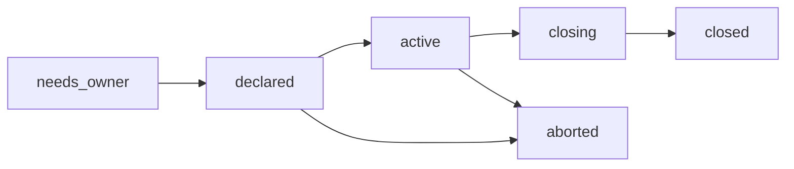

# Sprint declaration and ownership repair

## Overview

The first fresh-fork Conductor proof exposed four linked defects before a real
sprint could start:

| Issue | Failure |
|---|---|
| `#702` | Shell worktrees are correctly given canonical `sc` on `PATH`, but sprint skills call worktree-relative `./sc`, which may not exist after a fresh install. |
| `#703` | Operational roster shells inherited the primary shell's personal seed and lineage. |
| `#705` | No command creates a sprint declaration or board; the Planner slot itself requires an already-live board with a unit. |
| `#706` | No durable originating Planner exists; Conductor requires exactly one Planner in the fleet while the default roster intentionally contains two. |

**Objective.** Make a reviewed spec declarable by one Planner, hand the complete
board to Conductor, and run the sprint against durable ownership with no
worktree-relative engine assumptions.

**Done condition.** A fresh dos-app install with two Planners completes:
reviewed spec → Planner declaration → handoff → dev/review loop → Planner
decision re-entry → conformance → close. Every route resolves from DB state,
all operational shells remain role-only, and no sprint skill depends on
worktree-local `./sc`.

## Fixed decisions

This spec implements decisions #9, #10, and #11:

- Personal seed and lineage belong only to the installer-designated primary.
- Sprint ownership has a hard boundary: Planner provisions and exits;
  Conductor runs; the originating Planner re-enters only for decisions.
- Every role receives one detailed skill: `sprint_pln`, `sprint_dev`,
  `sprint_rev`, and `sprint_cond`.
- `sprint_cond` deliberately repeats the complete Conductor boot contract.
- A spec is sprint-eligible only when a review shell approved its current body.

```linear
Spec QAQC :::class1 -> Planner declares :::class2 -> Conductor runs :::class3 -> Planner decides :::class2 -> Conductor acts :::class3
```

## Ownership boundary

### Declaration phase

The FnB boots or addresses a Planner normally, without `--slot plan` and
without a sprint ID. The Planner loads `sprint_pln`, interviews the FnB for
role/model routes, verifies QAQC eligibility, declares the sprint, adds and
assigns every unit, verifies the board, emits one `handoff` directive, and
exits.

The sprint may contain zero units while `state=declared`. It is not active and
grants no worker authority until handoff.

### Active phase

Conductor executes `handoff`, validates that the board is non-empty and every
unit has the required roles/routes, changes the sprint to `active`, and boots
every dependency-ready developer. From then on Conductor owns:

- worker boots and relays;
- mechanical board transitions;
- dependency release after merges;
- PR/system event handling;
- evidence collection and refusal recording.

Normal progress never boots Planner. `ready-for-review`, `review-clean`,
`merged`, `unit-report`, and PR transitions are mechanical.

### Planner re-entry

Conductor boots the recorded originating Planner only when:

- a worker emits `ask-planner`;
- findings require a severity/scope ruling;
- a stall or dead-shell event requires a decision;
- all build units are terminal and conformance must be commissioned;
- conformance requires disposition or the sprint is ready to close;
- a directive is malformed or refused and cannot be resolved mechanically.

The Planner receives the question plus evidence, may inspect or modify the
board, emits one or more directives, then exits. Conductor executes them.
`--slot plan --sprint <id>` is this re-entry mode only; it is not declaration.

## QAQC evidence

Add an append-only `spec_qaqc_reviews` table:

| Column | Contract |
|---|---|
| `review_id` | Primary key |
| `spec_doc_id` | Required FK to a `documents.kind='spec'` row |
| `reviewer_shell_id` | Required FK; actor must be an active reviewer shell |
| `body_sha256` | SHA-256 of the exact canonical spec body reviewed |
| `verdict` | `approved` or `changes_requested` |
| `findings_doc_id` | Optional FK to the review report document |
| `completed_at` | UTC completion timestamp |

Rows are immutable. The API computes `body_sha256`; callers cannot assert it.
A spec is eligible only when an `approved` row matches the current body hash.
Editing the spec invalidates prior eligibility automatically without deleting
history. `changes_requested` records a completed round but does not grant
eligibility.

Reviewer CLI:

```sh
sc mem doc qaqc <spec-id> --verdict approved --findings-doc <doc-id>
sc mem get qaqc --doc <spec-id>
```

## Sprint record

Add a first-class `sprints` table. The sprint document remains the DB-owned
prose artifact; `sprints` owns executable declaration state.

| Column | Contract |
|---|---|
| `sprint_doc_id` | Primary key and FK to the sprint `documents` row |
| `spec_doc_id` | Required governing spec FK |
| `planner_shell_id` | Originating Planner FK; nullable only for migration state |
| `qaqc_review_id` | Required approved review for new declarations |
| `planner_route` | Exact resolved Planner harness/model route |
| `dev_route` | Exact resolved developer harness/model route |
| `reviewer_route` | Exact resolved reviewer harness/model route |
| `state` | `needs_owner`, `declared`, `active`, `closing`, `closed`, or `aborted` |
| `declared_at` | UTC declaration timestamp |
| `handed_off_at` | UTC activation timestamp |
| `closed_at` | UTC terminal timestamp |

`needs_owner` exists only for migrated legacy boards. New declarations require
an owner, current approved QAQC, and all three resolved routes.

The sprint state machine becomes authoritative:



Document title prefixes and unit count no longer define identity or liveness.
Closing updates `sprints.state` and freezes the sprint document in the same
transaction.

## API and CLI

### QAQC resource

- `POST /api/spec-qaqc-reviews` — reviewer-authenticated, idempotency-keyed;
  validates spec kind and records the server-computed body hash; returns `201`.
- `GET /api/spec-qaqc-reviews?spec_doc_id=N` — returns review history.
- Unknown fields are rejected. Errors use the standard `{code,message,details}`
  envelope.

### Sprint resource

- `POST /api/sprints` — Planner-authenticated, idempotency-keyed declaration.
  In one transaction: verify QAQC and routes, create the `SPRINT:` document,
  create the `sprints` row, return `201` with `Location`.
- `GET /api/sprints?status=active` — authoritative UI/runtime projection.
- `GET /api/sprints/{id}` — declaration, owner, routes, QAQC, and board.
- `POST /api/sprints/{id}/adopt` — operator-only repair for a migrated
  `needs_owner` board; records the explicit Planner and audit evidence.

Planner CLI:

```sh
sc sprint declare \
  --spec <spec-doc-id> \
  --title "<sprint title>" \
  --planner-route <harness/model> \
  --dev-route <harness/model> \
  --reviewer-route <harness/model>
```

The command returns the sprint document ID. Planner then uses existing
`sc sprint unit add/set/state/board` verbs and finishes with:

```sh
sc directives emit handoff --target conductor --sprint <id> --payload '{}'
```

## Routing and authority

Replace every fleet-wide `_only_shell("planner")` lookup with
`planner_for_sprint(sprint_doc_id)`.

The same lookup governs:

- dev/reviewer `ask-planner`;
- stall, dead-shell, malformed, and refusal escalation;
- terminal conformance and close-time Planner boots;
- Planner slot validation;
- Planner directive authorization;
- Planner board-write authorization;
- Sprints UI projection.

A Planner directive for a sprint it does not own is refused. Any active
Planner may read the board; only the originating Planner and Conductor may
write within their respective decision/mechanical boundaries. The operator
retains repair authority.

No normal merge or unit-report transition boots Planner. On merge, Conductor
releases every newly dependency-ready unit. When all build units are terminal,
Conductor boots the originating Planner with the integrated evidence.

## Role skills

Replace the shipped names and thin procedures with:

| Skill | Required explanation |
|---|---|
| `sprint_pln` | Declaration, model interview, QAQC gate, board provisioning, hard handoff, decision re-entry, allowed board edits, and mandatory exit |
| `sprint_dev` | Bounded unit ownership, evidence, allowed directives, merge gate, forbidden board/shell control, and exit |
| `sprint_rev` | Independent unit/conformance review, exact-SHA gate, findings protocol, forbidden planning/mechanical control, and exit |
| `sprint_cond` | Full transition table, issuer whitelist, owner routing, worker boots, board-write limits, refusal paths, stop conditions, and absolute no-decision rule |

`sprint_cond` repeats the Conductor boot doc completely. A test requires the
critical owner-routing, transition, refusal, and no-decision rules in both
surfaces.

Slot mapping becomes:

```text
plan -> planner  -> sprint_pln
dev  -> dev      -> sprint_dev
rev  -> reviewer -> sprint_rev
```

Conductor receives `sprint_cond` through its flavor pack on every wake; remove
the current zero-skill assertion.

## Worktree command contract

Bare `sc` is the shell command. `run.py` already prepends the canonical live
root to `PATH`; skills must use that contract and never assume the worktree has
its own launcher or engine state.

- Convert all commands in the four sprint skills to `sc`.
- Audit every skill granted to a non-admin flavor. Worktree-executed commands
  use `sc`; explicitly root/operator-only instructions may retain `./sc`.
- Add read-only `sc engine-ref`, resolving the canonical live root and printing
  the full pin. `issue_reporting` uses it instead of reading a relative
  `.sc-state/engine.ref`.
- Add a distribution lint that rejects unexplained `./sc` in non-admin skill
  packs.
- Do not create launcher or engine-state symlinks in worktrees; those would
  dirty tracked branches and create stale engine copies.

## Installer identity

PR #704 is the implementation for issue #703:

- shared shell creation defaults to `seed_identity=False`;
- only the installer-designated primary opts in;
- roster, Conductor, and GUI-created shells receive role/mandate only.

Do not delete seed or lineage from existing shells. Laws reserve that
curation to each shell. Verification uses a fresh dos-app reinstall after the
PR lands.

## Migration

Use expand → migrate → contract:

1. Add `spec_qaqc_reviews` and `sprints` in the next ordered migration.
2. Backfill every existing `SPRINT:` document with units into `sprints`.
3. Recover `planner_shell_id` only from durable unique evidence, preferring
   `wake_machine_retirements`. Never select the first or only-current Planner
   as a guess.
4. Boards without durable ownership become `needs_owner`; Conductor refuses
   them with the operator-only adoption command.
5. Existing sprint documents are not treated as QAQC evidence. New
   declarations require a current approved review.
6. Deploy readers that tolerate `needs_owner`, restart the engine service,
   verify projections, then switch liveness/routing to `sprints`.
7. Keep documents and `sprint_units` intact. A later contract migration may
   make ownership non-null after fleet repair; that is outside this spec.

Rollback disables the new declaration/runtime readers and leaves the additive
tables in place. No destructive rollback or inferred owner rewrite.

## Construction order

1. **Land identity isolation** — merge #704; verify its focused/full CI.
2. **Fix command addressing** — bare `sc`, `sc engine-ref`, and distribution
   lint. This is independent and may run in parallel with step 1.
3. **Add QAQC and sprint records** — migration, model, API, backfill, and
   legacy `needs_owner` behavior.
4. **Add declaration CLI** — pre-sprint Planner flow, unit provisioning, and
   explicit handoff.
5. **Retarget runtime** — owner lookup, authorization, mechanical dependency
   release, decision-only Planner boots, and UI projection.
6. **Ship four role skills** — rename/reseed/grant, Conductor redundancy, and
   deterministic slot loading.
7. **Fresh-fork proof** — reinstall dos-app and run synthetic then real sprint.

Steps 1 and 2 are parallelizable. Steps 4 and 6 may be authored in parallel
after the schema/API contract in step 3 is fixed. Runtime step 5 consumes both.

## Verification

### Focused gates

- A current-body `approved` QAQC record grants eligibility.
- `changes_requested`, missing review, or any post-review spec edit blocks
  declaration.
- Declaration is idempotent and atomic; partial document/metadata rows cannot
  survive failure.
- A declared zero-unit sprint is valid but inactive; handoff refuses it.
- Two active Planners exist; every return path boots only the recorded owner.
- A non-owner Planner directive and board write are refused.
- Normal unit progress never boots Planner; `ask-planner`, unresolved
  evidence, conformance, and close do.
- Merge releases all newly ready downstream units mechanically.
- `/api/sprints` reports the real Planner and QAQC/spec linkage.
- Fresh worktree commands `sc sprint --help` and `sc engine-ref` work while
  `./sc` is absent.
- Primary shell has identity; every operational shell, including Conductor,
  has none.
- All four role skills load and contain their detailed ownership contract;
  `sprint_cond` and the boot doc pass the redundancy lint.

### End-to-end gate

On a fresh dos-app install with the default two-Planner roster:

1. Create a spec and record one `changes_requested` QAQC round.
2. Prove declaration is refused.
3. Revise and obtain reviewer approval for the current body.
4. FnB directs one Planner to declare; Planner provisions, hands off, exits.
5. Conductor runs a two-unit dependency chain through review and merge.
6. A worker question boots the originating Planner, which answers and exits.
7. Conductor commissions conformance through Planner re-entry and closes.
8. Replay DB rows alone to reconstruct ownership, decisions, transitions, and
   final state.

Pass requires zero scheduled shell polling, zero Conductor-originated
decisions, zero ambiguous Planner lookup, and a clean full engine verification.

## Non-goals

- Resuming a Planner's old native conversation.
- Choosing a Planner from the fleet when ownership is absent.
- Treating document titles or body prose as executable sprint state.
- Automatically approving imported or legacy specs.
- Removing identity from already-created shells.
- Giving workers board-write or shell-boot authority.
