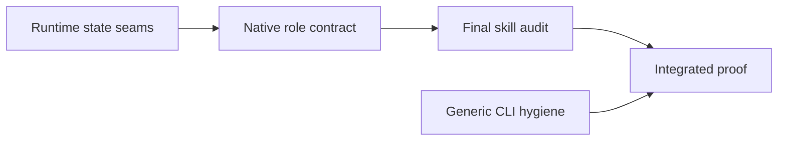

# Sprint operational hardening

## Objective

Close the six defects reproduced in the last three live Sprints with the smallest changes to existing ownership boundaries. Terminal completion must preserve the initiating Planner turn long enough to report success, Developer liveness must end at review handoff, pre-declaration QAQC must be runnable, help must remain read-only, resolved flag evidence must be independently readable, and bare `sc test` must detect nested Python suites.

Done means all six issue reproductions pass focused tests, all five Sprint role skills direct shells onto native wake infrastructure and pass an organization, cohesiveness, structure, directive-quality, intent-preservation, and token-efficiency audit, and one downstream-style Sprint proves the corrected paths without a new workflow controller, database concept, shell-owned poller, or test runner.

> [!class1]
> Prefer one narrow correction at each existing seam. Reuse terminal close intent, work-unit disposition, authenticated memory reads, role skills, and the current pruned file-discovery path.

## Governing constraints

This round preserves decisions #42, #44, #45, and #53, and adopts decisions #59 and #60:

- Liveness remains one durable expectation per accepted actionable message.
- Recovery and close-out compose existing Sprint, conversation, report, and liveness records; no recovery-state table is added.
- Completion guidance remains advisory except for existing integrity boundaries.
- Models use the durable relay and role skills; no participant protocol or recursive automation is added.
- Existing commands, typed handoffs, lifecycle authority, and generic conversation terminalization remain authoritative.
- Each defect closes by modifying an existing mechanism unless the current surface cannot express the required read.

## Native wake ownership

The engine owns scheduled Sprint coordination. Its armed runtime pulse dispatches ready work, reconciles unread pickup, evaluates liveness, and delivers durable wakes. Its registered-PR watcher observes GitHub and routes red, green, merged, and closed transitions. Participant shells react when woken; they do not create a second scheduler.

Every Sprint role skill states this boundary in role-specific terms:

| Skill | Required behavior |
|---|---|
| `sprint_prep` | `arm` creates conversations, assignments, and wake intents atomically. After success, hand control to `sprint_pln`; participant pickup belongs to native delivery. |
| `sprint_pln` | Rely on native dispatch, wake recovery, liveness, and PR observation. `sc sprint monitor` is a bounded one-shot diagnostic for concrete evidence. |
| `sprint_dev` | After `register-pr`, await native red/green facts; after `request-review`, stop until the native verdict wake. |
| `sprint_rev` | Pre-declaration QAQC may begin from an explicit Planner/FnB request because no Sprint exists. Armed-Sprint review enters through the durable wake/inbox and stops after the typed receipt. |
| `sprint_close` | Request conformance through the durable Sprint relay. Drain the inbox before `complete`; after success, emit the receipt-based final response and let close intent terminalize the conversation. |

A shell may perform a bounded one-shot status read when awake and may run normal implementation or verification commands. Long-running local tests may use the job runner. Sprint coordination waits on native wakes: do not start a recurring shell loop, scheduled job, harness background turn, manual watcher daemon, or external PR watcher to track Sprint state.

If an expected wake does not arrive, inspect durable message, wake, liveness, and service evidence through supported surfaces. Use existing resume/recovery or Planner/FnB escalation; do not create a private wake channel.

## Defect map

| Issue | Existing owner | Minimal correction |
|---|---|---|
| [#923](https://github.com/jedbjorn/subfloor/issues/923) | Terminal conversation cleanup | Keep close intent but defer interruption of the completing owning Planner run |
| [#929](https://github.com/jedbjorn/subfloor/issues/929) | Work-unit disposition and liveness trigger | Resolve the assignment expectation when the unit enters `in_review` |
| [#925](https://github.com/jedbjorn/subfloor/issues/925) | `sprint_rev` entry guidance | Split pre-declaration QAQC from post-declaration inbox entry |
| [#926](https://github.com/jedbjorn/subfloor/issues/926) | `sc_deps` argument entry | Return help before discovery, venv creation, or package action |
| [#922](https://github.com/jedbjorn/subfloor/issues/922) | Authenticated flag reads | Expose exact resolved rows and a feature-scoped resolved view |
| [#774](https://github.com/jedbjorn/subfloor/issues/774) | `sc_test` Python-presence gate | Replace root-only checks with pruned recursive discovery |

## Terminal completion

`sc sprint complete` already commits the final report and lifecycle before participant cleanup. Generic conversation finalization already closes a conversation carrying `conversation.close.requested` after its active run terminalizes. Sprint cleanup currently also interrupts the completing Planner run.

Required behavior:

- On `completed`, identify the active run belonging to the authorized owning Planner shell.
- Cancel queued follow-up turns and append the existing close-request event.
- Omit interrupt intent and signaling for that Planner run.
- Preserve immediate close for idle conversations and interruption for other active participants.
- Let existing broker finalization record the Planner run result and close its conversation once.
- Preserve interrupt-all behavior for `aborted`.
- Keep completion retry idempotent: no second report, lifecycle event, close event, or synthesized response.

No caller-run header, deferred-close state, delayed job, or post-completion message is added. `sprint_close` drains the inbox before `complete`. After terminal success, the Planner emits its bounded final response from the receipt and runs no further Sprint command.

## Liveness handoff

The accepted `work_assignment` expectation observes the Developer lane. Once `request-review` atomically moves the unit to `in_review`, the Reviewer owns forward progress and a separate accepted review request owns Reviewer liveness.

Extend the existing work-unit disposition resolution mechanism so `in_review` resolves unresolved `work_assignment` expectations with `work_unit.in_review`. Preserve terminal `completed` and `cancelled` resolutions. Leave the review-request expectation open until `record-review` resolves it.

The transition, assignment resolution, review message, Reviewer wake, work-unit event, and judgment remain in the existing request-review transaction. Retry changes nothing and cannot reopen or duplicate an expectation. `sprint_dev` directs the Developer to stop after successful review handoff and await the native verdict wake.

A changes-requested verdict re-observes the Developer through its accepted verdict wake message under the existing one-expectation-per-accepted-message rule; the resolved assignment expectation stays resolved and is never reopened for rework.

## Reviewer entry and evidence

### Pre-declaration QAQC

`record-qaqc` intentionally operates before a Sprint row or Sprint ID exists:

- Pre-declaration QAQC begins from the explicit Planner/FnB request, reads the exact spec document, and calls `sc sprint record-qaqc --document ...` without an inbox step.
- Once a Sprint exists, every Reviewer wake or re-entry uses `sc sprint inbox --sprint <id>` and accepts or declines actionable work.
- No placeholder Sprint, synthetic message, or alternate QAQC inbox is introduced.

### Resolved flag evidence

Keep `sc mem get flags` open-only by default. Extend that command rather than add a history command:

```text
sc mem get flags <flag-id>
sc mem get flags --feature <feature-id> --resolved
```

The exact-ID form returns one non-deleted flag whether open or resolved. The feature form returns only resolved, non-deleted flags for that feature and refuses an unscoped resolved-history read. Human and JSON output include numeric ID, display name, owner, feature, priority, description, opened date, resolved date, and closure notes.

Reuse the authenticated single-row endpoint already used by `flag close`; extend the existing list query for the feature-scoped selection. Update `flags`, `db_map`, and `sprint_rev` so independent Reviewers use the supported read.

## CLI hygiene

### Read-only dependency help

At the beginning of `sc_deps`, use the existing help-form parser to print usage and return zero before manifest discovery, `.venv` access, package probes, or installs. The recognized forms are `-h` and `--help` — the shared parser's contract; the bare word `help` remains a top-level dispatcher command and is out of scope. Normal `sc deps` behavior is unchanged. Repeated help from main and linked worktrees is byte-stable and leaves filesystem metadata and child-process calls unchanged.

### Nested Python discovery

Reuse the pruned recursive traversal that discovers dependency manifests. A Python suite is present when a `test_*.py` file exists below a directory named `tests`, excluding `.super-coder`, `.sc-state`, `.sc-worktrees`, virtual environments, VCS data, caches, build output, dependencies, and vendor trees.

Use one presence result at both gates:

- provision pytest when Python tests exist but the fork environment lacks it;
- choose the existing pytest or unittest path instead of reporting no tests.

Keep one repository-root pytest invocation so pytest owns recursive collection and configuration. The exclusion list above governs the presence gate only; execution-time collection follows pytest's own defaults, and any divergence between the two is accepted behavior, not a gate failure. Do not add per-directory loops, map dependence, import-root inference, or another runner. Explicit `sc test <args>` and applicable frontend execution remain unchanged.

## Construction plan



CLI hygiene is parallelizable with runtime state seams. Unit 2 follows Unit 1 to keep schema and skill-seed migrations ordered. Its final audit completes before the audited skills enter Unit 4.

### Unit 1 — terminal and liveness state

Modify terminal cleanup to defer interruption of the completing owning Planner run while preserving close intent. Expand the assignment-resolution trigger to include `in_review`; ship the ordered migration and schema source together.

Gate: simultaneous active Planner and Developer runs complete with Planner close intent but no Planner interrupt, unchanged Developer interruption, successful Planner terminal output, and eventual closed conversations. Abort interrupts both and preserves the existing equality invariant between the interrupted-run set and cleanup's run set. A separate accepted assignment enters review, resolves once as `work_unit.in_review`, emits no later Developer nudge, and leaves Reviewer liveness active until verdict; a changes-requested verdict re-arms Developer observation through its accepted verdict message without reopening the assignment expectation.

### Unit 2 — native roles, evidence, and audit

Expose exact and feature-scoped resolved flag reads. Update `sprint_prep`, `sprint_pln`, `sprint_dev`, `sprint_rev`, and `sprint_close` with the native-wake, entry, evidence, handoff, and stop contracts. Audit and correct their authoritative source bodies, then regenerate one final skill seed and ordered reseed migration for the set.

Gate: pre-declaration QAQC works without a Sprint; declared review still uses inbox acceptance; an independent Reviewer reads closure notes by ID and feature. Skill tests prove native-wake ownership, durable conformance relay, pre-terminal inbox drain, and absence of shell-owned coordination loops or post-`complete` commands.

### Unit 2 audit — final pass

After behavior edits and before Unit 2 is accepted, audit the five authoritative skill bodies together. The author supplies an audit matrix; the assigned Reviewer independently verifies it against the diff, command help, role authority, and generated skill seed. A failed audit returns Unit 2 for correction before Unit 4.

| Dimension | Passing evidence |
|---|---|
| Organization | Each skill follows its role lifecycle: entry and durable state, primary work, contingencies, typed handoff, and stop. Commands sit beside the decisions that use them. |
| Cohesiveness | Shared concepts use consistent terms and compatible rules, while every skill remains independently usable. No role claims another role's authority. |
| Structure | Headings expose workflow order; repeated rules have one clear home per skill; exceptions sit beside the rule they qualify. |
| Token efficiency | Record before/after lines, words, and characters per skill and combined. Remove redundant narration; explain necessary growth. Counts are evidence, not quotas. |
| Directive quality | Lead with action, evidence source, or stop condition. Use a prohibition only for a precise unsafe, authority-breaking, or duplicate-coordination action. |
| Intent preservation | Map every removed, merged, or material rewrite to retained text or an explicitly superseded behavior. Preserve commands, authority, limits, failure handling, idempotency, and receipts. |

Prefer directives such as `After request-review succeeds, stop and await the native verdict wake.` Keep a targeted exclusion where an unsafe alternative must be named: `Use Sprint-native wakes for coordination. Do not start a recurring shell loop, scheduled job, or external PR watcher to track Sprint state.`

The audit does not remove standalone context merely because a sibling skill contains it, flatten role differences into generic prose, or trade shorter text for implicit syntax or authority. Its matrix lists every remaining prohibition and the protected action; broad, duplicated, or non-actionable prohibitions become directives or are removed.

### Unit 3 — generic CLI hygiene

Return `sc deps --help` before mutation and use one pruned recursive Python-test presence helper in both `sc_test` gates.

Gate: help creates no `.venv`, invokes no pip/npm process, and works from main and linked worktrees. A fixture containing only `nested/app/tests/test_health.py` selects or provisions pytest and runs it; ignored engine, environment, worktree, dependency, build, and vendor tests do not count.

### Unit 4 — downstream-style proof

Run one small Sprint after Units 1–3 land:

1. QAQC the spec before declaration without a Sprint inbox.
2. Run `sc deps --help` and bare `sc test` against a nested Python suite.
3. Assign a Developer, accept, register green work, and request review.
4. Advance beyond the liveness threshold while the Reviewer remains active; observe no Developer nudge.
5. Have the Reviewer read feature-scoped resolved flag notes through `sc mem`.
6. Record the verdict; have the Planner record the final report and call `complete` from its linked conversation.
7. Observe the Planner's final response, terminal Sprint, exactly-once report, closed conversations, and idempotent retry.
8. Confirm every role relied on native wakes with no shell-owned coordination loop, manual boot, duplicate wake path, or post-terminal command.

Gate: durable Sprint, conversation, liveness, flag-read, native-wake, command-output, and test evidence proves the chain. Narration alone is not evidence.

## Adversarial gate

The round fails if any of these remains possible:

- A role skill directs a shell to create scheduled coordination, a duplicate wake path, a manual participant boot, or a background Sprint watcher.
- A shorter skill loses command syntax, role authority, failure handling, evidence, or a handoff/stop condition.
- The five skills contradict one another, bury workflow order, duplicate qualifications, or use broad prohibitions where a direct action is clearer.
- Completion interrupts its owning Planner caller, leaves that conversation open, stops interrupting other participants, or changes abort behavior.
- Assignment liveness remains open after `in_review`, resolves before durable handoff, or also resolves Reviewer liveness.
- Pre-declaration QAQC needs a nonexistent Sprint, or declared review bypasses its inbox.
- A Reviewer needs SQL, FnB credentials, mutation, or fleet-wide history to verify closure notes.
- `sc deps --help` touches `.venv`, scans for action, or invokes pip/npm.
- Bare `sc test` misses a non-ignored nested `tests/test_*.py`, or the presence gate counts tests in ignored trees.
- The fix adds a lifecycle state, liveness table, QAQC inbox, flag-history command family, package manager, or test runner.

Focused suites run first. Final verification covers Sprint close, liveness, review loop, role skills, memory API/CLI, dev-kit CLI, migration rebuild, `./sc render-check`, and `./sc verify` before Unit 4.

## Ratified decisions

1. **Completion deferral.** Defer only the authorized owning Planner's active run on `completed`; preserve every other completion interrupt and all abort interrupts.
2. **Resolved flags.** Support exact numeric ID plus `--feature <id> --resolved`; refuse unscoped resolved history.
3. **Packaging.** Deliver three implementation units and one report-only downstream proof under feature #31. The Sprint-skill audit is Unit 2's final gate, preserving this four-unit shape.
4. **Wake ownership.** Native runtime, wake recovery, liveness, and PR observation are the sole scheduled Sprint coordinators. Shells use bounded one-shot diagnostics and stop after typed handoff.

Ratified by FnB on 2026-08-02. Sprint declaration and worker arming remain gated on QAQC of this revision.

## Non-goals

- Reworking close-out, liveness scoring, or review orchestration beyond the reproduced seams.
- Adding shell-owned polling, watching, scheduling, or duplicate wake machinery.
- Removing role-specific standalone context solely to reduce counts.
- Enforcing a token-reduction percentage or sacrificing explicit commands and authority for brevity.
- Interrupting healthy work more aggressively or adding delayed cleanup workers.
- Adding global display-name flag lookup, deleted history, or fleet-wide resolved history.
- Teaching monorepo import-root policy or running pytest once per nested project.
- Changing dependency contents, package policy, pytest configuration, frontend selection, or command names.

## Issue closure

| Issue | Closure evidence |
|---|---|
| #923 | `sprint_close` pre-terminal contract, deferred Planner close test, and terminal live response |
| #929 | `sprint_dev` native-wake stop contract, `in_review` resolution test, and no-nudge interval |
| #925 | Pre-declaration QAQC skill test and live preparation step |
| #926 | No-mutation help fixture from main and linked worktrees |
| #922 | Independent exact and feature-scoped resolved flag reads |
| #774 | Nested-only Python discovery and execution fixture |
