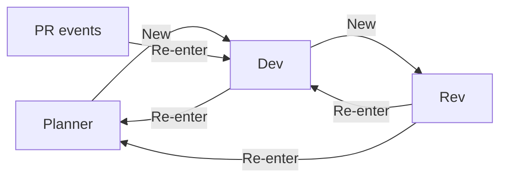

## Overview

Sprints v2.0 works — the method (Planner decomposes, Dev builds, Rev judges) is proven. What hurts is the management layer underneath it: wake-to-chat routing conditionals, chat close machinery, and zombie processes. This spec replaces that layer with a small set of engine-wide literals, locked by the FnB on 2026-08-02 (decision #65).

The core inversion: **the active chat is DB-tracked state, not derived state.** One registry row per shell answers every question the engine asks — who is active, in which chat, backed by which process. Wakes, the reaper, and the activity monitor all read and write that registry. Nothing repairs pointers, because the registry is the single authority.

> [!class1]
> Locked rules come from decision #65, the FnB design session of 2026-08-02, and the same-day review dispositions (flags #140–#142, decisions #66–#68). The Authority Split is **ratified** (decision #67, supersedes #53) and builds as enforcement.

The literals are deliberately general — wakes, wake messages, and PR-event subscriptions are engine-wide primitives, usable by future loop designs and by shells outside any sprint.

```stats
:::class1
value: 4
label: Engine literals
description: registry, wake, wake_message, PR subscription
:::class2
value: 2
label: Wake types
description: New and Re-enter — resolved at delivery
:::class3
value: 60s
label: Reaper heartbeat
description: kill anything unlinked from the registry
:::class4
value: 9
label: Retired subsystems
description: close machinery, pointers, purpose taxonomy, more
```

## The Literals

Four primitives, each independently usable inside and outside sprints:

| Literal | What it is | Keyed to |
|---|---|---|
| **Active chat registry** | The one DB-tracked active chat per shell, with its process identity | `shell_id` (unique) |
| **wake_message** | A durable message: sender (nullable = engine), receiver, body, acceptance record | receiver shell |
| **Wake** | Durable delivery intent created by every wake_message send; declared New or Re-enter, **resolved at delivery** | receiver shell, coalescing |
| **PR subscription** | A dev's ownership-scoped registration for GitHub PR events | owning dev shell |

Rules that bind them, engine-wide:

- Every wake_message send triggers a wake. Unilateral — the `active` suppression flag is retired.
- A GitHub event matching a subscription produces an engine-authored wake_message to the subscriber, which triggers a wake like any other. Every PR-event body carries the PR identity (repo, number, head SHA, event) so a delivery is always self-describing.
- A wake delivers its message bodies programmatically in the wake turn — and delivery is **complete**: the wake turn drains every undelivered wake_message for the receiver into whichever chat it runs in, so no rule about chat placement can lose a message. Acceptance (accept/decline) remains an explicit agent act — it drives work-unit transitions and liveness, and is never a delivery side effect.
- **Wake type resolves at delivery, not at send** (locked 2026-08-02, closes flags #141/#142). The declared type rides on the message; the pending wake carries no type. FnB ruling, verbatim (Jed, 2026-08-02): *"if mid-turn, we send the wake as a re-enter into the active chat as a rule for all wake_messages. this becomes a property of wake_messages. if process active — re-enter."* And on coalescing: *"if there is more than 1 wake stacked up, they combine to 1 wake until it is consumed. the wake triggers a read of wake_messages. all messages are delivered. simple."* At dispatch the engine reads the registry:

| Registry state at dispatch | Delivery |
|---|---|
| Live in-flight turn (pid set, identity-verified against `/proc/pid/stat`) | **Re-enter** into the active chat at the natural run boundary — regardless of declared type. A live turn is never displaced by a wake |
| Idle (pid NULL, or dead/recycled pid — a stale record counts as a boundary) | Declared types honored: any **New** in the coalesced set rotates the chat (fail-loud close, fresh chat) and the full drained backlog delivers there; all-Re-enter enters the existing chat, spawning a fresh run in it (an idle chat has no upcoming boundary to wait for) |
| No registry row | Create a chat and deliver — New behavior |

- `sprint_messages` is renamed and generalized to `wake_message`: sprint scope becomes optional, receiver keys on shell. Acceptance semantics carry over unchanged (disposition + `read_at`, DB-trigger-enforced tuples).
- Idempotency keys, the coalescing wake outbox (at most one pending wake per receiver — `idx_sprint_wake_one_pending_participant`), the wake↔message join, and the attempts evidence table all carry over from v2.0 — they are sound. Mixed-type coalescing is resolved by the delivery rule above, so the partial unique index carries over **without a type column**.

## Active Chat Registry

**The rule: at most one active chat per shell, tracked in the DB. Zero is legal.** A registry row holds the shell, its active chat id, and the process identity currently executing a turn in it (nullable between turns).


Registry shape:

| Column | Meaning |
|---|---|
| `shell_id` (UNIQUE) | the shell — one row max |
| `chat_id` | the active conversation |
| `process_pid` (nullable) | pid of the in-flight turn's process, NULL between turns |
| `process_start_ticks` (nullable) | field 22 of `/proc/pid/stat` — identity pair with pid |
| `updated_at` | last write |

A shell has a process only while a turn runs: the broker spawns the harness process for the turn, observes its exit as the parent, and clears `process_pid` in the same write that finalizes the run row. Idle is the ground state — an open chat with pid NULL — not a timeout or an inference.

### Creation ordering — fail loud

Step 1 of creating any new chat is closing the shell's existing active chat and clearing its registry row. **A new chat may not be created while the old one is open.** If the close fails, creation fails loudly — no fallback, no silent second chat, no sneaky zombies. Only after the close commits: insert the new chat, write the registry row, enqueue the wake turn.

Process registration is part of the spawn act: the pid + start_ticks land in the registry row in the same transaction that records the run start, so the reaper never sees a legitimate fresh process as unlinked. A ~30s reaper grace window on young processes is belt-and-suspenders.

### Universality — human chats included

The one-chat rule has no exemptions: the sprint-scope exemption is retired, and human-occupied chats are not special. A New delivered to an *idle* receiver displaces whatever chat is open — including a live FnB↔shell conversation sitting between turns — and the displaced chat's process linkage clears. Intended consequence — FnB ruling, verbatim (Jed, 2026-08-02): *"a planner launching a sprint closes his own chat, this is intended. so it boots in a fresh chat required."* The sprint boots in a required fresh chat and the FnB continues there. A mid-turn chat, human-driven or not, is protected by the delivery rule like any other; the FnB close button is the one unconditional displacement path.

### FnB close

The FnB close button works on any chat, any time, sprint or no sprint: flips the chat to closed, clears the registry row. The displaced process loses linkage and the reaper takes it. Closing the Planner's chat during an armed sprint additionally flips coordinate mode (see Wake Types & Routing).

### Chat identity

New chats created by wakes are keyed `generation:{gen}:wake:{wake_id}` — the per-sprint `conversation_generation` survives DB rebuilds and stays. The reroute-chain scanning and legacy raw-key dual lookups are retired with the machinery that needed them.

## Wake Types & Routing

Two wake types. Nothing else.

| Type | Behavior |
|---|---|
| **New** | Close the receiver's active chat (fail-loud ordering above), create a fresh chat, register it, deliver the wake turn into it — honored when the receiver is idle at dispatch (delivery rule) |
| **Re-enter** | Enqueue the wake turn into the registry chat: at the natural run boundary when a run is live, or by spawning a fresh run in the chat when the shell is dormant. No registry row → behave exactly as New |

The sprint routing table:



- **Planner → Dev: New.** Each work assignment opens a fresh dev chat; the dev's previous chat closes and its process linkage clears.
- **Dev → Rev: New.** Full review at every dev iteration, fresh reviewer chat each round — fresh eyes, no accumulated review-session bias. The reviewer's previous chat closes automatically.
- **Rev → Dev: Re-enter.** The dev fixes review comments in the session where the code was written. Session continuity where it matters most.
- **Dev → Planner and Rev → Planner: Re-enter.** All roads to the planner flow into its active chat — if one exists.
- **GitHub events: always Re-enter** — into the dev's *current* active chat. Merges are FnB-gated outside sprint authority, so a PR can outlive the chat it was submitted from: the Planner may rotate the dev's chat with the next assignment while the PR sits open, and a later red then lands in the new chat, about a different unit. That cross-unit delivery is legal and self-describing — the wake body carries the PR identity.

**The table's New semantics are idle-time guarantees.** Because type resolves at delivery, a busy receiver takes any wake as Re-enter: an assignment sent to a mid-turn dev, or a review request to a mid-turn Rev, enters the current chat at the boundary instead of rotating it. Fresh-chat-per-assignment and fresh-reviewer-eyes hold whenever the receiver is idle at dispatch — the overwhelmingly common case, since sprint sends target shells at hand-off points. The trade is deliberate (FnB, 2026-08-02): a live turn is never displaced by a wake. FnB confirmation of the full state machine, verbatim: *"idle + new chat = new chat. in turn + new chat = re-enter. Re-enter looks at DB for 'active' and resumes that chat with a new process."*

### The FnB mode dial — supervise vs coordinate

Because planner-bound messages are Re-enter, the FnB controls the planner's working mode with the close button alone:

- **Keep the planner chat open → supervise.** Every report and escalation flows into one continuous oversight chat for the whole sprint.
- **Close the planner chat mid-sprint → coordinate.** The close sets a coordinate flag on the planner for that sprint; while set, Re-enter messages to the planner behave as New. Each message opens a fresh chat, the planner handles it, the next message closes it. Ticket-by-ticket.

The flag is one tracked bit, sprint-scoped. **Only FnB-initiated close, pause, or cancel of that sprint clears it** (FnB ruling, 2026-08-02) — an auto-pause (`wake_delivery_exhausted`, contention exhaustion) preserves the flag across resume, so a passive safety system never silently reverts an explicit operator choice. The way back to supervise is unchanged: FnB pause + resume.

> [!class4]
> The coordinate flag must be tracked, not derived: without it, the first Re-enter after an FnB close would create a chat that then becomes active, and subsequent Re-enters would silently reconstruct supervise mode.

**Coordinate mode never kills the planner mid-turn.** A coordinate-mode New arriving while the planner is mid-handling delivers as Re-enter into the current ticket chat at the boundary — the delivery rule closes the displacement race (flag #142) with no coordinate-specific machinery. Messages arriving while the planner is idle open the next ticket chat as designed.

## PR Subscriptions

Devs own PRs and subscribe to their own PR events — **inside and outside sprints**. The subscription is a first-class registration keyed to the owning dev shell, replacing the hardcoded role×state routing in the watcher. The watcher's polling, six-state normalization (merged/closed/red/green/pending/created), and hash-chained transition dedupe carry over unchanged; its armed-sprint-only gate is removed — it runs whenever registrations exist.

Event semantics for the owning dev (all Re-enter, into the active chat):

| Event | Wake says |
|---|---|
| **red** | your PR went red — fix it |
| **green** | your PR is green — judge readiness and pass the baton to review |
| **closed** (without merge) | your PR was closed externally — judge, and inform the Planner if it's a real problem |

Every PR-event wake body names the PR (repo, number, head SHA, event): a wake delivered after a chat rotation may concern a different unit than the chat's current one, and must be self-describing.

Planner and Rev receive **no git wakes**, ever. They may check git status during their own turns. Merged PRs need no wake: merge observation completes merge-ready units and dispatches the next wave programmatically (decision #36's contract — the watcher never requests review; the dev's green-wake judgment does — is preserved).

## The Reaper

**The rule: any tracked process without an active-chat linkage in the registry dies.** The reaper runs on a 60-second heartbeat. Zombies expose themselves naturally as work progresses — every displacement unlinks a process, and every unlinked process is reaped on the next beat.

Sweep procedure, each beat:

1. Enumerate candidate processes from recorded run rows (pid + start_ticks + process group persisted at spawn).
2. A process is **protected** iff its pid + start_ticks match a current registry row.
3. For every unprotected candidate still alive: verify identity against `/proc/pid/stat` — **start_ticks must match before any signal is sent** (recycled pids are never killed).
4. Kill via the ladder on the process group: harness-native interrupt → SIGTERM after ~15s grace → SIGKILL after ~15s more. **Ladder state persists on the run row** (last signal + timestamp), so escalation advances across heartbeats instead of blocking a beat. When the kill lands, **the reaper itself writes the run row's terminal `interrupted` status** — runs finish as `interrupted`, never `unknown`.
5. Skip processes younger than the ~30s grace window.

The ladder generalizes decision #40's adapter-owned process-group cleanup into the shared subprocess runner, so every harness adapter gets identical guarantees. Broker-death orphans need no special path: on restart, their run rows still carry process identity, their registry linkage is gone (or superseded), and the sweep takes them.

On sandbox seats the reaper runs **inside the container**: the `/proc/pid/stat` identity check requires sharing the pid namespace of what it inspects — `init: true` covers child reaping, not namespace visibility. The container still runs a real init (`init: true` / tini) so killed children are actually reaped by PID 1.

### Zombie coverage

Every zombie is a legitimate turn process that outlived its bookkeeping. Four classes, each covered:

| Zombie class | Covered by |
|---|---|
| Displaced mid-turn (chat closed under a live process) | Registry unlink → reaper, next beat. Rarer by design: wakes never displace a live turn (delivery rule); FnB close is the remaining path |
| Broker death / engine restart orphan | Run rows keep process identity; linkage gone or superseded on restart → sweep takes them |
| Hung in-flight turn (pid matches registry — reaper-protected) | The **inactivity ceiling** (Activity Monitor, required) closes the chat, clearing linkage → reaper |
| Leaked children of a killed turn | Process-group ladder in the shared runner (generalized decision #40) |

## Activity Monitor

The existing 3-attempt wake budget is rewired to feed the registry and reaper:

```linear
Wake attempt fails 3 times :::class4 -> Chat flipped to closed :::class4 -> Registry row cleared :::class2 -> Reaper cleans up process :::class2 -> Sprint auto-pauses, FnB surfaced :::class1
```

If a shell fails to boot, three delivery attempts are made (with backoff — `available_at` advances on failure, fixing the current burn-in-10-seconds defect). The third failure closes the chat, the reaper cleans up, and the sprint auto-pauses with the existing `wake_delivery_exhausted` reason surfaced to the FnB. A role shell that cannot boot three times is a human problem, not a retry problem. (An auto-pause preserves the coordinate flag — see the mode dial.)

For normal work the reaper needs no monitor at all — displacement and rotation expose stale processes as the sprint progresses. One class is structurally reaper-immune: the **hung in-flight turn**, whose pid matches the registry and is therefore protected forever. Its backstop is the **inactivity ceiling, a required part of this unit**: an active chat whose run shows no evidence past a generous configurable ceiling (proposed default 45–60 min) is closed by the monitor, then reaped — and any wake queued behind the hung turn dispatches at that close. Only the trigger wiring stays open (mechanical timer vs the liveness monitor's silence-episode escalation — Open Items #2); the ceiling itself is not optional. The liveness monitor's advisory role (nudge, escalate to Planner) is unchanged either way.

## Arming Flow

Arming a sprint always triggers a **New** wake to the overseeing Planner. That chat opens with model selection for every role — Planner included — prefilled with defaults. This replaces the Sprints v2.0 interview.

- The FnB can adjust any selection in the chat, or say go.
- **Dispatch is gated on selections being recorded — defaults satisfy the gate.** An FnB that trusts defaults adds zero friction; no work dispatches before the gate passes.
- Selections write the existing per-participant `harness / model / effort` fields.
- UX: **re-use the existing per-role pickers from the arming modal** — no new UI surface. If the FnB makes no selections, defaults apply and the gate passes on them.

## Authority Split

> [!class3]
> **Ratified by the FnB 2026-08-02** — decision #67, superseding #53 broadly: its *Devs and Reviewers report, the Planner decides* doctrine and its Planner-only pause-teaching clause both give way. #52 is the sc dispatcher/PATH contract, untouched. (Erratum: decision #65's rationale cites #52 here — read #53.)

Ratifying words, verbatim (Jed, the FnB, 2026-08-02): *"Rev decides and documents, planner acts."*

The lane split:

| Role | Owns |
|---|---|
| **Dev** | Writing code; monitoring owned PRs via subscriptions |
| **Rev** | All decisions and recommendations: pause, cancel, conclude. All reports: conformance doc, sprint report |
| **Planner** | All actions: executes pause/cancel/close by protocol on receipt of a Rev decision message |

Conclude flow: Rev decides the sprint is done, writes the conformance doc and sprint report, messages the Planner (Re-enter); the Planner closes the sprint by protocol. No new skill is needed — the pause/cancel/close action protocols extend `sprint_pln`, report authorship moves into `sprint_rev`, and the FnB retains its board-level override (decision #46) regardless.

## Retired Machinery

Deleted outright by this spec:

- `current_conversation_id` and `persistent_conversation_id` pointer columns and every live writer that maintains them — six at spec time (five in `sprint_participant_chats.py`, one in `sprint_liveness.py`); re-inventory at build so the retirement sweep misses none
- The `work / fix / merge / fallback` purpose taxonomy and parent-pointer chat topology
- Reroute-chain scanning and legacy raw-key dual lookups in wake conversation resolution
- The deferred-close machinery (`close_for_terminal_lifecycle`), its planner exemption, stranded close requests, and the close↔wake attempt-burning race
- The `active` flag on messages (every message wakes)
- The sprint-scope exemption from the one-open-chat rule (the registry rule is universal)
- The two divergent wake producers (assignment path and message path unify on one producer)
- The watcher's hand-rolled wake cancellation (all cancellation through the message store)
- The PR watcher's armed-sprint-only gate (subscriptions are engine-wide)

Kept because they are sound: the coalescing wake outbox and its partial unique index (no type column needed — type resolves at delivery), the wake↔message join, attempts evidence, acceptance triggers, `conversation_generation` rebuild-safety, transition hash-chain dedupe, the liveness evidence model, and the queued-turn delivery machinery that Re-enter rides on.

## Build Order

```linear
Registry migration + fail-loud creation ordering :::class1 -> wake_message rename + delivery-time type resolution, one producer :::class1 -> Reaper service + persisted process identity :::class2 -> Activity monitor rewire + required inactivity ceiling + attempt backoff :::class2 -> Routing table + coordinate flag + FnB close :::class3 -> Engine-wide PR subscriptions, always-on watcher :::class3 -> Arming flow + model-selection gate :::class3 -> Authority split protocols in sprint_pln + sprint_rev :::class4 -> Skills + boot docs fold-in, retirements, test sweep :::class4
```

Each step is a shippable unit with its own tests. The registry lands first because every later step reads it; retirements land last so nothing is deleted before its replacement is proven.

## Open Items

1. **Inactivity ceiling wiring** — the ceiling itself is **required** (see Activity Monitor); open is only the trigger (mechanical timer vs liveness-escalation) and the value (proposed default: 45–60 min).
2. **Reaper tunables** — heartbeat 60s, TERM grace 15s, KILL grace 15s, young-process grace 30s; all config, defaults above.

Settled post-review (FnB, 2026-08-02):

- **Authority Split ratified** — decision #67 supersedes #53; the protocols build as their own unit (see Build Order). FnB verbatim: *"Rev decides and documents, planner acts. yes. lets do this."*
- **No `shell_messages` unification** — decision #68: wake messages and non-wake messages are different kinds and remain separate stores; the boot-time inbox stays as-is. The former "endgame" framing is dropped, not deferred. FnB verbatim: *"we should have wake messages and non wake messages. we dont need to unify."*
- **Model-selection UX** — FnB verbatim: *"it will use defaults if no selections are made, and we should re-use our existing pickers we already have in the modal."*
