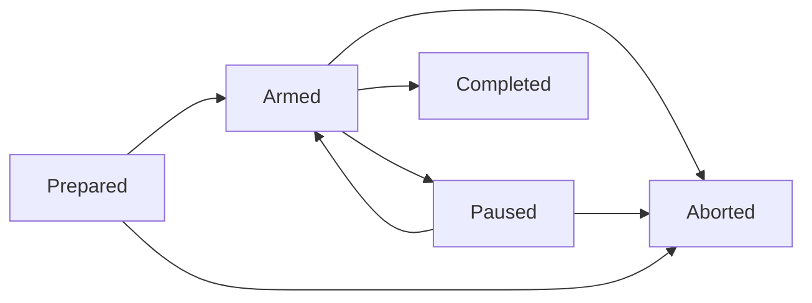

# Sprints v2.0 — Collaboration Loop

## Overview

> [!class4]
> REV5 — REV4 (the phase-0 QAQC write-backs: flags #64–#68 from independent rounds docs #52/#53) plus the two Low residues prescribed verbatim in the REV4 PASS verdicts (docs #54/#55): routing-table wake target now reads current Sprint conversation; the non-owner-edit rule is marked policy-guard-not-write-lock. QAQC PASS binds to REV4; PLN1 ruled REV5 arming-eligible without a further round since both edits are the verdicts' own prescriptions (recorded in SPRINT doc #51). The implementation task plan is ACTIVE. Mid-Sprint edit REV6 (owning-Planner, recorded per Pause and Recovery): one-line pill precedence for multi-participation shells (armed > most-recently-paused), settling review flag #71's fix direction. Mid-Sprint edit REV7 (ruling R3, settling SC-028): a registered PR has exactly one owning work unit — Terms' "one or more work units" contradicted the review loop's per-lane invariant; registration now rejects multi-unit sets. Mid-Sprint edit REV8 (ruling R5, settling REV2's abandoned-review-request Low): closed-without-merge observation resolves the owning unit's outstanding review-request expectations. Post-conformance edit REV9 (decision #45, FnB disposition of dual-FAIL conformance docs #57/#58): R7 completion semantics — merged observation completes only `merge_ready` units, grant-bypass notifies the Planner and never auto-completes; watcher head-change transitions with automatic `merge_ready` → `in_review` delta re-review; advisory close-out completeness (FnB stance: shells make judgment calls, the report and follow-up patches absorb deviations — the engine surfaces gaps, it does not gate); FnB-only follow-up disposition (accepted/resolved/dismissed); QAQC recording via the authenticated surface with Review-shell signer verification; close-out authority is the originating Planner or FnB only; the engine never executes merges — shells merge under the grant, the watcher observes.

A Sprint is an observable, long-running collaboration loop in which a Planner, one or more Developers, and one or more Reviewers work together to build a roadmap feature governed by one or more approved specs. The FnB can observe and enter every participating shell conversation throughout the Sprint without becoming a required transition gate.

Sprints v2.0 starts from a zero baseline. Sprint v1 runtime data, APIs, tables, state, Conductor behavior, and compatibility requirements do not constrain this design. Generic browser-conversation, quota, Git, and shell infrastructure may be reused only where it has an independently verified non-Sprint owner and satisfies this spec's contracts. Messaging is not reused: Sprint coordination lives in a dedicated `sprint_messages` domain with its own acceptance semantics.

The system controls the process like a river: it establishes durable boundaries, routes work and evidence, exposes stalls, and supports recovery while leaving capable shells room to exercise judgment. Partial failure is acceptable. Silent loss, duplicated authority, and invisible stalls are not.

## Design Principles

- Collaboration is the primary purpose.
- FnB visibility into live Planner, Developer, and Reviewer conversations is a core capability.
- Shells receive goals, context, boundaries, and evidence rather than a brittle sequence of mandatory moves.
- Sprint behavior is skill-driven. The spec fixes contracts and invariants; the Sprint skills carry procedure, severity rubrics, and prompt craft. Fine-tuning behavior means editing a skill, not revising this spec.
- Developer and Review shells may resolve ambiguity and adapt to changed reality when they record the decision and rationale for conformance review.
- The system captures every fact it can determine reliably. Shells contribute judgment, intent, explanation, and synthesis.
- Hard guards protect true invariants, dangerous actions, and delivery integrity. Ordinary uncertainty produces evidence and escalation rather than a stalled Sprint.
- Messages are durable facts. Wakes are retryable delivery attempts for those facts.
- Correctness rests on transactions, idempotency, uniqueness, reconciliation, and observable recovery rather than timing.
- A useful Sprint with visible failed or retried operations is preferable to a theoretically perfect Sprint that routinely deadlocks. A stall patched through pause, reconcile, and resume counts as success, not failure.
- Sprint-specific polling, monitoring, and dispatch are active only while the Sprint is armed.

## Roles and Authority

| Role | Authority and responsibility |
|---|---|
| FnB | Collaborates on declaration, enters any participant conversation, observes the Sprint, sends messages, and may pause, resume, or abort. FnB approval is not required for every transition or completion. If the Planner is unavailable at close, the FnB drives completion, optionally booting a replacement Planner on a fallback harness. |
| Planner | Prepares and arms the Sprint, selects participants and routes, decomposes specs into work units, plans dependencies and waves, responds to escalations, governs scope, owns and may edit governing specs mid-Sprint when reality requires (recorded for the report), assigns follow-up work in the Developer's existing conversation, and drives close-out: boots the conformance review, submits the final report, and closes the Sprint. |
| Developer | Accepts assigned work, implements and verifies it, opens and retains ownership of PRs until green, responds to watcher-backed red and green wakes, hands off to review, responds to review findings, merges when the Sprint merge grant's bar is met, cleans its tree, and records material judgment calls or deviations. |
| Reviewer | Independently evaluates assigned work and PRs against the governing spec, flags Medium-and-above findings only, records findings and verdicts, may choose an appropriate review method, records material judgment calls, and performs the final whole-Sprint conformance review at close. |
| System | Owns durable state, message and wake delivery, conversation bindings, GitHub observation, liveness evidence, deterministic event capture, routing, reconciliation, and report evidence compilation. Pauses the Sprint automatically when a wake exhausts its delivery budget. |

Any participating shell may pause a Sprint immediately when Sprint integrity is threatened or an unresolvable issue is encountered — for example a GitHub outage, a spec that turns out unbuildable, broken tests or runners, or provider rate limits. Only the Planner or FnB resumes it after reviewing the evidence.

Abort is narrower: only the Planner or FnB may abort — from `armed`, `paused`, or `prepared` — and participant shells may pause but never abort. Aborting a `prepared` Sprint is the discard route for a declared Sprint that will never arm; it records a stub abort report and deletes nothing.

## Terms

- **Sprint**: one execution of this collaboration loop for one roadmap feature.
- **Spec revision**: the exact immutable body revision reviewed for Sprint eligibility.
- **Participant**: a shell assigned a Sprint role, route, and durable Sprint conversation.
- **Work unit**: a Planner-defined group of existing spec tasks assigned to one shell for one coherent handoff — one editing lane.
- **Dependency**: a hard prerequisite between work units.
- **Wave**: the Planner's intended grouping of parallel-ready work; a planning and display signal, not a prohibition.
- **Sprint message**: a durable, addressed collaboration record in the `sprint_messages` domain, scoped to a Sprint. Marking an actionable Sprint message read means the shell accepted it.
- **Wake**: an idempotent request to start or queue a harness turn that tells the shell to inspect its Sprint inbox.
- **Nudge**: an automated activity-confirmation Sprint message plus wake, sent by the liveness monitor before any Planner escalation.
- **Registered PR**: a GitHub pull request linked to a Sprint, an owning shell, and exactly one owning work unit; a work unit may register additional PRs when the implementation requires them. Registration rejects a multi-unit set — the review loop is a per-lane machine and a PR spanning lanes has no coherent gate.
- **Sprint merge grant**: the Sprint-scoped permission, committed at arming, for a Developer to merge its registered PR once review passes with all Medium-and-above findings addressed **and the PR's checks are green at merge time**. An earlier observed green is stale once checks re-run or the base moves; a merge attempt against regressed checks waits for the watcher's next green wake. Overrides the standing FnB-merge rule for the Sprint's registered PRs only.
- **Judgment record**: a shell-authored explanation of an ambiguity, deviation, decision, or issue that deterministic evidence cannot supply. Developer PR notes are intentionally freeform; the work is trusted, the record is for the report.

## Lifecycle

The lifecycle is deliberately small:



| State | Meaning and permitted automation |
|---|---|
| `prepared` | The Sprint record and plan exist but may still be revised. Sprint polling, monitoring, and dispatch are off. May transition directly to `aborted` (Planner or FnB) when a declared Sprint will never arm. |
| `armed` | Automation is enabled. Messages may wake participants, ready work may dispatch, registered PRs are polled, and liveness is monitored. |
| `paused` | The Sprint remains visible and historically intact but is not armed. New dispatch and Sprint polling stop; active Sprint turns receive durable interrupt intent. Planner/FnB coordination remains available through generic conversation and messaging services. |
| `completed` | Terminal. Conformance and the final report are the expected close-out artifacts, recorded through the close surface; their absence is surfaced in the evidence packet, not enforced by the transition (advisory close-out, REV9). Active Sprint services are off and amber participant pills are removed. |
| `aborted` | Terminal. Work stops without deleting history; an abort report records the reason, completed work, outstanding work, and recovery disposition. |

Development, Review, conformance, and reporting are progress phases within an armed Sprint, not lifecycle states. They are represented by work and evidence already in the system rather than duplicated lifecycle flags.

`paused` is entered by any participant shell, by the FnB, or by the system itself when a wake exhausts its delivery budget. The auto-pause path uses the same pause machinery, including the pause report.

## Preparation and QAQC

The FnB declares the intended Sprint with a Planner. The Planner invokes the `sprint_prep` skill and verifies:

- One roadmap feature is selected.
- One or more governing specs are selected.
- Every selected spec's current revision has passed at least one QAQC round signed by a Review shell.
- Every Medium, High, or Critical QAQC finding is resolved before approval.
- Any edit to an approved spec body creates a new revision and makes the previous approval ineligible for arming. Ineligibility gates new arming only: an armed Sprint continues on its bound revision, and mid-Sprint spec edits by the owning Planner are recorded and reported, not blocked.
- Existing spec tasks have been grouped into work units with assigned shells, roles, dependencies, and planned waves.
- A primary harness, model, and effective effort are selected for each participant.
- Planner fallback capacity is identified when another configured harness has usable quota.
- Required Developer and Reviewer capacity is available.
- GitHub repository access and local worktrees are available.
- No other Sprint is armed in the installation and no selected shell participates in another armed Sprint.

Deficiencies are surfaced to the FnB and remain editable in `prepared`. QAQC approval is a durable review record bound to reviewer, verdict, timestamp, findings, and exact spec revision; it is never a copied boolean on the Sprint row. It is recorded by the reviewing shell through the authenticated Sprint surface, and the recording surface verifies the signer is a Review shell (REV9).

Arming is one authoritative transaction. It commits the final plan, participant bindings, durable conversation placeholders, the Sprint merge grant, initial task messages, wake outbox intents, and armed transition before any external harness or GitHub action occurs. A crash after commit is recovered from the outbox; a crash before commit exposes no partial Sprint.

## Participant Conversations

Every participant receives a durable Sprint conversation at arming, including shells assigned to later waves. Creating the conversation does not launch a harness or consume model usage.

Conversation topology during the loop:

- A Developer's work conversation persists across work units. The Planner assigns the Developer's next unit in the same conversation, so context carries forward.
- Review outcomes open fresh linked conversations carrying exactly the context needed: approval opens a fresh merge conversation for the Developer; requested changes open a fresh fix conversation carrying the review notes. Fresh conversations keep short mechanical steps from dragging the whole development context along.
- All linked conversations remain inspectable from Sprint history, and the participant pill always points at the current one.

Each participant has exactly one **current Sprint conversation** — a durable pointer updated in the same transaction that creates or selects a conversation for that participant. Every wake for the participant — watcher red or green, review outcome, next-unit assignment, nudge, escalation — is delivered to the pointer's target at delivery time, and the amber pill always points at it. The transitions that move the pointer: work-unit assignment selects the participant's persistent work conversation; a changes-requested review creates and selects the fresh fix conversation; an approved review creates and selects the fresh merge conversation. During a fix loop, red and green watcher wakes therefore land in the fix conversation; after the merge, the next assignment returns the pointer to the persistent work conversation, whose context carries forward.

While the Sprint is armed or paused:

- Every participant shell card displays an amber `Sprint [n]` pill with its role and current high-level disposition. A shell with more than one live (armed or paused) participation shows exactly one pill: its armed participation when one exists (unique by the single-armed invariant), else its most recently paused participation; every participation stays enterable from Sprint history.
- Clicking the pill enters the participant's current Sprint conversation.
- The FnB may enter Planner, Developer, and Reviewer conversations at any time.
- Merely opening or viewing a conversation does not count as shell activity and does not wake the shell.
- An FnB message becomes a Sprint message and follows normal delivery policy.
- Messages submitted during an active native turn queue after that turn. They never inject into or silently interrupt generation.

A visible Sprint participation is stable even when its native harness execution changes. If the Planner's primary harness is exhausted, v2.0 creates a linked replacement conversation on an eligible configured fallback, supplies a generated Sprint context packet, and makes the pill point to the current conversation. It does not attempt cross-harness native-session resume. Earlier conversations remain enterable.

Terminal completion or abort removes the live amber pill but retains conversations in Sprint history.

## Sprint Messages and Wakes

Sprint coordination uses a dedicated `sprint_messages` domain rather than generic shell messaging. It is the same durable, addressed-message shape, but with one deliberate policy override: **marking an actionable Sprint message read means acceptance, and the shell begins work immediately.** Generic messaging's mark-read-on-completion habit does not apply here, and the domains never share rows, so neither policy contaminates the other. Only actionable task messages carry acceptance semantics; informational and passive messages do not. Every actionable message carries a durable disposition: `pending` until the shell acts, `accepted` when marked read, or `declined` with a recorded reason. Decline resolves the message — it stops waking — and the disposition is captured alongside read state as system evidence.

Every collaboration instruction or notification is committed as a durable message before delivery is attempted. A wake never carries changing task context. Every participant wake — assignment, ordinary participant message, review handoff or outcome, PR alert, nudge, escalation, Planner decision, or recovery — uses one role-aware routing envelope. Only the exact Sprint id, durable participant role, and corresponding role skill vary:

```text
Sprint {sprint_id} handoff for your {role} role. Load `{role_skill}`. Run `sc sprint inbox --sprint {sprint_id}` now and act on the Sprint message(s) using `{role_skill}`. Confirm every Sprint write succeeds before stopping. If the handoff is not complete, load `{role_skill}` again and run `sc sprint inbox --sprint {sprint_id}` again.
```

The envelope contains no task or message identifiers. The shell opens the durable Sprint inbox and follows `sprint_dev`, `sprint_rev`, or `sprint_pln`; retries retain byte-identical prompt text for one wake identity.

Delivery rules:

- An active notification records the message and creates or coalesces a wake intent.
- A passive notification records the message but does not create a harness turn; the shell reads it on its next turn.
- All addressed Sprint messages are active while armed unless explicitly recorded as passive system evidence.
- If a participant has a queued or running turn, new active messages accumulate in the inbox and coalesce behind one pending follow-up wake.
- A wake uses at-least-once delivery with a stable idempotency identity. Duplicate attempts may occur; duplicate native turns for the same pending wake may not.
- Message creation, assignment association, and wake outbox creation share one database transaction.
- A wake is attempted at most three times. A third failure is terminal: the system records the failure and pauses the Sprint automatically, pending investigation. It should never get this far — the budget exists so a delivery fault can never wedge the loop silently. Pausing the whole Sprint on one terminal wake failure is deliberate v2.0 posture — a loud stall beats partially silent operation; scoping the pause to the affected lane is future refinement.
- A shell that declines records the reason in the same transaction that sets the `declined` disposition, sends a result to the Planner, and stops receiving wakes for that message. A declined work-unit assignment returns the unit to the ready pool for reassignment; a declined review request routes back to the Planner for reviewer reassignment. A decline must never remain unread and wake forever.
- Delivery attempts, outcomes, retry timing, coalescing, and terminal failures are system evidence.

The system sender owns deterministic GitHub and liveness notifications, including nudges. Shells never forge system events.

## Work and Parallelism

The Planner groups existing spec tasks into work units. A work unit records its Sprint, assigned shell and role, assigned Reviewer, task membership, expected output, planned wave, dependencies, and current disposition. A registered PR's assigned Reviewer is inherited from its owning work unit.

- Dependencies are the only hard sequencing edges.
- Work units without unmet dependencies are parallel-eligible.
- A planned wave expresses the Planner's intended concurrent launch group; it is stored for planning and later display (the board web GUI itself remains future scope per Non-Goals).
- The Planner may revise waves, assignments, or dependencies as reality changes, provided already-completed history is not rewritten.
- The dispatcher launches as many ready work units as assigned capacity supports.
- One shell may own only one active work unit in the armed Sprint at a time. A work unit is an editing lane: the rule exists to prevent overlapping code edits in one shell's tree. Review assignments are not work units and do not count against it.
- A work unit may cover multiple related spec tasks.
- A code work unit normally registers one owning PR but may link additional PRs when the implementation requires them. Each registered PR has exactly one owning work unit (REV7).
- A work unit explicitly planned as report-only or no-code may complete with a durable result rather than a PR.
- The completion judgment for a code work unit is supplied at merge authorization: an approved review plus checks green at merge time produces the authorization, and the watcher's subsequent merged observation completes the unit by executing that already-given judgment (REV9, ruling R7). A merged observation on a unit that never reached `merge_ready` — an out-of-band merge bypassing the grant — never auto-completes the unit: it is recorded as `merge.grant_bypassed` and actively notifies the Planner for disposition. PR facts alone never substitute for the judgment chain.

The board is a projection of durable Sprint state. Shells do not manually maintain a second markdown board or repeat facts the system already knows.

## GitHub Observation

One installation-level Sprint watcher observes only registered PRs belonging to the armed Sprint. It has a five-second scheduling pulse while armed and performs no Sprint GitHub requests while prepared, paused, completed, aborted, or without an armed Sprint.

The watcher:

- Takes an initial snapshot on registration, arm, and resume.
- Batches or conditionally requests PR state where practical.
- Normalizes relevant transitions such as created, pending or unstable, red, green, merged, and closed.
- Appends an event when the normalized state **or the observed head** changes (REV9) — a same-state push is never invisible to the transition log.
- Never writes an unchanged result every five seconds.
- On observing a head change while the owning work unit is `merge_ready`: voids the now-stale approval, returns the unit to `in_review`, and actively wakes the assigned Reviewer for a delta review against the new head (REV9). No manual un-wedge is required.
- Uses stable transition identities so retries cannot duplicate events.
- Records poll failures and rate pressure, then backs off without inventing PR state.
- Reconciles current state after restart or resume. It does not fabricate intermediate transitions it could not observe.
- Updates the Sprint board and report evidence automatically. Developers never flip PR state in the database.

Every newly observed transition into red or green creates an active notification for the owning Developer, delivered to its current Sprint conversation. A closed-without-merge observation also resolves the owning work unit's outstanding review-request liveness expectations — an abandoned lane must not nudge or escalate over a review that can no longer happen (REV8). If the first snapshot after PR registration observes the PR already red or green, that state occurrence is notified once. Resume or restart reconciliation emits a new notification only when the current normalized state differs from the last durable observed state; an unchanged state never creates a duplicate wake. Stable transition identity and wake coalescing make these notifications retry-safe.

Notification routing:

| Recipient | PR notifications |
|---|---|
| Owning Developer | Active on every newly observed red or failing transition and every newly observed green transition on its own registered PRs; passive for other transitions. A red wake routes correction work. A green wake routes readiness judgment and review handoff through the Developer's current Sprint conversation. |
| Planner | Active when a registered PR is closed without merge; passive for every other registered Sprint PR transition |
| Assigned Reviewer | Passive for transitions on its assigned PRs |

The watcher never requests review directly. Its active green notification wakes the owning Developer's conversation; the Developer verifies readiness and sends the active review-request Sprint message to the assigned Reviewer. Developer judgment still decides readiness, while watcher delivery ensures the handoff does not depend on accidental conversation activity.

The engine never executes a merge (REV9). Merging is always performed by the authorized shell directly against GitHub, under the grant; the watcher observes the result and records it. "Merge under the grant" names this shell-performed act, not an engine capability.

## Dev and Review Loop

1. Planner or dispatcher sends a ready work-unit message to its Developer.
2. Developer accepts (marking the message read), works in its assigned worktree, verifies the result, records material judgment calls, and registers its PR.
3. The Developer owns the PR until it is green. Its native turn may idle while checks are pending; the watcher actively wakes the Developer's current Sprint conversation whenever the registered PR enters red or green. Red routes correction work. Green routes readiness judgment and review handoff.
4. On a green wake, the Developer verifies that the PR is ready, sends an active review-request Sprint message to the assigned Reviewer, and then idles. The conversation is retained. If the Developer is already running, the green notification coalesces behind the active turn and is processed next rather than being lost.
5. The Reviewer evaluates the governing spec revision, code, checks, and relevant evidence, and flags Medium-and-above findings only. The severity rubric lives in the `sprint_rev` skill, and Reviewer judgment applies; this spec does not define Medium.
6. A changes-requested review records its findings and actively wakes the owning Developer on a fresh linked fix conversation carrying the review notes; the fix conversation becomes the Developer's current conversation, so subsequent red and green watcher wakes land there. The Developer fixes; after green, it verifies readiness and hands back to review. The loop repeats.
7. A passed review with all Medium-and-above findings addressed records the verdict and actively wakes the owning Developer on a fresh linked merge conversation, where it verifies the checks are still green and merges under the Sprint merge grant, cleans the worktree, leaves freeform judgment and PR notes in the record, and submits its result.
8. GitHub observation detects the merge automatically and updates the board.
9. The Developer asks the Planner for further work; the Planner assigns the next ready unit in the Developer's persistent work conversation, which becomes its current conversation again at assignment.
10. The Planner receives passive evidence and is actively woken only when a decision, escalation, re-plan, pause, or terminal synthesis is required.

Developer and Reviewer discretion is intentional. The spec and role skills define goals, ownership boundaries, required evidence, forbidden destructive actions, and stop conditions. They do not attempt to enumerate every valid judgment.

## Sprint Skills

Sprint behavior is skill-driven. The spec fixes contracts; the skills carry procedure. Five skills make up the loop, and each is a named deliverable of this feature:

| Skill | Carried by | Purpose |
|---|---|---|
| `sprint_prep` | Planner | Declaration and arming checklist: feature and spec selection, QAQC eligibility, work units, waves, routes, capacity, merge grant. |
| `sprint_pln` | Planner | Running the armed Sprint: dispatch, escalation response, re-planning, scope and spec-edit judgment, pause and resume coordination. |
| `sprint_dev` | Developer | The development lane: acceptance, implementation, PR ownership until green, review handoff, merge under the grant, judgment notes. |
| `sprint_rev` | Reviewer | Review method and verdicts, the Medium-and-above severity bar, findings craft, and the close-out conformance pass. |
| `sprint_close` | Planner | Close-out: booting conformance, compiling the final report from the evidence packet, and completing or aborting the Sprint. |

The skills guide a river; they do not build gears. Each defines goals, boundaries, required evidence, and stop conditions while leaving room for shell judgment. Behavioral fine-tuning — including what counts as a Medium finding — lives in the skills and never requires a revision of this spec.

## Liveness Monitoring

The liveness monitor evaluates each accepted active work expectation every five minutes while armed. An accepted active work expectation is any accepted actionable Sprint message — work-unit assignments and review requests alike; review expectations are monitored even though reviews are not work units. It consumes evidence; it does not infer failure from one missing signal.

Strong evidence includes:

- Message acceptance and state transitions
- Native run start, assistant output, tool start or completion, permission/input request, usage event, or terminal event
- A fresh broker lease heartbeat bound to the exact native run
- Exact native session inspection or reconciliation
- Durable work-unit results or Sprint messages
- Git commits and registered PR transitions

Supporting evidence includes harness process presence, CPU movement, worktree changes, and quota snapshots. Browser-tab presence and lack of disk writes are not proof of shell activity or failure.

Policy:

- Acceptance begins a ten-minute presumed-live grace window unless a proven terminal failure occurs.
- Fresh strong evidence extends confidence without launching another shell.
- A proven failed run, missing expected process, expired unrecoverable lease, or exhausted provider quota escalates immediately.
- Ambiguous silence beyond ten minutes triggers exactly one automated nudge: a Sprint message asking the shell to confirm activity, delivered with a wake. A nudge costs one small turn and is cheaper than a Planner escalation.
- Continued silence beyond a further ten-minute window creates one active Planner escalation containing the observed evidence and unreadable signals.
- An escalation is deduplicated until new evidence arrives or a later escalation threshold is reached.
- The monitor does not repeatedly boot the worker merely to ask whether it is working; one nudge per silence episode is the limit.
- Planner escalation delivery uses an eligible configured fallback harness when the Planner's own primary provider is exhausted — the same linked-replacement-conversation mechanism as Participant Conversations. The monitor never re-boots the silent worker on a fallback harness. If no fallback is available, the system records the failure and surfaces pause as an option.
- Monitor uncertainty alone does not corrupt work-unit state or silently abort the Sprint.

The first release may discover additional failure shapes. Each must remain visible and patchable rather than hidden behind guards that stop ordinary work.

## Pause and Recovery

Any participant may pause with a short reason, and the system pauses automatically on terminal wake failure. Effective pause and its reason are committed atomically before a detailed report is required.

Pause behavior:

- Transition to `paused`; the Sprint is no longer armed.
- Stop new work dispatch, Sprint GitHub polling, and liveness evaluation.
- Persist interrupt intent for active Sprint turns; delivery failure remains visible and retryable.
- Retain every conversation, message, assignment, PR, event, and partial result.
- Actively notify the Planner and make the pause visible to the FnB.
- Generate a pause-report template containing deterministic state, recent anomalies, active turns, work units, and PRs. The pausing shell or Planner adds the integrity threat, judgment, and recommendation.

Resume is owned by Planner or FnB. Before re-arming, the system reconciles native runs, unread messages, pending wakes, work-unit dispositions, registered PRs, participant capacity, and current spec eligibility. Eligibility reconciliation informs; it never silently blocks: if a governing spec body changed while paused, resume proceeds on the Sprint's bound revision, the drift is recorded as evidence and actively notified to the Planner, and the Planner judges whether to continue, re-plan, or abort. A governing spec bound to an armed or paused Sprint may be edited only by its owning Planner or the FnB; the system records any other write as drift evidence and notifies the Planner the same way (a policy guard with detection, not a write lock). The bound revision's QAQC approval remains valid for the running Sprint — approval ineligibility gates new arming only. The system then commits a new armed transition and resumes external services.

Abort is terminal and never deletes history. It stops new work, requests active interruption, removes live pills, and routes the Planner to produce an abort report.

## Deterministic Capture

| System captures | Shells contribute |
|---|---|
| Sprint lifecycle and transition times | Scope decisions and rationale |
| Participant, role, route, conversation, model, harness, and effort | Acceptance or decline reason |
| Message bodies, sender, recipient, read state, and timestamps | Judgment calls and adaptations |
| Wake intents, attempts, coalescing, retry, and outcome | Explanations of ambiguous behavior |
| Native run identities, events, tool activity, usage, and terminal outcome | Developer implementation summary and freeform PR notes |
| Work-unit assignment, dependency, wave, and state history | Review findings and verdict reasoning |
| GitHub PR identity, state, checks, transition, URL, and merge | Mid-Sprint spec edits and their rationale |
| Poller and monitor health, failures, nudges, and escalation | Pause integrity assessment |
| Git and worktree observations already available to the engine | Conformance judgment and final synthesis |
| — | Lessons and follow-up recommendations |

The final report compiler supplies a bounded evidence packet rather than a raw event dump. It includes scope, exact spec revisions (including mid-Sprint edits), planned versus actual work, PR outcomes, important deviations, pause/recovery events, wake-health aggregates, anomaly details, unresolved work, and links to the complete timeline and participant conversations. The Planner supplies meaning and final judgment.

## Sprint Close and Conformance

The final step of every Sprint is a whole-Sprint conformance review. When all planned work is done, the Planner boots a Review shell to review the Sprint's delivered work against the governing spec revision(s) for general conformance.

Conformance findings are **not** fixed inside the Sprint — at any severity, including Critical. They are recorded as follow-ups for FnB review and included in the sprint report. The Sprint ships; the FnB dispositions the follow-ups.

Follow-up disposition is an FnB-only act with three terminal outcomes (REV9): `accepted` — ship as-is, acknowledged and tracked, terminal; `resolved` — addressed by a follow-up patch; `dismissed` — judged not a defect. Until dispositioned, a follow-up remains `pending`. Only `pending` counts as unresolved in the evidence packet.

The Planner then closes the Sprint with a full sprint report covering the conformance outcome, judgments made by Developers, issues encountered, mid-Sprint spec edits, and the follow-up list. `sprint_close` carries this procedure. If the Planner is unavailable after all delivery work has merged, the FnB drives close-out, optionally booting a replacement Planner on a fallback harness.

Close-out authority — compiling the final report, completing, or aborting — rests with the originating Planner or the FnB only; a replacement Planner booted for continuity holds no close-out authority (REV9, confirming shipped behavior). Close-out completeness is advisory by design (REV9): a Sprint may complete with unresolved work units or a missing close-out artifact when reality demands it. The evidence packet surfaces every gap, the sprint report explains it, and follow-up patches carry the remainder. The engine surfaces; it does not gate — shells make judgment calls, and reports and follow-up patches absorb deviations.

## Conceptual Data Model

Physical table boundaries may reuse proven generic services, but the domain must expose these durable concepts:

- `sprints`: identity, feature, originating Planner, lifecycle, timestamps, and terminal outcome
- `sprint_specs`: included spec revision and qualifying QAQC approval
- `sprint_participants`: shell, role, selected route, current conversation, and participation disposition
- `sprint_work_units`: assignment, assigned Reviewer, expected output, planned wave, and disposition
- Work-unit task membership and dependency edges
- `sprint_messages`: the dedicated Sprint message domain with read-equals-acceptance and durable decline dispositions for actionable messages
- Wake outbox intents and delivery attempts, including the per-wake attempt count
- Registered PRs and append-only normalized PR transitions
- Judgment, pause, conformance, and final reports
- An append-only Sprint event timeline or equivalent projection from authoritative records

Do not store copied QA rollups, duplicated PR state, `parallel_with` edges, or booleans that can be derived reliably. Current-state projections may be cached only when one authoritative transition path maintains them. At most one armed Sprint per installation is a uniqueness invariant enforced inside the arming transaction itself, not only by the preparation-time check.

External GitHub and harness work never occurs inside database transactions. SQLite writes are short, retried within bounded policy, and batch noisy conversation evidence where safe.

## Core Systems and Gates

| Stage | Core system | Independent verification gate |
|---|---|---|
| 1 | Lifecycle and armed-service switch | Restart recovers an armed Sprint; invalid transitions fail; non-armed states perform zero Sprint polling or dispatch; terminal wake failure auto-pauses |
| 2 | Participation and conversations | Arming creates every conversation and amber pill; FnB enters the correct chat; viewing causes no wake; fresh review-outcome conversations link correctly and the pill follows the current one |
| 3 | Sprint messages and wakes | Message and wake commit atomically; the general role-aware prompt arrives once logically; read equals acceptance for actionable messages only; crash/retry loses nothing, creates no duplicate native turn, and stops at three attempts |
| 4 | Work units, dependencies, and waves | Ready work launches in parallel; blocked work does not; re-planning preserves history; reviews never occupy an editing lane |
| 5 | PR registration and watcher | Five-second armed pulse observes normalized transitions, suppresses unchanged writes, actively wakes the owning Developer on red and green through its conversation, delivers a first-observed red or green state once, does not duplicate unchanged state after restart or resume, and performs zero idle calls |
| 6 | Dev and Review loop | An active green wake reliably reaches the Developer and produces a readiness judgment plus review request; failed review returns to the Developer on a fresh conversation; passed review plus checks green at merge time permits merge under the grant; merge is observed automatically and advances work |
| 7 | Liveness and quota escalation | Fake-clock evidence tests prove grace, extension, one nudge, one Planner escalation, and deduplication |
| 8 | Pause, resume, and recovery | Pause stops external Sprint services and persists interrupt intent; resume reconciles before dispatch; a mid-Sprint spec edit surfaces as evidence without blocking resume |
| 9 | Conformance and report compiler | Conformance findings land as follow-ups, never as in-Sprint fixes; the Planner receives a bounded evidence packet with anomaly detail and full-history links |
| 10 | Live vertical proof | One serial and one parallel Sprint complete with real browser conversations and a real GitHub repository |

Stages 2 and 3 form the first thin vertical proof: arm one Sprint, display one amber pill, enter one Developer conversation, deliver one task message, wake once, and accept. Stage 5 extends it with one registered PR and one real observed transition. Sophisticated boards and broad orchestration must not precede proof of these foundations.

Each core-system implementation unit must specify its activation trigger, inputs, durable outputs, idempotency identity, external effects, failure and retry behavior, UI evidence, and unit/integration/browser/restart/live tests.

## Adversarial Acceptance

Before Sprints v2.0 is accepted, tests deliberately exercise:

- Crash after message commit but before wake dispatch
- Duplicate wake delivery and multiple messages arriving during one active turn
- Three failed wake attempts causing automatic pause
- Browser entry and FnB messaging during an active participant turn
- GitHub outage, rate pressure, unchanged polls, and recovery
- First-observed and later red-to-green PR states, proving each state occurrence actively wakes the owning Developer once and green reaches review handoff even when the Developer conversation was idle
- PR changes while paused followed by resume reconciliation
- Quota exhaustion after task acceptance
- Ten minutes of quiet with a healthy long-running tool (nudge fires, no escalation)
- Continued silence after a nudge (exactly one Planner escalation)
- Missing process or expired native run lease
- Pause during an active Developer turn
- Two or more parallel Developers completing out of planned order
- Review rejection, correction on a fresh conversation, approval, and merge under the grant
- Mid-Sprint spec edit by the owning Planner, surfaced in the report
- Planner/report failure after all delivery work has merged (FnB drives close)
- Engine restart during every non-terminal lifecycle state
- Concurrent conversation and watcher writes without an unbounded SQLite lock

A failed operation may remain failed. Acceptance requires that failure be durable, visible, attributable, retryable or explicitly terminal, and unable to silently wedge unrelated Sprint progress. A stall patched through pause, reconcile, and resume counts as a pass, not a failure.

## Non-Goals

- Preserving or migrating Sprint v1 data or behavior
- Multiple armed Sprints in one installation in v2.0
- One shell participating in multiple armed Sprints
- Strict tenant isolation or elaborate role ACLs
- Encoding every valid Developer or Reviewer judgment, or defining severity rubrics in this spec (they live in `sprint_rev`)
- Exactly-once remote harness execution
- Continuous GitHub polling while idle or paused
- The Sprint board web GUI (waves are stored for planning and later display; the board is future scope)
- Fixing conformance findings inside the Sprint they review
- Eliminating all first-release failure states before useful operation
- Asking shells to restate deterministic system evidence

## QAQC Checklist

The Review shell must challenge at minimum:

- Whether the lifecycle has one unambiguous authority for every transition, including system auto-pause
- Whether every newly observed red and green registered-PR state occurrence actively wakes the owning Developer through its conversation, including first observation, without duplicate wakes for unchanged state after restart or resume
- Whether the general role-aware wake, sprint_messages acceptance, decline, coalescing, and three-attempt budget avoid duplicate or endless turns
- Whether the nudge policy reliably precedes Planner escalation without repeatedly booting workers
- Whether FnB can enter every participant conversation without changing liveness
- Whether armed-only services truly make zero idle GitHub calls
- Whether PR and QA state have one authoritative owner
- Whether the Sprint merge grant is scoped, recorded at arming, and sufficient to keep merges unblocked
- Whether the conversation topology (persistent dev lane, fresh review-outcome chats) preserves both context and token economy
- Whether pause and restart recovery preserve history and converge safely, including mid-Sprint spec edits
- Whether cross-harness Planner fallback is achievable without pretending native-session portability
- Whether the five Sprint skills are enumerated tightly enough to implement, and loosely enough to allow judgment
- Whether the conceptual data model avoids duplicated truth
- Whether every core system has an independently executable verification gate
- Whether any remaining hard guard constrains agent judgment without protecting a true invariant

QAQC approval must identify the reviewed spec revision and record all findings. Medium, High, and Critical findings must be resolved before implementation tasks are created and the feature moves from `next` to active construction.

