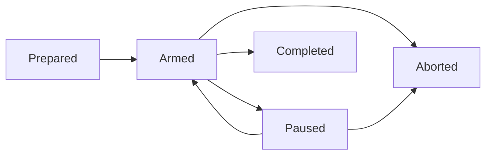

# Sprints v2.0 — Collaboration Loop

## Overview

> [!class4]
> Draft status: pending at least one QAQC round by a Review shell. No implementation task plan may be activated from this spec until QAQC passes against this exact revision.

A Sprint is an observable, long-running collaboration loop in which a Planner, one or more Developers, and one or more Reviewers work together to build a roadmap feature governed by one or more approved specs. The FnB can observe and enter every participating shell conversation throughout the Sprint without becoming a required transition gate.

Sprints v2.0 starts from a zero baseline. Sprint v1 runtime data, APIs, tables, state, Conductor behavior, and compatibility requirements do not constrain this design. Generic browser-conversation, messaging, quota, Git, and shell infrastructure may be reused only where it has an independently verified non-Sprint owner and satisfies this spec's contracts.

The system controls the process like a river: it establishes durable boundaries, routes work and evidence, exposes stalls, and supports recovery while leaving capable shells room to exercise judgment. Partial failure is acceptable. Silent loss, duplicated authority, and invisible stalls are not.

## Design Principles

- Collaboration is the primary purpose.
- FnB visibility into live Planner, Developer, and Reviewer conversations is a core capability.
- Shells receive goals, context, boundaries, and evidence rather than a brittle sequence of mandatory moves.
- Developer and Review shells may resolve ambiguity and adapt to changed reality when they record the decision and rationale for conformance review.
- The system captures every fact it can determine reliably. Shells contribute judgment, intent, explanation, and synthesis.
- Hard guards protect true invariants, dangerous actions, and delivery integrity. Ordinary uncertainty produces evidence and escalation rather than a stalled Sprint.
- Messages are durable facts. Wakes are retryable delivery attempts for those facts.
- Correctness rests on transactions, idempotency, uniqueness, reconciliation, and observable recovery rather than timing.
- A useful Sprint with visible failed or retried operations is preferable to a theoretically perfect Sprint that routinely deadlocks.
- Sprint-specific polling, monitoring, and dispatch are active only while the Sprint is armed.

## Roles and Authority

| Role | Authority and responsibility |
|---|---|
| FnB | Collaborates on declaration, enters any participant conversation, observes the Sprint, sends messages, and may pause, resume, or abort. FnB approval is not required for every transition or completion. |
| Planner | Prepares and arms the Sprint, selects participants and routes, decomposes specs into work units, plans dependencies and waves, responds to escalations, governs scope, runs final conformance coordination, and submits the final report. |
| Developer | Accepts assigned work, implements and verifies it, opens and owns PRs, responds to review, merges approved work when permitted, cleans its tree, and records material judgment calls or deviations. |
| Reviewer | Independently evaluates assigned work and PRs against the governing spec, records findings and verdicts, may choose an appropriate review method, and records material judgment calls. |
| System | Owns durable state, message and wake delivery, conversation bindings, GitHub observation, liveness evidence, deterministic event capture, routing, reconciliation, and report evidence compilation. |

Any participating shell may pause a Sprint immediately when Sprint integrity is threatened or an unresolvable issue is encountered. Only the Planner or FnB resumes it after reviewing the evidence.

## Terms

- **Sprint**: one execution of this collaboration loop for one roadmap feature.
- **Spec revision**: the exact immutable body revision reviewed for Sprint eligibility.
- **Participant**: a shell assigned a Sprint role, route, and durable Sprint conversation.
- **Work unit**: a Planner-defined group of existing spec tasks assigned to one shell for one coherent handoff.
- **Dependency**: a hard prerequisite between work units.
- **Wave**: the Planner's intended grouping of parallel-ready work; a planning signal, not a prohibition.
- **Sprint message**: a durable, addressed collaboration record scoped to a Sprint.
- **Wake**: an idempotent request to start or queue a harness turn that tells the shell to inspect its inbox.
- **Registered PR**: a GitHub pull request linked to a Sprint, owning shell, and one or more work units.
- **Judgment record**: a shell-authored explanation of an ambiguity, deviation, decision, or issue that deterministic evidence cannot supply.

## Lifecycle

The lifecycle is deliberately small:



| State | Meaning and permitted automation |
|---|---|
| `prepared` | The Sprint record and plan exist but may still be revised. Sprint polling, monitoring, and dispatch are off. |
| `armed` | Automation is enabled. Messages may wake participants, ready work may dispatch, registered PRs are polled, and liveness is monitored. |
| `paused` | The Sprint remains visible and historically intact but is not armed. New dispatch and Sprint polling stop; active Sprint turns receive durable interrupt intent. Planner/FnB coordination remains available through generic conversation and messaging services. |
| `completed` | Terminal. Conformance and the final report are recorded; active Sprint services are off and amber participant pills are removed. |
| `aborted` | Terminal. Work stops without deleting history; an abort report records the reason, completed work, outstanding work, and recovery disposition. |

Development, Review, conformance, and reporting are progress phases within an armed Sprint, not lifecycle states. They are represented by work and evidence already in the system rather than duplicated lifecycle flags.

## Preparation and QAQC

The FnB declares the intended Sprint with a Planner. The Planner invokes the `sprint_prep` skill and verifies:

- One roadmap feature is selected.
- One or more governing specs are selected.
- Every selected spec's current revision has passed at least one QAQC round signed by a Review shell.
- Every Medium, High, or Critical QAQC finding is resolved before approval.
- Any edit to an approved spec body creates a new revision and makes the previous approval ineligible for arming.
- Existing spec tasks have been grouped into work units with assigned shells, roles, dependencies, and planned waves.
- A primary harness, model, and effective effort are selected for each participant.
- Planner fallback capacity is identified when another configured harness has usable quota.
- Required Developer and Reviewer capacity is available.
- GitHub repository access and local worktrees are available.
- No other Sprint is armed in the installation and no selected shell participates in another armed Sprint.

Deficiencies are surfaced to the FnB and remain editable in `prepared`. QAQC approval is a durable review record bound to reviewer, verdict, timestamp, findings, and exact spec revision; it is never a copied boolean on the Sprint row.

Arming is one authoritative transaction. It commits the final plan, participant bindings, durable conversation placeholders, initial task messages, wake outbox intents, and armed transition before any external harness or GitHub action occurs. A crash after commit is recovered from the outbox; a crash before commit exposes no partial Sprint.

## Participant Conversations

Every participant receives a durable Sprint conversation at arming, including shells assigned to later waves. Creating the conversation does not launch a harness or consume model usage.

While the Sprint is armed or paused:

- Every participant shell card displays an amber `Sprint [n]` pill with its role and current high-level disposition.
- Clicking the pill enters the participant's current Sprint conversation.
- The FnB may enter Planner, Developer, and Reviewer conversations at any time.
- Merely opening or viewing a conversation does not count as shell activity and does not wake the shell.
- An FnB message becomes a Sprint message and follows normal delivery policy.
- Messages submitted during an active native turn queue after that turn. They never inject into or silently interrupt generation.
- All prior linked conversations remain inspectable from Sprint history.

A visible Sprint participation is stable even when its native harness execution changes. If the Planner's primary harness is exhausted, v2.0 creates a linked replacement conversation on an eligible configured fallback, supplies a generated Sprint context packet, and makes the pill point to the current conversation. It does not attempt cross-harness native-session resume. Earlier conversations remain enterable.

Terminal completion or abort removes the live amber pill but retains conversations in Sprint history.

## Messages and Wakes

Every collaboration instruction or notification is committed as a durable message before delivery is attempted. A wake never carries changing task context. Every wake uses exactly this prompt:

```text
Check your inbox. If you accept the task(s), mark the message as read and act on the message using the assigned sprint type skill.
```

Delivery rules:

- An active notification records the message and creates or coalesces a wake intent.
- A passive notification records the message but does not create a harness turn; the shell reads it on its next turn.
- All addressed Sprint messages are active while armed unless explicitly recorded as passive system evidence.
- If a participant has a queued or running turn, new active messages accumulate in the inbox and coalesce behind one pending follow-up wake.
- A wake uses at-least-once delivery with a stable idempotency identity. Duplicate attempts may occur; duplicate native turns for the same pending wake may not.
- Message creation, assignment association, and wake outbox creation share one database transaction.
- Marking an actionable task message read means the shell accepted it.
- A shell that declines records a reason, sends a result to the Planner, resolves the actionable message, and leaves the work unit available for reassignment. It must not remain unread and wake forever.
- Delivery attempts, outcomes, retry timing, coalescing, and terminal failures are system evidence.

The system sender owns deterministic GitHub and liveness notifications. Shells never forge system events.

## Work and Parallelism

The Planner groups existing spec tasks into work units. A work unit records its Sprint, assigned shell and role, task membership, expected output, planned wave, dependencies, and current disposition.

- Dependencies are the only hard sequencing edges.
- Work units without unmet dependencies are parallel-eligible.
- A planned wave expresses the Planner's intended concurrent launch group and is shown in the board.
- The Planner may revise waves, assignments, or dependencies as reality changes, provided already-completed history is not rewritten.
- The dispatcher launches as many ready work units as assigned capacity supports.
- One shell may own only one active work unit in the armed Sprint at a time.
- A work unit may cover multiple related spec tasks.
- A code work unit normally registers one owning PR but may link additional PRs when the implementation requires them.
- A work unit explicitly planned as report-only or no-code may complete with a durable result rather than a PR.
- PR state never determines task completion by itself. The shell supplies the completion judgment; the system supplies the PR facts.

The board is a projection of durable Sprint state. Shells do not manually maintain a second markdown board or repeat facts the system already knows.

## GitHub Observation

One installation-level Sprint watcher observes only registered PRs belonging to the armed Sprint. It has a five-second scheduling pulse while armed and performs no Sprint GitHub requests while prepared, paused, completed, aborted, or without an armed Sprint.

The watcher:

- Takes an initial snapshot on registration, arm, and resume.
- Batches or conditionally requests PR state where practical.
- Normalizes relevant transitions such as created, pending or unstable, red, green, merged, and closed.
- Appends an event only when normalized state changes.
- Never writes an unchanged result every five seconds.
- Uses stable transition identities so retries cannot duplicate events.
- Records poll failures and rate pressure, then backs off without inventing PR state.
- Reconciles current state after restart or resume. It does not fabricate intermediate transitions it could not observe.
- Updates the Sprint board and report evidence automatically. Developers never flip PR state in the database.

Notification routing:

| Recipient | PR notifications |
|---|---|
| Owning Developer | Active for every transition on its own registered PRs |
| Planner | Passive for every registered Sprint PR transition |
| Assigned Reviewer | Passive for transitions on its assigned PRs |

Review kickoff is an active work message, not merely a PR notification.

## Dev and Review Loop

1. Planner or dispatcher sends a ready work-unit message to its Developer.
2. Developer accepts, works in its assigned worktree, verifies the result, records material judgment calls, and registers its PR.
3. When the PR reaches the planned review-ready condition, the system sends an active Review assignment message and closes or idles the Developer turn without deleting its conversation.
4. Reviewer evaluates the governing spec revision, code, checks, and relevant evidence.
5. A failed review records findings and actively wakes the owning Developer. The Developer may correct, explain, or escalate ambiguity.
6. A passed review records the verdict and actively wakes the owning Developer to merge when permitted, clean the worktree, and submit its result.
7. GitHub observation detects merge automatically and updates the board.
8. The Planner receives passive evidence and is actively woken only when a decision, escalation, re-plan, pause, or terminal synthesis is required.
9. Newly ready work units dispatch according to dependencies, waves, and available assigned shells.

Developer and Reviewer discretion is intentional. The spec and role skills define goals, ownership boundaries, required evidence, forbidden destructive actions, and stop conditions. They do not attempt to enumerate every valid judgment.

## Liveness Monitoring

The liveness monitor evaluates each accepted active work expectation every five minutes while armed. It consumes evidence; it does not infer failure from one missing signal.

Strong evidence includes:

- Message acceptance and state transitions
- Native run start, assistant output, tool start or completion, permission/input request, usage event, or terminal event
- A fresh broker lease heartbeat bound to the exact native run
- Exact native session inspection or reconciliation
- Durable work-unit results or Sprint messages
- Git commits and registered PR transitions

Supporting evidence includes harness process presence, CPU movement, worktree changes, and quota snapshots. Browser-tab presence and lack of disk writes are not proof of shell activity or failure.

Policy:

- Acceptance begins a ten-minute presumed-live grace window unless a proven terminal failure occurs.
- Fresh strong evidence extends confidence without launching another shell.
- A proven failed run, missing expected process, expired unrecoverable lease, or exhausted provider quota escalates immediately.
- Ambiguous silence beyond ten minutes creates one active Planner escalation containing the observed evidence and unreadable signals.
- An escalation is deduplicated until new evidence arrives or a later escalation threshold is reached.
- The monitor does not repeatedly boot the worker merely to ask whether it is working.
- Planner escalation uses an eligible configured fallback harness when the primary provider is exhausted. If none is available, the system records the failure and surfaces pause as an option.
- Monitor uncertainty alone does not corrupt work-unit state or silently abort the Sprint.

The first release may discover additional failure shapes. Each must remain visible and patchable rather than hidden behind guards that stop ordinary work.

## Pause and Recovery

Any participant may pause with a short reason. Effective pause and its reason are committed atomically before a detailed report is required.

Pause behavior:

- Transition to `paused`; the Sprint is no longer armed.
- Stop new work dispatch, Sprint GitHub polling, and liveness evaluation.
- Persist interrupt intent for active Sprint turns; delivery failure remains visible and retryable.
- Retain every conversation, message, assignment, PR, event, and partial result.
- Actively notify the Planner and make the pause visible to the FnB.
- Generate a pause-report template containing deterministic state, recent anomalies, active turns, work units, and PRs. The pausing shell or Planner adds the integrity threat, judgment, and recommendation.

Resume is owned by Planner or FnB. Before re-arming, the system reconciles native runs, unread messages, pending wakes, work-unit dispositions, registered PRs, participant capacity, and current spec eligibility. It then commits a new armed transition and resumes external services.

Abort is terminal and never deletes history. It stops new work, requests active interruption, removes live pills, and routes the Planner to produce an abort report.

## Deterministic Capture

| System captures | Shells contribute |
|---|---|
| Sprint lifecycle and transition times | Scope decisions and rationale |
| Participant, role, route, conversation, model, harness, and effort | Acceptance or decline reason |
| Message bodies, sender, recipient, read state, and timestamps | Judgment calls and adaptations |
| Wake intents, attempts, coalescing, retry, and outcome | Explanations of ambiguous behavior |
| Native run identities, events, tool activity, usage, and terminal outcome | Developer implementation summary |
| Work-unit assignment, dependency, wave, and state history | Review findings and verdict reasoning |
| GitHub PR identity, state, checks, transition, URL, and merge | Pause integrity assessment |
| Poller and monitor health, failures, and escalation | Conformance judgment and final synthesis |
| Git and worktree observations already available to the engine | Lessons and follow-up recommendations |

The final report compiler supplies a bounded evidence packet rather than a raw event dump. It includes scope, exact spec revisions, planned versus actual work, PR outcomes, important deviations, pause/recovery events, wake-health aggregates, anomaly details, unresolved work, and links to the complete timeline and participant conversations. The Planner supplies meaning and final judgment.

## Conceptual Data Model

Physical table boundaries may reuse proven generic services, but the domain must expose these durable concepts:

- `sprints`: identity, feature, originating Planner, lifecycle, timestamps, and terminal outcome
- `sprint_specs`: included spec revision and qualifying QAQC approval
- `sprint_participants`: shell, role, selected route, current conversation, and participation disposition
- `sprint_work_units`: assignment, expected output, planned wave, and disposition
- Work-unit task membership and dependency edges
- Sprint-scoped messages or generic messages with durable Sprint correlation
- Wake outbox intents and delivery attempts
- Registered PRs and append-only normalized PR transitions
- Judgment, pause, conformance, and final reports
- An append-only Sprint event timeline or equivalent projection from authoritative records

Do not store copied QA rollups, duplicated PR state, `parallel_with` edges, or booleans that can be derived reliably. Current-state projections may be cached only when one authoritative transition path maintains them.

External GitHub and harness work never occurs inside database transactions. SQLite writes are short, retried within bounded policy, and batch noisy conversation evidence where safe.

## Core Systems and Gates

| Stage | Core system | Independent verification gate |
|---|---|---|
| 1 | Lifecycle and armed-service switch | Restart recovers an armed Sprint; invalid transitions fail; non-armed states perform zero Sprint polling or dispatch |
| 2 | Participation and conversations | Arming creates every conversation and amber pill; FnB enters the correct chat; viewing causes no wake |
| 3 | Messages and active wakes | Message and wake commit atomically; the fixed prompt arrives once logically; crash/retry loses nothing and creates no duplicate native turn |
| 4 | Work units, dependencies, and waves | Ready work launches in parallel; blocked work does not; re-planning preserves history |
| 5 | PR registration and watcher | Five-second armed pulse observes normalized transitions, suppresses unchanged writes, routes correctly, and performs zero idle calls |
| 6 | Dev and Review loop | Failed review returns to Developer; passed review permits merge; merge is observed automatically and advances work |
| 7 | Liveness and quota escalation | Fake-clock evidence tests prove grace, extension, exhaustion, one Planner escalation, and deduplication |
| 8 | Pause, resume, and recovery | Pause stops external Sprint services and persists interrupt intent; resume reconciles before dispatch |
| 9 | Conformance and report compiler | Planner receives a bounded evidence packet with anomaly detail and full-history links |
| 10 | Live vertical proof | One serial and one parallel Sprint complete with real browser conversations and a real GitHub repository |

Stages 2 and 3 form the first thin vertical proof: arm one Sprint, display one amber pill, enter one Developer conversation, deliver one task message, wake once, and accept. Stage 5 extends it with one registered PR and one real observed transition. Sophisticated boards and broad orchestration must not precede proof of these foundations.

Each core-system implementation unit must specify its activation trigger, inputs, durable outputs, idempotency identity, external effects, failure and retry behavior, UI evidence, and unit/integration/browser/restart/live tests.

## Adversarial Acceptance

Before Sprints v2.0 is accepted, tests deliberately exercise:

- Crash after message commit but before wake dispatch
- Duplicate wake delivery and multiple messages arriving during one active turn
- Browser entry and FnB messaging during an active participant turn
- GitHub outage, rate pressure, unchanged polls, and recovery
- PR changes while paused followed by resume reconciliation
- Quota exhaustion after task acceptance
- Ten minutes of quiet with a healthy long-running tool
- Missing process or expired native run lease
- Pause during an active Developer turn
- Two or more parallel Developers completing out of planned order
- Review rejection, correction, approval, and merge
- Planner/report failure after all delivery work has merged
- Engine restart during every non-terminal lifecycle state
- Concurrent conversation and watcher writes without an unbounded SQLite lock

A failed operation may remain failed. Acceptance requires that failure be durable, visible, attributable, retryable or explicitly terminal, and unable to silently wedge unrelated Sprint progress.

## Non-Goals

- Preserving or migrating Sprint v1 data or behavior
- Multiple armed Sprints in one installation in v2.0
- One shell participating in multiple armed Sprints
- Strict tenant isolation or elaborate role ACLs
- Encoding every valid Developer or Reviewer judgment
- Exactly-once remote harness execution
- Continuous GitHub polling while idle or paused
- Eliminating all first-release failure states before useful operation
- Asking shells to restate deterministic system evidence

## QAQC Checklist

The Review shell must challenge at minimum:

- Whether the lifecycle has one unambiguous authority for every transition
- Whether active versus passive notification routing is complete
- Whether the fixed wake, acceptance, decline, coalescing, and retry contracts avoid duplicate or endless turns
- Whether FnB can enter every participant conversation without changing liveness
- Whether armed-only services truly make zero idle GitHub calls
- Whether PR and QA state have one authoritative owner
- Whether liveness evidence avoids both token-burning wakes and silent stalls
- Whether pause and restart recovery preserve history and converge safely
- Whether cross-harness Planner fallback is achievable without pretending native-session portability
- Whether the conceptual data model avoids duplicated truth
- Whether every core system has an independently executable verification gate
- Whether any remaining hard guard constrains agent judgment without protecting a true invariant

QAQC approval must identify the reviewed spec revision and record all findings. Medium, High, and Critical findings must be resolved before implementation tasks are created and the feature moves from `next` to active construction.
