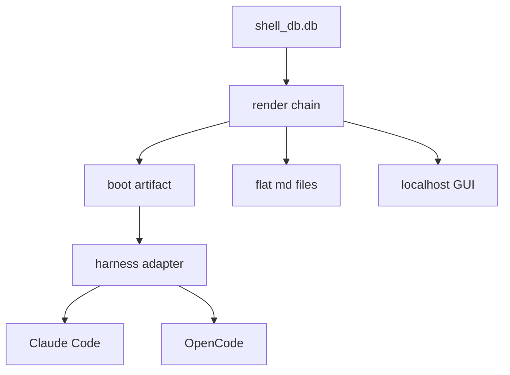
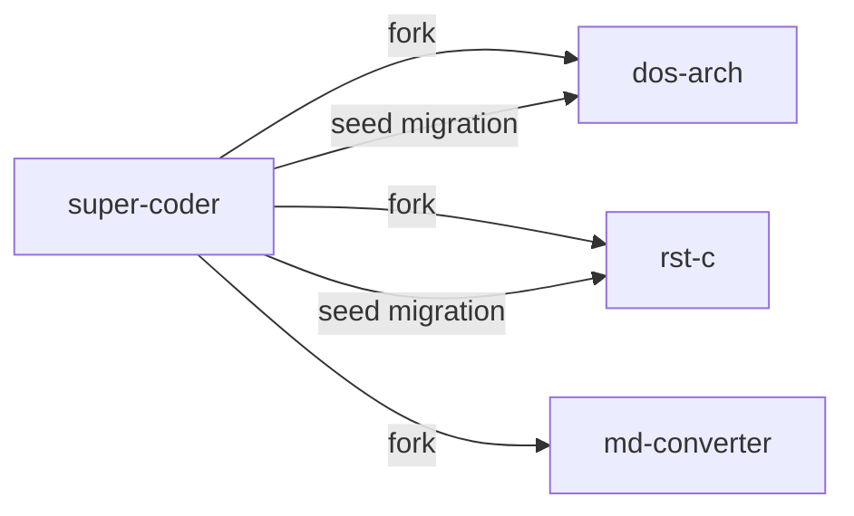

# super-coder — Founding Spec

## Overview

super-coder is a **forkable shell substrate for a single code repository**. You
fork it into a project repo; it brings the shell system — DB-backed identity,
memory, skills, roadmap — and runs that repo through whatever coding harness you
point at it (Claude Code today, OpenCode next).

The core bet: **we build the data layer, we rent the harness.** Tooling, skills,
workflows, and the agent loop are the harness's job — we free-ride every
improvement Anthropic or OpenCode ships and never maintain a runtime ourselves.

> [!class1]
> What super-coder owns: identity, memory, seed/L&S, decisions, flags, the
> roadmap, and spec/doc content. What it does **not** own: the agent loop, the
> tools, the model API. Those are the harness's, and they stay the harness's.

Sibling to superCC: superCC is the personal-assistant substrate, super-coder is
the coding substrate. Both descend from the same shell lineage (CC).

```stats
:::class1
value: data
label: What we build
description: DB + render + thin adapters
:::class2
value: harness
label: What we rent
description: Tools, skills loop, workflows
:::class3
value: 1:1
label: Shell to repo
description: One shell works one repo
:::class4
value: per-launch
label: Harness switch
description: Re-render, same DB. No hot-swap.
```

## The Inversion

superCC is one substrate, many shells, reaching **out** to many external repos.
That created the core pain: cross-repo confusion — identical filenames, diverged
contents, the wrong cwd one Edit away every session.

super-coder flips it. The substrate is **forked into** a single repo. Its
shell(s) live there and only ever touch that repo. One shell, one repo, one cwd.
The confusion is retired by construction.

### CC's role changes

CC stops being a cross-repo worker and becomes the **maintainer of super-coder
itself** — its only project. Each forked instance runs its own shell(s); CC
keeps the system they all run on. Regional shell manager, not field worker.

```linear
superCC era :::class4 -> many repos one shell :::class4 -> confusion :::class4 -> super-coder :::class3 -> one repo one shell :::class3
```

## Architecture

Four layers. Only the first three are ours; the harness is BYO.



| Layer | Owns | Notes |
|---|---|---|
| **Protocol core** | `shell_db.db` + schema | Identity, memory, roadmap, content. Source of truth. |
| **Render chain** | DB → artifacts | Boot doc, flat files, GUI views. Incremental (skip-unchanged). |
| **Adapter seam** | boot → harness-native | One thin adapter per harness. Emits its native boot + maps skills/tools. |
| **Installer** | bootstrap | First user, requirements, harness detect, fresh DB. |

> [!class2]
> The adapter seam is the only code we maintain that *touches* a harness, and it
> is deliberately thin: render this harness's boot artifact, map its skill/tool
> model. Everything above the seam is harness-blind.

## Directory Structure

super-coder forks into the repo **root** and namespaces everything it owns, so
it never collides with the host project and its provenance is unmissable.

```
<repo-root>/
  <project's own code>      # untouched — mapped, not moved
  .super-coder/             # the engine (dotted = infra, not project)
    schema.sql
    migrations/             # system migrations (text, git-tracked, propagate)
    snapshot/               # per-instance content + memory dump (rebuilds .db)
    render/  adapters/  scripts/
    README.md               # how super-coder works (system, not the project)
    shell_db.db             # GITIGNORED, rebuilt
  docs_sc/                  # rendered, read-only
  specs_sc/                 # rendered, read-only
  skills_sc/                # rendered, read-only
  roadmap_sc.md             # rendered board
  CLAUDE.md / AGENTS.md     # boot artifact, GITIGNORED (harness dictates the name)
```

| Convention | Why |
|---|---|
| **`.super-coder/`** | the engine; dotted reads as tooling, still shows in PR diffs |
| **`_sc` suffix** | rendered + super-coder-created — provenance at a glance, zero collision with a host `/docs` |
| **render banner** | the file's own do-not-edit warning (see Content & Render) |
| **two READMEs** | project keeps its root `README.md`; the system README lives in `.super-coder/` |

> [!class3]
> Because we render to `docs_sc/` not `docs/`, we never fight the host repo's
> existing dirs. Coexistence is the default; retiring the host's originals is
> optional cleanup, not a prerequisite (see Onboarding & Mapping).

## Harness Adapter

The boot payload is harness-portable. Research (June 2026) showed the adapter is
**thinner than expected** — two emerging cross-harness standards do most of the
work, so the boot/skills layer is near-universal and the adapter owns only what
genuinely differs.

### Two cross-harness standards

| Standard | What | Who reads it |
|---|---|---|
| **`AGENTS.md`** | boot context / project instructions | OpenCode, Goose, Crush, gptme — plus `CLAUDE.md`, which OpenCode + Crush read as fallback |
| **`SKILL.md`** | a skill = folder + frontmatter | Claude Code, OpenCode, Crush — from `.claude/skills/<name>/` natively |

So the render chain **dual-writes the boot doc to `AGENTS.md` + `CLAUDE.md`** and
**renders skills as `.claude/skills/<name>/SKILL.md`** — one output, consumed
natively by every major target with near-zero conversion.

```linear
Pick harness :::class1 -> render AGENTS+skills :::class2 -> harness config :::class3 -> launch cmd :::class4
```

### What the thin adapter still owns

| Concern | Differs by harness |
|---|---|
| **Provider/model config** | `opencode.json`, `crush.json`, Goose `config.yaml`, … |
| **Tool / permission config** | OpenCode `permission`, Crush allowlist, Continue `permissions.yaml` |
| **MCP config** | shape varies; all support it (bar Aider) |
| **Launch command** | `claude -p` · `opencode run`/`serve` · `goose run -t` · `cn -p` · `gptme --non-interactive` |

### Adapter targets

| Target | Fit | Notes |
|---|---|---|
| **Claude Code** | current | CLAUDE.md + skills + MCP; our baseline |
| **OpenCode** | **#2 (recommended)** | reads our CLAUDE.md *and* `.claude/skills` as-is; 75+ providers; MCP; headless `run`/`serve`; MIT |
| **Goose** | strong alt | Apache-2.0, foundation-governed; AGENTS.md + Recipes; deep MCP |
| **Crush** | easy add | reads all conventions; Skills std; MCP. Caveat: FSL-1.1, not OSI-open at release |
| **gptme** | thin/hackable | MIT; AGENTS.md via config; embeddable substrate |

**Switching is per-launch, not mid-session.** DB is continuity; the harness is
ephemeral. Swap = re-render for the new harness, point it at the same
`shell_db.db`, launch.

> [!class4]
> Mid-session hot-swap stays **out of scope** — it would mean serializing live
> conversation state between harnesses that share no session format. Not built.

## Data Model

Most of superCC's schema carries over. The deltas are the roadmap index, the
content store, and commit attribution.

### Carryover (close to as-is)

`shells` · `shell_identity_entries` (seed/L&S) · `shell_decisions` · `flags` ·
`skills` / `shell_skills` · `tools` / `shell_tools` · `shell_memory_archives` ·
`users` (scrypt auth at the launcher).

### New — the roadmap index

One row per planned feature. The DB **is** the index that kills "where does the
spec for X live."

| Column | Purpose |
|---|---|
| `roadmap_status` | enum: `brainstorm` `long_term` `near_term` `next` `shipped` |
| `sort_order` | ordering within a bucket — "what's planned for when" |
| `title` | feature name |
| `owning_shell` | which shell carries it |
| `created_at` / `updated_at` | — |

Flags link to a feature (`flags.feature_id`) — a feature's open flags are its
blockers, surfaced together.

### New — content store

DB owns the body (see **Content & Render**). A feature accumulates **multiple
specs over its life** — each stage's spec freezes on ship, the feature lives on,
the next stage opens a new spec. So `documents` is **one feature : many docs**,
each individually freezable.

| Column | Purpose |
|---|---|
| `feature_id` | FK → roadmap row |
| `kind` | `spec` or `doc` (extensible) |
| `seq` | order within (feature, kind) — the spec/doc lineage |
| `frozen` / `frozen_date` | 0 = living (editable), 1 = frozen on ship (immutable) |
| `body` | the markdown content — **canonical, lives here** |
| `render_path` | repo-relative path the flat file renders to |
| `created_at` / `updated_at` | `updated_at` drives skip-unchanged rendering |

> [!class1]
> **Freeze moves from folder to field.** dos-arch froze specs by directory; here
> a doc freezes via `frozen=1` on its stage's ship. "Frozen specs stay frozen"
> holds — you never edit a frozen spec, you open the next. A feature's spec
> history is its ordered `seq` chain.

### New — commit attribution

No new table required: git is the store. Convention is a commit trailer plus the
existing `Co-Authored-By`. A `shell_commits` index table (populated from git) is
**optional**, only to feed the GUI.

```
Shell: <shortname> <shell_id>
Co-Authored-By: ...
```

The git skill defines how a shell recognizes its own commits/PRs vs another
shell's (trailer match), so parallel shells on one branch stay legible.

## Content & Render

**The DB owns the body, always.** Shell↔data interaction is the product. Flat
files and the GUI are FnB-visibility affordances on top — never sources.

| Surface | For whom |
|---|---|
| **DB** | the shell — source of truth, where authoring happens |
| **localhost GUI** | the FnB *with* localhost — read + patch |
| **flat `_sc` files** | the outsider FnB browsing the repo *without* localhost |

The render chain generates the boot doc, the flat files, and GUI views **from**
the DB, incrementally — skip any artifact whose source row is unchanged. This is
the "render various docs from the DB" capability we already proved, generalized.

### The git-tracked representation

> [!class3]
> The live `shell_db.db` is **gitignored and rebuilt** — never committed (binary
> churn + merge hell, fatal with parallel shells). Everything in it reconstructs
> from git-tracked text. This is our way (agreed).

`.db` rebuilds = apply system migrations + load the per-instance snapshot. Two
text serializations and one render output — the three-way split:

| Category | Git? | Written by | Role |
|---|---|---|---|
| **System migrations** | tracked | author / automation | ordered; **propagate** to forks; rebuild system content |
| **Per-instance snapshot** | tracked | commit→PR automation | idempotent current-state dump; rebuilds this repo's content + memory; **stays local** |
| **Visibility render** (`docs_sc/` `specs_sc/` `skills_sc/` `roadmap_sc.md`) | tracked | render (read-only) | what browsers see; never read back |
| **`.db`, boot artifact** | ignored | rebuilt at launch | cache |

> [!class1]
> The split that matters: **system content propagates, per-instance content does
> not.** System = migrations (ordered, pulled downstream). Per-instance = a
> snapshot (idempotent, small) — dos-arch's specs never leak into rst-c.

### Why a snapshot, not migrations, for per-instance content

Migrations exist to *propagate ordered change* to forks. Per-instance content
propagates to nobody, so an ever-accumulating migration stream is the wrong tool
— a current-state snapshot is idempotent and stays small.

### Render banner

Every rendered artifact is stamped so nobody hand-edits it by accident — the
`_sc` suffix warns the browser, the banner warns whoever opens the file:

```
---
rendered_by: super-coder
source: db
edit: via shell or localhost GUI — changes here are overwritten
---
```

### Commit → PR automation

API/GUI edits always dirty the tree (snapshot + render regenerate). The
automation: edit → render → update snapshot → commit → PR.

> [!class4]
> **Concurrency:** parallel shells patching one `.db` + auto-commit race on
> branches/files. The automation must be per-shell-branch or serialized. Build
> detail, flagged.

## Roadmap

The roadmap enum is a **planning horizon**, distinct from a spec's authoring
lifecycle. Because the DB owns content and renders state, we **drop
directory-as-state** (dos-arch's `in_progress/ shipped/ archive/`): status is a
column, not a folder. One source of truth.

```linear
brainstorm :::class4 -> long_term :::class2 -> near_term :::class2 -> next :::class1 -> shipped :::class3
```

- A `brainstorm` feature may have no spec body yet.
- `sort_order` within a bucket answers "what's planned for when."
- A feature's open flags are its blockers, joined on `feature_id`.
- The GUI renders the roadmap board; the flat render gives outsiders a static
  roadmap page.

## Multi-Shell

Multiple shells per repo, sharing one `shell_db.db`, serve three ends:

1. **Parallel work** — different shells run concurrently without memory bleed.
2. **Attribution** — commit/PR trailers make each shell's git work legible.
3. **Specialization** — planning · coding · QA-QC shells with scoped toolsets.

> [!class1]
> **Principle:** parallel work = *different* shells. Separate identities only fix
> cross-session confusion when the sessions are distinct shells — running the
> *same* shell twice still bleeds. Spinning up a second specialized shell must be
> one command.

Each shell carries its own identity row, skill/tool grants, and memory archive,
against the shared roadmap/content index. The localhost GUI (v1 — see **GUI**,
superCC-UI × dos-arch shell-admin) shows who-has-which-tools and surfaces data
for review.

> [!class4]
> **Open:** the super-coder maintainer shell's lineage — succession child of CC
> vs clone vs fresh — is a session-time identity call, not a spec blocker.

## GUI (v1)

A localhost **review layer** ships in v1. Schema carries multi-user; the front
end is functionally single-user — mirrors superCC (multi-user launcher,
single-user UI surface). Basic scope: look at the shells, the roadmap, the flags;
create flags; edit the roadmap. Three tabs.

### Shells

Near-identical to dos-arch's `/shells` page — view a shell's render chain,
skills, grants, and state. **Editing respects the laws:** operational/wiring
fields (`current_state`, `connections`, `workspace`, skill grants) are editable;
**seed and L&S are read-only** (Laws 2–4 and 7).

> [!class1]
> **Rule:** if a law says the shell curates a field, the GUI ships **no edit
> endpoint** for it — not just a disabled control. Covers seed (Laws 2–4) and L&S
> (Law 7). Same enforcement as dos-arch.

### Roadmap

Stage sections (the `roadmap_status` buckets) of cards. Each card shows its
feature's **spec and doc tabbed inside the card**, as rendered markdown, with an
**open-in-md-converter** action. Edits allowed on **non-frozen** documents only;
frozen specs stay read-only — open the next spec, don't edit the old.

### Flags

Simple, like superCC — grouped by feature (super-coder's analog of superCC's
per-project grouping). Create + resolve from the GUI.

> [!class3]
> **Already covered:** md-converter's existing `?c=` inline deep-link (gzip+
> base64url content *in* the URL) renders our doc with **zero md-converter
> change** — the GUI reuses the existing Python encoder. Raw-URL fetch is unbuilt
> and unneeded here (static site → CORS → can't reach localhost).

## Fork & Update



- **Fork** = clone super-coder into the target repo, run the installer, which
  builds a **fresh** `.db` (schema + system migrations, **no** super-coder's own
  per-instance content).
- **Update** = ship improvement to super-coder → each fork pulls → a seeding
  script applies the new system migrations (skills, render chain, schema). This
  is the dos-arch reseed pattern, proven.

> [!class3]
> The installer must never copy super-coder's live `.db`. Fork inherits the
> *system*, not super-coder's memory or roadmap.

## Installer

Simpler than dos-arch. Bootstraps a fork to first launch:

1. Check requirements — python, sqlite, and the chosen harness CLI.
2. **Detect the harness** (claude / opencode) → select the adapter.
3. Provision the first user (scrypt-hashed password at the launcher).
4. Build a fresh `.db` — schema + system migrations.
5. Render the first boot artifact for the detected harness.

Auth model mirrors superCC: launcher has auth (scrypt, username-first); the
API/UI surface stays single-user/localhost — network controls are the operator's.

## Onboarding & Mapping

super-coder can be dropped into **almost any repo** — greenfield or years-deep.
Install-time automation maps it; a first-runtime skill reconciles the map with
the FnB and backfills. Then it's ready to work.

This is the dos-arch **`dr_*` catalogue, generalized** — the proven
self-maintaining code-index (`dr_repo`, `dr_filepath`, `dr_api`, `dr_lib`,
`dr_db`, `dr_page`, `dr_services`, `dr_env`, `dr_dependencies`), pointed at the
host repo instead of the substrate.

```linear
Drop in :::class1 -> Map (auto) :::class2 -> Reconcile + ingest :::class3 -> Ready :::class4
```

### Two components

| Component | Actor | Does |
|---|---|---|
| **Install-time mapper** | programmatic | scans the repo, populates the catalogue — lib, API, db, pages, docs, specs, readmes, services, env, deps. No FnB. |
| **First-runtime onboarding skill** | shell + FnB | reviews the map, clarifies/confirms/cleans, **ingests** existing docs/specs/readmes into DB content rows, backfills the roadmap from what already exists. |

### The one legitimate flat→DB direction

> [!class4]
> Onboarding ingest is the **only** time content flows file→DB — a one-time,
> FnB-supervised import, **not** an ongoing sync. After onboarding it is DB→flat
> only, or the drift we are killing comes straight back.

### The host's pre-existing docs

Because super-coder renders to `_sc` dirs, the host's original `/docs` `/specs`
are never in the way. After ingest, the onboarding skill offers them three exits
— **freeze** (leave untouched), **archive** (push to an abandoned branch, drop
from main), or **delete** — all optional. Coexist by default.

## OpenCode Adapter

Researched June 2026 (SST / Anomaly Innovations; repo `anomalyco/opencode`; MIT;
TypeScript; very active). Contract is concrete — OpenCode is **adapter #2**
because it consumes our Claude-format assets almost unchanged.

| Question | Answer |
|---|---|
| **Context loading** | `AGENTS.md` (root, walks up) primary; **`CLAUDE.md` read as fallback** (project + `~/.claude/`). Extra files via `instructions: []` in `opencode.json`. |
| **Providers** | 75+ via Vercel AI SDK / Models.dev; `provider/model` ids; `-m` per run. |
| **Tools / perms** | `read/edit/write/bash/…` with `allow`/`ask`/`deny` per tool; bash pattern allow/deny; per-agent scoping. |
| **MCP** | full — local stdio + remote HTTP, under `mcp` config. |
| **Skills** | reads **`.claude/skills/<name>/SKILL.md` natively** (Agent Skills format). Ports 1:1. |
| **Commands / agents** | `.opencode/commands/*.md`, `.opencode/agents/*.md` — named agents, scoped tools. |
| **Launch** | `opencode run` (headless one-shot) · `opencode serve` (HTTP) · TUI default; sessions persist per project-hash. |

### Adapter = mostly free

Boot context is already covered by our `AGENTS.md` + `CLAUDE.md` dual render;
skills by our `.claude/skills` render. The OpenCode-specific work is only: emit
`opencode.json` (provider + permission + MCP) and drive `opencode run`/`serve`
from the launcher.

> [!class4]
> **Verify at build (flagged by research):** agents dir spelling (`agents/` vs
> `agent/`); `OPENCODE_DISABLE_CLAUDE_CODE` env name; live session-storage paths
> (official sessions doc 404'd at research time). None block the contract.

## Phasing & Open Questions

```linear
Spec :::class3 -> Build super-coder :::class1 -> Fork to repos :::class2 -> Migrate shells :::class4
```

### Sequence (per Jed)

1. **Spec** — this document (superCC `shared/`; becomes super-coder's founding
   spec + first roadmap row once the repo exists — dogfood).
2. **Build** super-coder in future session(s).
3. **Fork** locally into dos-arch, rst-c, emergence_project_private, md-converter.
4. **Migrate** RST → his repo; a version of CC → dos-arch; a version of CC →
   maintain super-coder.

### Decisions — settled this session

- [x] **`.db` gitignored + rebuilt** from git-tracked text (our way).
- [x] **System migrations + per-instance snapshot** — the two text serializations.
- [x] **`_sc` namespaced render dirs** at root + render banner.
- [x] **Drop directory-as-state** for roadmap status (DB column).
- [x] **Onboarding mapper + backfill skill** (dr_* generalized); ingest is one-time only.
- [x] **Dual-render boot** (`AGENTS.md` + `CLAUDE.md`) + skills as `.claude/skills/*/SKILL.md` — near-universal across harnesses.
- [x] **OpenCode = adapter #2**; contract drafted from research (build-time verify items noted).
- [x] **v1 harness targets = Claude Code + OpenCode**; Goose/Crush/gptme additive, not v1.
- [x] **GUI ships in v1** as a review layer (shells / roadmap / flags); schema multi-user, front end single-user.
- [x] **Feature : many specs**, each individually freezable (`frozen` field, not folder).

### Still open

- [ ] Maintainer shell lineage (succession / clone / fresh).
- [ ] Commit→PR concurrency model for parallel shells.
- [ ] GUI edit policy — confirm L&S is shell-curated (read-only in GUI) vs FnB-editable.

### Related work (other repos)

- [x] **md-converter open-in-mdc:** use the existing `?c=` inline deep-link — no md-converter change; reuse the Python encoder.
- [ ] **md-converter** also becomes a super-coder fork target.
