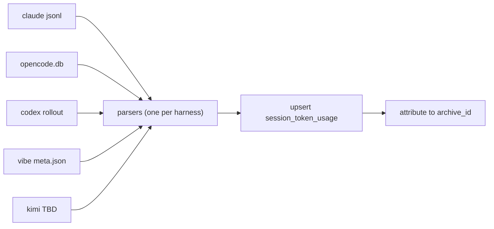

# Token & Session Analytics — Spec

[](https://md-converter.designs-os.com/?url=https://github.com/jedbjorn/super-coder/blob/main/specs_sc/token-session-analytics.md)

## Overview

Track token spend and session history **ourselves**, across every harness the
engine launches. Provider plans are opaque about allotments; the harnesses
already write usage data to disk — we ingest it into the fork's own DB and
surface it in the GUI.

What ships:

- **Session history** — every session with shell, harness, provider, model,
  started, ended. Listed newest-first, grouped by day, default 7 days,
  "More" loads 7 more. Sprint-spawned sessions cluster under their sprint.
- **Token analytics** — input / output / cache-read / cache-write (+
  reasoning where exposed), filterable by harness, provider, model.

```stats
:::class1
value: 5
label: Harnesses covered
description: claude · opencode · codex · vibe · kimi
:::class2
value: 4+1
label: Token classes
description: input · output · cache read · cache write · reasoning (where exposed)
:::class3
value: 7 days
label: Default history window
description: cursor-paged, "More" loads 7 more
:::class4
value: 0
label: Token data captured today
description: entire capture layer is new
```

> [!class1]
> Design stance (FnB, 2026-07-19): per-harness parsers are **plugins over
> third-party formats we don't control**. Version drift is accepted — if a
> parser breaks, we fix it. Loud failure, never silent zeros.

Why not dos-arch's mechanism: dos-arch meters in-process (every model call
passes one `egress_log` wrapper). super-coder never calls a model — it launches
external harness CLIs. Capture is therefore **pull**: parse what each harness
leaves on disk. dos-arch's normalized token classes and read-time aggregation
carry over; the capture boundary does not.

## Recon — per harness

Verified on the host, 2026-07-19. Every harness except kimi confirmed
parseable.

| Harness | Source | Token fields | Fidelity |
|---|---|---|---|
| claude | `~/.claude/projects/<dir>/*.jsonl` — per-request `usage` | input, output, cache_creation, cache_read + model per request | Full |
| opencode | `~/.local/share/opencode/opencode.db` — `session` table | tokens_input/output/reasoning/cache_read/cache_write, model, cost, time_created/updated | Full — plain SQL read |
| codex | `~/.codex/sessions/YYYY/MM/DD/rollout-*.jsonl` — `token_count` events | input, cached_input, output, reasoning (per-turn `last_token_usage`) | Good — no cache-write class |
| vibe | `~/.vibe/logs/session/<id>/meta.json` | start/end time, session_prompt_tokens, session_completion_tokens, working_directory | Partial — no cache split |
| kimi | nothing on disk here (never run on host) | unknown | Recon at build |

Notes:

- **opencode** is the easiest: per-session totals are pre-aggregated in its
  SQLite `session` table, including cache write and reasoning.
- **codex** rollout events carry both `total_token_usage` and per-turn
  `last_token_usage`; summing `last_token_usage` gives session totals. Model
  id extraction from `session_meta` is unverified — Preparation task.
- **vibe** `meta.json` also carries `working_directory`, `start_time`,
  `end_time` — enough for lifecycle + input/output totals. Model field TBD.
- **kimi**: if its CLI exposes no usage, kimi sessions still appear in
  history (lifecycle from `run.py`) with token status `no_usage`.

## Data model

One migration (next free number at build time). All engine-DB; every fork
gets it at repin.

### Session lifecycle — columns on shell_memory_archives

Nullable columns, historical rows stay NULL:

| Column | Type | Written by |
|---|---|---|
| started_at | TEXT (ISO UTC) | `run.py open_session` |
| ended_at | TEXT (ISO UTC) | sweep backfill (last harness activity) |
| harness | TEXT | `run.py open_session` |
| provider | TEXT | `run.py open_session` |
| model | TEXT | `run.py open_session` |
| sprint_ref | TEXT | `run.py open_session` from `SC_SPRINT_REF` env |

`run.py` already resolves harness + model for the exec env — it just never
persists them. `ended_at` cannot be written at exit (`run.py` execs the
harness; no code runs after), so the sweep backfills it from harness session
data.

### New table — session_token_usage

One row per (harness session × model). Not per API call — per-request
granularity is a later option for claude only.

| Column | Type | Notes |
|---|---|---|
| usage_id | INTEGER PK | |
| archive_id | INTEGER NULL | FK → shell_memory_archives; NULL = unattributed |
| shell_id | INTEGER NULL | denormalized for filtering |
| harness | TEXT NOT NULL | claude/opencode/codex/vibe/kimi |
| harness_session_ref | TEXT NOT NULL | transcript path / session id / rollout file / session dir |
| provider | TEXT | anthropic/openai/mistral/moonshot/… |
| model | TEXT | |
| started_at / ended_at | TEXT | from harness data |
| input_tokens | INTEGER NULL | fresh (uncached) input |
| output_tokens | INTEGER NULL | |
| cache_read_tokens | INTEGER NULL | |
| cache_write_tokens | INTEGER NULL | |
| reasoning_tokens | INTEGER NULL | opencode + codex expose it |
| status | TEXT CHECK | ok · partial · no_usage |
| parser_version | TEXT | per-parser format pin |
| captured_at | TEXT | sweep time |

`UNIQUE(harness, harness_session_ref, model)` — the idempotency key; parsers
upsert, re-sweeps never double-count.

> [!class4]
> Token classes are normalized to dos-arch's four (fresh input / cache read /
> cache write / output) plus nullable reasoning. A harness that can't fill a
> class leaves it NULL — NULL means "not exposed", 0 means "measured zero".

## Capture

One collector, one parser module per harness — the plugin seam.



- **Collector**: `sc analytics sweep` (script + `./sc` subcommand). Scans
  each harness's data dir, filters to sessions belonging to **this fork's
  repo directory**, upserts rows. Runs: at `run.py` boot (pre-session,
  cheap incremental), on demand, and from the GUI analytics tab load.
- **Parsers**: `scripts/token_parsers/<harness>.py`, each pinning
  `parser_version` to the format shape it expects. On shape mismatch: write
  what it can with `status='partial'` and log loudly — never skip silently,
  never write zeros as if measured.
- **Attribution**: match harness session → archive by (repo directory,
  time-window overlap with `started_at`/`ended_at`). Worktree shells have
  distinct cwds, which disambiguates parallel dev shells. Residual ambiguity
  → row stays `archive_id=NULL` (still visible in analytics, flagged
  unattributed).
- **Real-time path (claude only, v1)**: adapter `merge_json` injects a
  `SessionEnd` hook (same seam as branch-guard) POSTing the transcript path
  to `POST /_sc/mem/telemetry`; server runs the claude parser inline. The
  sweep remains the backstop for missed hooks. codex `notify` / opencode
  plugin push are later enhancements — the sweep already covers them.
- **Provider derivation**: parser-level default (codex→openai, vibe→mistral,
  kimi→moonshot), model-string prefix for opencode (`anthropic/…`), model
  catalog lookup as fallback.

## API

New GUI-namespace routes in `api/server.py` (localhost, same stance as the
rest of `/api/*`):

- `GET /api/analytics/sessions?before=<ISO>&days=7&harness=&provider=&model=&shell=`
  → `{days: [{date, sprints: [...], sessions: [...]}], next_before}` —
  session rows carry shell, harness, provider, model, started/ended, token
  sums, sprint_ref. Cursor-paged: "More" re-calls with `next_before`.
- `GET /api/analytics/tokens?from=&to=&group_by=day|model|provider|harness&…filters`
  → `{totals: {input, output, cache_read, cache_write, reasoning}, series}`.
- `GET /api/analytics/filters` → distinct harnesses/providers/models/shells
  present in the data (populates dropdowns).
- `POST /_sc/mem/telemetry` (token-scoped namespace) — hook ingest:
  `{harness, harness_session_ref}`; server parses + upserts inline.

## UI

New **Analytics** tab in `ui/app.js` (vanilla JS, no framework — house
style):

- **Filter row**: harness / provider / model selects (from
  `/api/analytics/filters`), default All. Filters apply to both the summary
  and the list.
- **Summary strip**: token totals for the loaded window — input, output,
  cache read, cache write.
- **Session history**: grouped by day, newest first. 7 days initially;
  **More** loads 7 more via cursor. Row: started–ended time, shell,
  harness, model, provider, per-class token counts. `status` shown when not
  `ok` (no_usage / partial / unattributed).
- **Sprint grouping**: within a day, sessions sharing a `sprint_ref` render
  clustered under a sprint header with rolled-up totals; solo sessions list
  flat.
- No cost column in v1 — tokens only.

## Sprint grouping

No sprint entity exists in the data model today — a sprint is a workflow
(tracker document + spec_tasks + typed messages). The linkage:

- Sprint orchestration sets `SC_SPRINT_REF=<sprint slug/tracker doc id>` in
  the env when spawning headless workers; `run.py open_session` persists it
  to the archive row. The orchestrating parent session sets its own the same
  way.
- Preparation task: confirm the headless spawn path (sprint eventing,
  worker boot) threads env through, and pick the ref format (tracker
  document_id is the natural key).

> [!class2]
> Deliberately thin: no sprints table, no FK — a nullable tag on the session
> row. If sprint reporting later needs a real entity, the tag migrates into
> it.

## Out of scope & risks

Out of scope for v1:

- **Cost / pricing** — no `models` pricing table, no $ math. dos-arch's
  read-time `cost_*` join is the precedent when wanted; token counts are the
  ground truth being bought here.
- **Per-request rows** — claude could support them; v1 stays per
  session × model.
- **Push capture for codex/opencode** — sweep covers them; `notify` /
  plugin seams are enhancements.
- **Retention/rollup** — row volume is tiny (sessions × models, not
  requests).

Risks, with stance:

| Risk | Stance |
|---|---|
| Harness format drift (all parsers) | Accepted (plugin stance): parser_version pin, `partial` status, loud log, fix forward |
| kimi data shape unknown | Build-phase recon; lifecycle-only fallback keeps history complete |
| codex model id extraction unverified | Preparation task before build |
| Attribution ambiguity (same repo, overlapping sessions) | claude hook gives exact refs; worktrees give distinct cwds; residue stays unattributed, never guessed |
| Old sessions predate lifecycle columns | Sweep still ingests harness-side history — token rows exist unattributed; archives stay NULL |

## Build plan

Three-session cadence (FnB, 2026-07-19): **spec** (this doc, session 0213) →
**QA** (next session — adversarial pass on this spec, resolve Preparation
unknowns that don't need code) → **build** (third session, task-tracked via
the spec skill).

```linear
Spec authored :::class3 -> QA pass :::class1 -> Build :::class2 -> Verify on real sessions :::class4
```

Task shape for the build session:

1. Preparation — kimi recon, codex model field, vibe model field, sprint
   spawn env path, migration number.
2. Migration — archive lifecycle columns + `session_token_usage`.
3. `run.py` — persist started_at/harness/provider/model/sprint_ref at
   `open_session`.
4. Collector + claude parser (transcript JSONL).
5. opencode + codex parsers.
6. vibe + kimi parsers (kimi per recon; lifecycle-only fallback).
7. `/api/analytics/*` routes + `/_sc/mem/telemetry` ingest.
8. claude `SessionEnd` hook via adapter `merge_json`.
9. UI Analytics tab (filters, summary, 7-day list + More, sprint clusters).
10. Verification — real sessions on ≥3 harnesses, re-sweep idempotency,
    render + snapshot + render-check.
