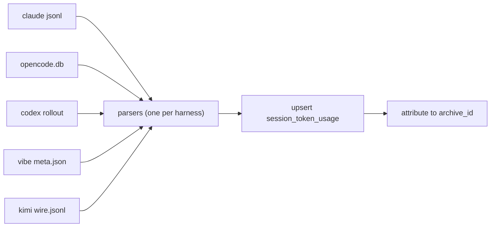

# Token & Session Analytics — Spec

[](https://md-converter.designs-os.com/?url=https://github.com/jedbjorn/super-coder/blob/main/specs_sc/token-session-analytics.md)

## Overview

Track token spend and session history **ourselves**, across every harness the
engine launches. Provider plans are opaque about allotments; the harnesses
already write usage data to disk — we ingest it into the fork's own DB and
surface it in the GUI.

What ships:

- **Session history** — every session with shell, harness, provider, model,
  started, ended, and a **session title** (native where the harness stores
  one, first-prompt-derived otherwise). Listed newest-first, grouped by day,
  default 7 days, "More" loads 7 more. Collapsed cards carry the basics with
  the title truncated at 100 chars; expanded cards carry the full title and
  per-class detail. Sprint-spawned sessions cluster under their sprint.
- **Token analytics** — input / output / cache-read / cache-write (+
  reasoning where exposed), filterable by harness, provider, model.
- **Usage analytics** — behavioral reads over the same data: favorite model
  per shell flavor, recent sprints, recent features. Read-time queries only;
  no extra capture.

```stats
:::class1
value: 5
label: Harnesses covered
description: claude · opencode · codex · vibe · kimi
:::class2
value: 4+1
label: Token classes
description: input · output · cache read · cache write · reasoning (where exposed)
:::class3
value: 7 days
label: Default history window
description: cursor-paged, "More" loads 7 more
:::class4
value: 0
label: Token data captured today
description: entire capture layer is new
```

> [!class1]
> Design stance (FnB, 2026-07-19): per-harness parsers are **plugins over
> third-party formats we don't control**. Version drift is accepted — if a
> parser breaks, we fix it. Loud failure, never silent zeros.

Why not dos-arch's mechanism: dos-arch meters in-process (every model call
passes one `egress_log` wrapper). super-coder never calls a model — it launches
external harness CLIs. Capture is therefore **pull**: parse what each harness
leaves on disk. dos-arch's normalized token classes and read-time aggregation
carry over; the capture boundary does not.

## Recon — per harness

Verified on the host, 2026-07-19 — kimi against a live K3 session (QA pass,
session 0213). All five harnesses confirmed parseable.

| Harness | Source | Token fields | Fidelity |
|---|---|---|---|
| claude | `~/.claude/projects/<dir>/*.jsonl` — per-request `usage` | input, output, cache_creation, cache_read + model per request | Full — **dedupe by `message.id` required** (see notes) |
| opencode | `~/.local/share/opencode/opencode.db` — `session` table | tokens_input/output/reasoning/cache_read/cache_write, title, model JSON, cost, time_created/updated | Full — plain SQL read |
| codex | `~/.codex/sessions/YYYY/MM/DD/rollout-*.jsonl` — `token_count` events | input (⊇ cached_input), output (⊇ reasoning) — last event's `total_token_usage` is cumulative | Good — no cache-write class |
| vibe | `~/.vibe/logs/session/<id>/meta.json` | `stats.session_prompt_tokens` / `session_completion_tokens`, title, model, start/end, working_directory | Partial — no cache split |
| kimi | `~/.kimi-code/sessions/wd_*/session_*/` — `state.json` + `agents/*/wire.jsonl` `usage.record` events | inputOther, output, inputCacheRead, inputCacheCreation — 1:1 to the four classes, per-event model | Full — cleanest source |

Notes:

- **claude** transcripts repeat the same `usage` object on every
  content-block line of a multi-block response (verified: 286 usage lines,
  141 unique message ids in one transcript — naive summing overcounts ~2×).
  Dedupe by `message.id` (or `requestId`) — **in-file and cross-file**,
  since resume/fork can copy lines into a new session file. No native
  title; derive from the first user message (transcript, or
  `~/.claude/history.jsonl` sessionId→display map).
- **opencode** is the easiest: per-session totals pre-aggregated, native
  `title`. The `model` column is **JSON**
  (`{"id","providerID","variant"}`) — provider comes straight from
  `providerID`; fold `variant` into the model label when present.
- **codex**: take the **last** `token_count` event's `total_token_usage`
  (cumulative) — do not sum per-turn values. Model id lives in
  `turn_context.payload.model`; provider in
  `session_meta.payload.model_provider`. cwd in both. No native title;
  derive from first user message.
- **vibe** `meta.json`: model = `config.active_model`, provider from
  `config.models[].provider`; native `title` (+ `title_source`); lifecycle
  from `start_time`/`end_time`; repo filter from
  `environment.working_directory`.
- **kimi** (`kimi-code` CLI): `state.json` carries
  `createdAt`/`updatedAt`, `workDir` (worktree-precise), native `title`
  (+ `isCustomTitle`), `lastPrompt`. `usage.record` events sum per
  (session × model); `llm.request` events carry `provider`/`model`
  natively. Sessions can run multiple agents (swarm mode) — sum across
  `agents/*/wire.jsonl`. `harness_session_ref` = session dir.

## Data model

One migration (next free number at build time). All engine-DB; every fork
gets it at repin.

### Session lifecycle — columns on shell_memory_archives

Nullable columns, historical rows stay NULL:

| Column | Type | Written by |
|---|---|---|
| started_at | TEXT (ISO UTC) | `run.py open_session` |
| ended_at | TEXT (ISO UTC) | sweep backfill (last harness activity) |
| harness | TEXT | `run.py open_session` |
| provider | TEXT | `run.py open_session` |
| model | TEXT | `run.py open_session` |
| sprint_ref | TEXT | `run.py open_session` from `SC_SPRINT_REF` env |

`run.py` already resolves harness + model for the exec env — it just never
persists them. `ended_at` cannot be written at exit (`run.py` execs the
harness; no code runs after), so the sweep backfills it from harness session
data.

### New table — session_token_usage

One row per (harness session × model). Not per API call — per-request
granularity is a later option for claude only.

| Column | Type | Notes |
|---|---|---|
| usage_id | INTEGER PK | |
| archive_id | INTEGER NULL | FK → shell_memory_archives; NULL = unattributed |
| shell_id | INTEGER NULL | denormalized for filtering |
| harness | TEXT NOT NULL | claude/opencode/codex/vibe/kimi |
| harness_session_ref | TEXT NOT NULL | transcript path / session id / rollout file / session dir |
| provider | TEXT | anthropic/openai/mistral/kimi/… |
| model | TEXT | |
| title | TEXT NULL | harness-side session title (native or first-prompt derived); UI truncates |
| started_at / ended_at | TEXT | from harness data (ISO UTC) |
| input_tokens | INTEGER NULL | fresh (uncached) input |
| output_tokens | INTEGER NULL | |
| cache_read_tokens | INTEGER NULL | |
| cache_write_tokens | INTEGER NULL | |
| reasoning_tokens | INTEGER NULL | opencode + codex expose it |
| status | TEXT CHECK | ok · partial · no_usage |
| parser_version | TEXT | per-parser format pin |
| captured_at | TEXT | sweep time |

`UNIQUE(harness, harness_session_ref, model)` — the idempotency key; parsers
upsert, re-sweeps never double-count. "Unattributed" is `archive_id IS
NULL`, **not** a fourth status value.

> [!class4]
> Token classes are normalized to dos-arch's four (fresh input / cache read /
> cache write / output) plus nullable reasoning. A harness that can't fill a
> class leaves it NULL — NULL means "not exposed", 0 means "measured zero".
> **Per-harness subset rules** (or classes double-count): codex
> `input_tokens` includes `cached_input_tokens` → fresh-input = input −
> cached_input, cache_read = cached_input; codex `reasoning_output_tokens`
> is inside `output_tokens`. kimi's `inputOther` is already fresh input — no
> arithmetic. opencode caveat: its columns are `NOT NULL DEFAULT 0`, so
> "not exposed" and "measured zero" are indistinguishable at that layer —
> trust opencode's numbers as-is.

## Capture

One collector, one parser module per harness — the plugin seam.



- **Collector**: `sc analytics sweep` (script + `./sc` subcommand). Scans
  each harness's data dir, filters to sessions belonging to **this fork's
  repo directory**, upserts rows. Runs: at `run.py` boot (pre-session,
  incremental), on demand, and from the GUI analytics tab load.
  **Incrementality**: skip source files whose mtime ≤ the row's last
  `captured_at` — the first full sweep of harness history is large; every
  later sweep touches only what changed. Two hazards close the gaps in that
  gate (CC-145): **off-repo files** never produce rows so they never earn a
  watermark — the codex parser bails on the `session_meta` line (line 1)
  the moment the cwd is off-repo, instead of re-parsing other projects'
  history every sweep; and the claude parser's **dir-scoped dedupe** meant
  one live session file re-parsed its whole project dir every boot — per-file
  parse state (byte-offset high-water mark + full id→usage maps, cross-file
  dedupe replayed from cache in mtime order) persists in
  `analytics_parse_cache` (migration 0073, one JSON row per harness, pinned
  to `parser_version`), so a grown transcript parses only its tail delta. The
  cache is a disposable accelerator, never a source of truth: it lives in the
  DB so a rebuild drops rows and cache together, and a version bump or
  `--full` discards it.
- **Repo filtering (claude)**: read the `cwd` field on the JSONL lines, not
  the project-dir name — the dir-name dash-encoding is lossy (`/` and `-`
  encode identically). Harness sessions launched **outside** `run.py` in a
  fork's repo dir are swept and shown unattributed — deliberate: it is real
  spend on this repo.
- **Parsers**: `scripts/token_parsers/<harness>.py`, each pinning
  `parser_version` to the format shape it expects. On shape mismatch: write
  what it can with `status='partial'` and log loudly — never skip silently,
  never write zeros as if measured. Parsers also fill `title` (native field
  or first-user-message fallback).
- **Attribution**: match harness session → archive by (repo directory,
  time-window overlap with `started_at`/`ended_at`). An archive whose
  `ended_at` is still NULL is treated as open-ended until that shell's next
  `started_at`. Worktree shells have distinct cwds, which disambiguates
  parallel dev shells. Residual ambiguity → row stays `archive_id=NULL`
  (still visible in analytics, flagged unattributed).
- **Real-time path (claude only, v1)**: adapter `merge_json` injects a
  `SessionEnd` hook (same seam as branch-guard) POSTing the transcript path
  to `POST /_sc/mem/telemetry`; server validates the ref resolves under the
  expected harness data dir, then runs the claude parser inline. The sweep
  remains the backstop for missed hooks. codex `notify` / opencode plugin
  push are later enhancements — the sweep already covers them.
- **Provider derivation**: native fields where the harness exposes them
  (opencode `providerID`, kimi `llm.request.provider`, codex
  `session_meta.model_provider`); parser-level default for vibe (mistral);
  model catalog lookup as fallback.

## API

New GUI-namespace routes in `api/server.py` (localhost, same stance as the
rest of `/api/*`):

- `GET /api/analytics/sessions?before=<ISO>&days=7&harness=&provider=&model=&shell=`
  → `{days: [{date, sprints: [...], sessions: [...]}], next_before}` —
  session rows carry shell, harness, provider, model, title, started/ended,
  token sums, sprint_ref, status. Cursor-paged: "More" re-calls with
  `next_before`.
- `GET /api/analytics/tokens?from=&to=&group_by=day|model|provider|harness&…filters`
  → `{totals: {input, output, cache_read, cache_write, reasoning}, series}`.
- `GET /api/analytics/usage` → `{favorite_models: [{flavor, model,
  sessions}], recent_sprints: [...], recent_features: [...]}` — read-time
  aggregation; flavor joins through the attributed `shell_id`, features via
  sprint_ref → tracker doc → `feature_id`.
- `GET /api/analytics/filters` → distinct harnesses/providers/models/shells
  present in the data (populates dropdowns).
- `POST /_sc/mem/telemetry` (token-scoped namespace) — hook ingest:
  `{harness, harness_session_ref}`; server validates + parses + upserts
  inline.

## UI

New **Analytics** tab in `ui/app.js` (vanilla JS, no framework — house
style). Timestamps are stored UTC and **translated to local time at
render** — day-grouping and displayed times are local.

- **Filter row**: harness / provider / model selects (from
  `/api/analytics/filters`), default All. Filters apply to the summary,
  the usage panels, and the list.
- **Summary strip**: token totals for the loaded window — input, output,
  cache read, cache write.
- **Usage panels**: favorite model per shell flavor, recent sprints,
  recent features (from `/api/analytics/usage`).
- **Session history**: grouped by day, newest first. 7 days initially;
  **More** loads 7 more via cursor. **Collapsed card**: started–ended
  time, shell, harness, model, provider, title truncated at 100 chars,
  total tokens. **Expanded card**: full title, per-class token counts,
  sprint_ref, harness_session_ref, `status` when not `ok` (no_usage /
  partial / unattributed).
- **Sprint grouping**: within a day, sessions sharing a `sprint_ref` render
  clustered under a sprint header with rolled-up totals; solo sessions list
  flat.
- No cost column in v1 — tokens only.

## Sprint grouping

No sprint entity exists in the data model today — a sprint is a workflow
(tracker document + spec_tasks + typed messages). The linkage:

- Sprint orchestration sets `SC_SPRINT_REF=<tracker document_id>` in the
  env when spawning headless workers; `run.py open_session` persists it to
  the archive row. The orchestrating parent session sets its own the same
  way. **Env threading is verified** (QA pass): `job.py` spawns inherit the
  caller's environment and `run.py` builds the exec env from
  `{**os.environ}` — no new plumbing needed.

> [!class2]
> Deliberately thin: no sprints table, no FK — a nullable tag on the session
> row. If sprint reporting later needs a real entity, the tag migrates into
> it.

## Out of scope & risks

Out of scope for v1:

- **Cost / pricing** — no `models` pricing table, no $ math. dos-arch's
  read-time `cost_*` join is the precedent when wanted; token counts are the
  ground truth being bought here.
- **Per-request rows** — claude could support them; v1 stays per
  session × model.
- **Push capture for codex/opencode/kimi** — sweep covers them; `notify` /
  plugin seams are enhancements.
- **Retention/rollup** — row volume is tiny (sessions × models, not
  requests).

Risks, with stance:

| Risk | Stance |
|---|---|
| Harness format drift (all parsers) | Accepted (plugin stance): parser_version pin, `partial` status, loud log, fix forward |
| claude usage duplication (multi-block lines, resume/fork file copies) | Dedupe by `message.id` in-file and cross-file — verified hazard, ~2× overcount if skipped |
| Attribution ambiguity (same repo, overlapping sessions) | claude hook gives exact refs; worktrees give distinct cwds; NULL `ended_at` = open-ended until next session; residue stays unattributed, never guessed |
| Old sessions predate lifecycle columns | Sweep still ingests harness-side history — token rows exist unattributed; archives stay NULL |

## Build plan

Cadence (FnB, 2026-07-19): **spec + QA** landed together in session 0213 —
the QA pass (adversarial review + live recon on all five harnesses,
including kimi against a running K3 session) resolved every Preparation
unknown except the migration number (build-time trivial). **Build** is the
next session, task-tracked via the spec skill.

```linear
Spec authored :::class3 -> QA pass :::class1 -> Build :::class2 -> Verify on real sessions :::class4
```

Task shape for the build session:

1. Migration — archive lifecycle columns + `session_token_usage`
   (incl. `title`); next free migration number.
2. `run.py` — persist started_at/harness/provider/model/sprint_ref at
   `open_session`.
3. Collector + claude parser (transcript JSONL; message-id dedup, cwd
   filter, title from first prompt).
4. opencode + codex parsers (JSON model column; last cumulative total +
   subset normalization).
5. vibe + kimi parsers (meta.json; wire.jsonl usage.record, multi-agent
   sum).
6. `/api/analytics/*` routes (sessions, tokens, usage, filters) +
   `/_sc/mem/telemetry` ingest with ref validation.
7. claude `SessionEnd` hook via adapter `merge_json`.
8. UI Analytics tab (filters, summary, usage panels, 7-day list + More,
   collapsed/expanded cards, sprint clusters; UTC→local at render).
9. Verification — real sessions on ≥3 harnesses, re-sweep idempotency,
   render + snapshot + render-check.
