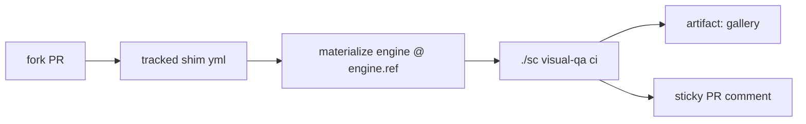

# Visual QA CI — Playwright viewport screenshots

## Overview

Downstream forks build apps; PRs change those apps' UIs; nothing in the loop
looks at the result. This feature ships a **native** visual-QA layer: on every
fork PR, CI boots the fork's app, captures full-page screenshots at a set of
viewports across the fork's declared routes, and surfaces the gallery to the
review loop. Requested by downstream; ships engine-native — every fork gets it,
and **existing forks adopt it via the normal `make update` channel**.

> [!class1]
> **v1 shape (settled with the FnB, 2026-07-20 — decision #3):** capture-only
> galleries (no committed baselines, no pixel-diffing) · **advisory** check
> (fails only when the app cannot boot or serve — never on visual content) ·
> results surface as a **sticky PR comment + CI artifact**. No GUI tab, no
> inbox eventing in v1.

The central constraint the design answers: **GitHub Actions only executes
workflow files tracked in the fork's own `.github/workflows/`**, but under B7
the engine is a gitignored materialized dependency — a fork checkout in CI has
no `.super-coder/` at all. So the feature splits into a **thin, fork-tracked
workflow shim** (stable, rarely changes) and an **engine-side runner** holding
all the logic (updates ride the existing engine update channel).



## Architecture

Three parts, three owners:

| Part | Path (in fork) | Tracked? | Owner |
|---|---|---|---|
| Workflow shim | `.github/workflows/subfloor-visual-qa.yml` | yes | engine-managed (marker header) |
| Fork config | `.sc-state/visual-qa.json` | yes | fork-authored |
| Runner | `.super-coder/scripts/visual_qa.py` | no (gitignored engine) | engine |

**Why a thin shim + engine runner, not a fat workflow:** every line in the
tracked yml is a line the update path must be able to rewrite in N existing
forks — a coordination cost. Every line engine-side updates atomically with a
normal engine repin, and CI runs it **at the fork's pinned `engine.ref`**, so
fork CI is deterministic and changes only when the fork repins. The shim is
therefore ~30 lines that should not change across releases: checkout → clone
subfloor at `engine.ref` into `.super-coder/` → invoke `./sc visual-qa ci` →
upload artifact.

**Determinism note:** the shim clones the public subfloor repo at the exact
SHA in `.sc-state/engine.ref`. No ref → the run fails with "run `make update`
(B7) first". It never falls back to `main` — a fork's CI must not change
behavior because upstream moved.

## Workflow shim

`.github/workflows/subfloor-visual-qa.yml`, seeded into forks (never into the
subfloor source repo itself — `is_source_repo()` guard, same as install):

- **Triggers:** `pull_request` + `workflow_dispatch`. No path filter in the
  yml (that would make the shim fork-specific); skip logic lives in the runner
  (see Runner — skip rules).
- **Permissions:** least-privilege, matching the house style in `tests.yml`:
  `contents: read`, `pull-requests: write` (the sticky comment).
- **Concurrency:** `group: subfloor-visual-qa-${{ github.ref }}`,
  `cancel-in-progress: true` — a force-push cancels the stale run.
- **Steps:** checkout fork → setup python + node → restore Playwright browser
  cache (keyed on the Playwright version the runner pins) → clone subfloor at
  `engine.ref` → `./sc visual-qa ci` → `actions/upload-artifact` of the
  gallery dir (always, even on failure — a failed boot's logs are the QA
  signal), retention per config default 14 days.
- **Managed marker:** first lines of the file:

```yaml
# managed-by: subfloor — visual-qa shim v1
# Edits are overwritten by `make update`. Delete the managed-by line to take
# ownership; subfloor will then leave this file alone.
```

## Fork config

`.sc-state/visual-qa.json` — tracked, fork-owned, authored by the fork's
shells (they know their app). The engine ships a commented example and
`./sc visual-qa init` scaffolds a best-guess from the repo (package.json
scripts, vite/sveltekit detection, port defaults):

```json
{
  "cwd": ".",
  "setup": ["npm ci", "npm run build"],
  "serve": "npm run preview -- --port {port} --host 127.0.0.1",
  "port": 4173,
  "ready_path": "/",
  "ready_timeout_s": 120,
  "settle_ms": 500,
  "routes": ["/", "/dashboard"],
  "viewports": "default",
  "paths": ["src/**", "static/**", "package.json"],
  "services": [],
  "artifact_retention_days": 14
}
```

- `viewports: "default"` = mobile 375×812 · tablet 768×1024 · desktop
  1440×900; or an explicit list of `{name, width, height}`.
- `paths` — glob list; the runner diffs the PR against its base and **skips
  (neutral pass, one-line comment)** when nothing matches. Empty/absent =
  always run.
- `services` — v1 supports one value, `"postgres"`: the runner starts a
  Postgres container on the CI host, exports `DATABASE_URL`, and runs the
  fork's `setup` commands after it (the fork's own migrations provision the
  schema — consistent with the dev_kit stance: a set-but-empty `DATABASE_URL`
  means provision-me).
- `{port}` in `serve` is substituted by the runner; local mode picks a free
  port instead of the fixed CI one.

> [!class4]
> The config is fork-authored input, not engine-trusted data: invalid JSON or
> a missing required key (`serve`, `routes`) **fails the check with a clear
> message** — a broken config is a broken contract, not a skip.

## Runner

`scripts/visual_qa.py`, dispatched as `./sc visual-qa <ci|run|init>`.

**`ci` mode** (what the shim invokes):

1. Load + validate config. Absent config → **neutral pass**: green check, one
   sticky comment line ("visual QA not configured — `./sc visual-qa init`").
   Forks without a UI never see red.
2. Skip rule: if `paths` set and the PR's diff vs base touches none → neutral
   pass, comment notes "no app paths changed".
3. `pip install playwright==<pinned>` + `playwright install --with-deps
   chromium` (ephemeral to the CI run; the engine itself stays
   stdlib-only — no permanent dependency). Chromium only in v1.
4. Start `services`, run `setup`, launch `serve`, poll
   `http://127.0.0.1:{port}{ready_path}` until 200 or `ready_timeout_s` →
   timeout **fails the check** (advisory covers visuals, not a dead app).
5. For each route × viewport: navigate, wait for network-idle plus
   `settle_ms`, capture full-page PNG →
   `gallery/<route-slug>/<viewport>.png`. Per-route failure rules:
   - non-200 or navigation error → screenshot whatever rendered, mark ✗ in
     the summary, check stays green (humans judge);
   - **all** routes failed → fail the check (the app isn't actually serving).
6. Write `gallery/index.html` (local browsing of the artifact) +
   `summary.json`.
7. Post/update the **sticky PR comment** (marker
   `<!-- subfloor-visual-qa -->`, edited in place — one comment per PR
   forever): status line, route × viewport table with ✓/✗ and image
   dimensions, links to the artifact and run. CI screenshots are not
   web-hostable from artifacts, so **no inline thumbnails in v1** — named
   plainly as a limitation; hosting options (gallery branch, Pages) are
   deferred.
8. Comment-post failure (e.g. read-only token on a PR from an external fork)
   degrades gracefully: artifact still uploads, summary still lands in
   `$GITHUB_STEP_SUMMARY`, check status unaffected.

**`run` mode** — the same capture loop pointed at a locally running app
(default `http://127.0.0.1:$SC_DEV_PORT`, `--url` to override), writing to a
local `gallery/` dir. Gives dev shells pre-PR visual QA and reviewer shells a
way to eyeball a worktree; requires Playwright locally and errors with install
guidance if missing.

**`init` mode** — scaffold `.sc-state/visual-qa.json` from repo detection;
never overwrites an existing config.

## Distribution & fork update

The request explicitly covers **existing** forks, so distribution is two
channels — install-time seed and update-time reconcile:

- **New forks:** `init_fork` / `install.py` seed the shim + the example
  config, exactly like the Makefile/gitignore bootstrap surface.
- **Existing forks:** `./sc update` gains `ensure_workflows()` alongside
  `ensure_gitignore()`. Reconcile rules, in order:
  1. shim absent → write it, print the `git add` guidance line update.py
     already prints for `.sc-state/` artifacts;
  2. present **with** managed marker, older version → overwrite with the
     current shim (bump `vN` in the marker);
  3. present **without** the marker → fork took ownership: leave the file
     alone, print one notice;
  4. source repo → no-op.
- **Runner/logic changes** need no workflow-file touch at all: they arrive
  with the engine materialization and take effect when the fork repins
  `engine.ref` — the shim's job is to stay boring.
- The fork commits the shim + config on its own branch/PR per its normal git
  flow; `update` never commits for the fork (consistent with B7: update
  stages tracked artifacts, the operator commits).

```linear
make update :::class1 -> shim seeded/refreshed :::class2 -> fork commits shim + config :::class2 -> next PR runs visual QA :::class3
```

## Edge cases & failure modes

| Case | Behavior |
|---|---|
| No config in fork | Neutral pass + one-line pointer comment |
| Invalid config | Check fails with parse/validation message |
| `paths` set, none touched | Neutral pass ("no app paths changed") |
| App boot/ready timeout | Check fails; boot log tail in artifact + comment |
| One route errors | Capture + ✗ in table; check stays green |
| All routes error | Check fails |
| No `engine.ref` (pre-B7 fork) | Check fails: "run `make update` first" |
| PR from external fork (read-only token) | No comment; artifact + step summary still land |
| Force-push mid-run | Prior run cancelled (concurrency group) |
| Fork edited the shim (marker removed) | Update leaves it alone, prints notice |
| Subfloor source repo | Shim never seeded (`is_source_repo()`) |
| Auth-gated routes | Out of scope v1 — config lists public routes |
| Animations/dynamic content | Network-idle + `settle_ms` best-effort; capture-only tolerates residual flake |

## Change surface

All engine-side, in the subfloor source repo:

- **New** `scripts/visual_qa.py` — runner (`ci` / `run` / `init`).
- **New** `templates/fork/subfloor-visual-qa.yml` + `visual-qa.example.json`
  — the seeded surfaces.
- `sc` — `visual-qa` dispatch + help line.
- `install.py` / `init_fork.py` — seed shim + example config.
- `update.py` — `ensure_workflows()` reconcile (marker/version rules above).
- `engine_manifest.py` — include the new template paths.
- Docs — feature doc on ship (docs skill flow); `dev_kit` /
  `git` skill touch-ups only if their text names the CI surface.

**Testing** — the engine suite stays hermetic (stdlib + pytest, no network,
no browser — the `tests.yml` contract): unit-test config validation, skip
logic, marker/version reconcile, comment-body build, and gallery/summary
assembly with a mocked capture layer. Playwright itself only ever runs in
fork CI or a local `run` — never in engine tests.

## Done condition

On a fork with a configured app: a PR touching an app path produces a green
advisory check, an artifact containing route × viewport PNGs + `index.html`,
and one sticky comment that updates in place on the next push. On a fork
predating this feature: `make update` seeds the shim + example config and
prints the commit guidance; re-running update after the fork edits the shim
(marker removed) leaves the edit intact. `./sc visual-qa run` against a dev
worktree produces the same gallery locally.

## Open questions

- **Inline thumbnails** — artifacts aren't embeddable in comments; is a
  pushed gallery branch or Pages hosting worth it in v2, or is
  download-the-artifact acceptable indefinitely?
- **Cross-harness forks on non-GitHub remotes** — the shim is GitHub
  Actions-only; is that an accepted v1 boundary? (Runner is host-agnostic;
  only the shim + comment layer are GitHub-specific.)
- **Playwright pin policy** — pinned in the runner (moves with engine repin);
  does it also need a config override for forks stuck on an old app stack?

## Out of scope (later)

- Baseline pixel-diffing and the capture+soft-diff mode (interview: declined
  for v1; capture-only is the shipped shape).
- GUI tab / inbox eventing for results (declined for v1).
- Cross-browser (WebKit/Firefox), device emulation beyond viewport size,
  video/trace capture, auth flows, multi-service `services` beyond postgres.
